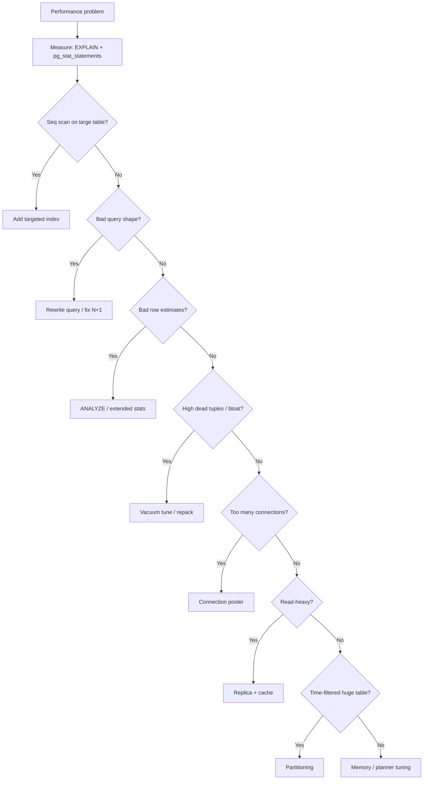

# Decision Guide, Checklist, and Common Mistakes

A practical reference for choosing strategies and avoiding common mistakes.

> **Scope:** Database-layer scenarios only (queries, indexes, vacuum, pooling, partitioning, replicas). System-wide throughput scenarios → [HTS §12](../../high-throughput-systems/includes/12-decision-guide-and-common-mistakes.md).
>
> **Related:** Start here → [§1 Measurement](01-measurement.md) · Scale-out terms → [§9](09-views-functions-and-scale-out-terminology.md) · Consistency trade-offs → [§14](14-consistency-promises-and-costs.md)

## Scenario recommendations

| Scenario | Recommended approach |
|----------|---------------------|
| One slow API endpoint | `EXPLAIN ANALYZE` → index or query rewrite |
| App feels slow generally | `pg_stat_statements` top 10 by total time |
| "Too many connections" | PgBouncer before raising `max_connections` |
| Table growing, queries slowing | Check dead tuples; tune autovacuum |
| Time-series, 50M+ rows | Range partition on `created_at` + BRIN or B-tree |
| Dashboard aggregations | Materialized view + periodic refresh |
| Read-heavy SaaS | Optimize primary → read replica → Redis cache |
| Nightly bulk import | `COPY` → `ANALYZE` → verify indexes |
| Login brute force (many writes) | Short transactions; partial index on active sessions |
| JSONB attribute search | GIN index; don't replace relational filters |

## Full decision flow

## Priority checklist

Use this order — skipping steps wastes effort:

- [ ] Enable and review **`pg_stat_statements`**
- [ ] **`EXPLAIN (ANALYZE, BUFFERS)`** on top slow queries
- [ ] Add **targeted indexes** (verify with plan, drop unused ones)
- [ ] Fix **query shape** (N+1, `SELECT *`, pagination)
- [ ] Confirm **autovacuum** is healthy on churny tables
- [ ] Add **connection pooling**
- [ ] Tune **`shared_buffers`**, **`work_mem`**, **`random_page_cost`**
- [ ] Read **[§9 scale-out terminology](09-views-functions-and-scale-out-terminology.md)** before partitioning or replicas
- [ ] Consider **partitioning** for time-series at scale
- [ ] Add **read replicas** and **caching** last

## Common mistakes

| Mistake | Why it fails | Do instead |
|-------|--------------|------------|
| Index every column | Write slowdown, planner confusion | Index based on EXPLAIN evidence |
| Raise `max_connections` to 2000 | Memory exhaustion, thrashing | PgBouncer |
| Global `work_mem = 256MB` | OOM under concurrent load | Conservative global; per-session for reports |
| Replicas before query tuning | 10× the same bad query | Optimize on primary first |
| Partition without pruning key in queries | Scans all partitions | Match schema to query patterns |
| Everything in JSONB | Slow filters, huge GIN indexes | Relational columns for hot paths |
| Long idle transactions | Blocks vacuum, holds locks | Pool timeouts; short transactions |
| `VACUUM FULL` in peak hours | Exclusive lock | `pg_repack` or maintenance window |
| Optimize on empty dev DB | Plans don't match production | Test on realistic data volume |
| Buy bigger hardware first | Masks root cause | Measure and fix queries |

## Before/after validation

For every change:

1. Capture baseline: query time, plan, `pg_stat_statements` entry
2. Apply one change
3. Re-measure under similar load
4. Document what worked

## See also

- [Database Connection & Security](../../database-connection-and-security/README.md) — credentials, PgBouncer, production connection patterns
- [Database Security](../../database-connection-and-security/includes/02-prod-db-security.md) — production hardening
- [Strong consistency — promises and costs](14-consistency-promises-and-costs.md) — when replicas and caches break strong reads
- [High throughput systems](../../high-throughput-systems/README.md) — system-wide optimization order and scaling layers
- [tree-and-index-structures](../../tree-and-index-structures/README.md) — B+ vs LSM for write-heavy workloads
- [api-rate-limiting](../../api-rate-limiting/README.md) — protect DB from connection storms via app-layer limits
- [deployment-strategies](../../deployment-strategies/README.md) — safe rollout during pool and schema changes
