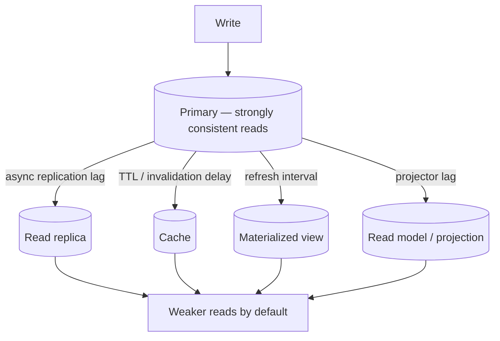
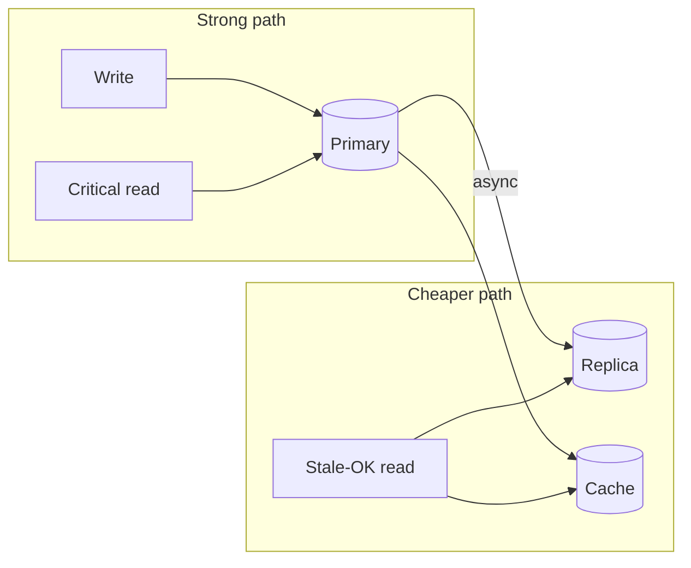

# Strong Consistency — Promises and Costs

What strong consistency guarantees, what it costs in latency and scale, and how to apply it when you add replicas, caches, and multi-region deployments.

> **Related:** Operational routing → [Read scaling and caching](11-read-scaling-and-caching.md) · API(Application Programming Interface) implications → [Stateless architecture](../../api-design-and-protection/includes/11A-stateless-auth-operations.md#consistency-and-read-routing) · CQRS(Command Query Responsibility Segregation) lag → [Eventual consistency in read models](../../event-sourcing-and-cqrs/includes/02-cqrs-and-read-models.md#eventual-consistency)

---

## At a glance

| Term | Promise | Typical context |
|------|---------|-----------------|
| **ACID (single primary)** | Committed writes are durable; reads see committed data in transaction order | PostgreSQL primary |
| **Linearizability** | Every operation appears instantaneous; no stale reads after a completed write | Distributed consensus (Raft, Paxos) |
| **Serializability** | Concurrent transactions behave as if run one at a time | Heavy OLTP under contention |
| **Read-your-writes** | A client always sees its own recent writes | Post-login, post-checkout flows |
| **Eventual consistency** | Replicas converge given enough time; reads may lag | Async replicas, caches, projections |

**Rule of thumb:** Strong consistency is the default on a **single PostgreSQL primary**. Every layer that serves reads without going through that primary — replica, Redis, materialized view, projector — is a place where consistency can break unless you design for it.

---

## What strong consistency promises

After a write succeeds, a subsequent read (by the same or another client, depending on the model) will **not** return pre-write data unless you explicitly choose a weaker read path.

That enables safe reasoning:

- "If the API returned `200`, the balance really changed."
- "Inventory count is trustworthy — we won't oversell."
- "Permission revocation takes effect on the next read."

Without it, applications must handle stale state: retries, version checks, compensating actions, and UX that tolerates lag.

---

## Where consistency breaks



| Layer | Why reads can be stale |
|-------|------------------------|
| **Async read replica** | WAL(Write-Ahead Log) replay lags behind primary |
| **Application cache** | TTL, missed invalidation, race on write-through |
| **Materialized view** | Refreshed on schedule, not on every write |
| **Multi-region replica** | Cross-region replication + routing |
| **Separate read DB (CQRS)** | Projector processes events after append |
| **Microservices** | No single shared transaction across services |

Strong consistency is an **end-to-end** property — not a checkbox on one database.

---

## The costs

### Latency

Strong writes often require waiting for:

- **Synchronous replication** — standby acknowledges before client gets OK
- **Quorum consensus** — majority of nodes (distributed databases)
- **Cross-region coordination** — speed-of-light round trips

| Setup | Typical write impact |
|-------|---------------------|
| Single AZ primary | Baseline (lowest) |
| Sync replica same region | +1–5 ms |
| Sync multi-AZ | +5–20 ms |
| Cross-region sync | +50–200+ ms |

### Availability (CAP)

Under network partition, a strongly consistent system often **refuses** reads or writes rather than serve stale data.

**Cost:** Errors during partial outages instead of degraded-but-available service. Correctness over liveness.

### Write throughput

Consensus and synchronous replication limit how fast the system accepts writes. A single leader (or small quorum group) becomes a bottleneck.

**Cost:** Scale writes vertically or shard — not by adding async read replicas alone.

### Read scaling friction

Read replicas and caches improve throughput but weaken consistency by default. Keeping strong reads means:

- Routing critical reads to the **primary** (loses replica benefit), or
- **Synchronous replicas** (adds write latency), or
- Accepting **documented staleness** on non-critical endpoints

See [Read scaling and caching](11-read-scaling-and-caching.md) for routing patterns.

### Operational complexity

- Classify endpoints by consistency requirement
- Read routing in app, ORM, or connection pooler
- Idempotency keys and optimistic concurrency (`ETag`, version columns)
- Failover testing — what happens to in-flight writes and lagging replicas
- Monitoring replication lag and cache hit/miss invalidation

### Infrastructure cost

Sync multi-AZ setups, larger primaries, bypassing cache on critical paths, and fewer cheap async replicas on hot read paths all increase spend.

---

## Promises vs costs

| You get | You pay |
|---------|---------|
| Correct balances, inventory, permissions | Higher write latency |
| Predictable application logic | Reduced availability under partition |
| Safe failover with sync replication | Lower peak write throughput |
| Audit and regulatory fit | Harder global low-latency reads |
| Fewer "ghost state" bugs | Explicit routing and documentation |

---

## When strong consistency is required

| Domain | Why |
|--------|-----|
| **Payments / ledger** | Double-spend, incorrect balances |
| **Inventory reservation** | Overselling stock |
| **AuthZ changes** | Revoked access must not still work |
| **Unique constraints at scale** | Duplicate rows if reads are stale |
| **Idempotency enforcement** | Retry must see prior write |

## When eventual consistency is acceptable

| Domain | Typical staleness tolerance |
|--------|----------------------------|
| Analytics dashboards | Seconds to minutes |
| Search / autocomplete | Seconds |
| Social feeds, view counts | Seconds |
| Product catalog (non-inventory) | Short TTL cache OK |
| Config that propagates gradually | Seconds |

If a user could **lose money, access, or trust** from stale data for even a few seconds, treat that path as strongly consistent.

---

## PostgreSQL-specific patterns

### Single primary (default)

Reads and writes against the primary are **strongly consistent** within PostgreSQL's isolation level (default `READ COMMITTED`).

Use **`SERIALIZABLE`** or **`REPEATABLE READ`** only when proven race conditions require it — see [Bulk operations and concurrency](12-bulk-operations-and-concurrency.md).

### Async streaming replication

Default on managed PostgreSQL (RDS, Cloud SQL(Structured Query Language), Azure). Replicas lag by milliseconds to seconds under load.

```sql
-- On primary: monitor lag
SELECT application_name, state, sync_state,
       pg_wal_lsn_diff(pg_current_wal_lsn(), replay_lsn) AS lag_bytes
FROM pg_stat_replication;
```

**Mitigation:** Route session-critical reads to primary; use replicas for reports and list views.

### Synchronous replication

```sql
-- Example: wait for at least one standby (use with care)
ALTER SYSTEM SET synchronous_standby_names = 'ANY 1 (standby1)';
SELECT pg_reload_conf();
```

**When to use:** Failover RPO(Recovery Point Objective) = 0 for committed transactions; financial writes that must survive primary loss immediately.

**Cost:** Write latency tied to slowest sync standby; availability hit if standby is down (writes block or fail).

### Read-your-writes without sync replicas

After a write, pin that user's reads to primary for a short window, or pass a **consistency token** (LSN or timestamp) and retry on replica until caught up.

| Pattern | How |
|---------|-----|
| **Primary pin** | Route to primary for N seconds after user's write |
| **Sticky session + primary** | Same connection pool target post-write |
| **LSN catch-up check** | App compares replica `pg_last_wal_replay_lsn()` to write LSN; retry or fall back to primary |

### Materialized views and caches

Strong consistency and periodic refresh **conflict by design**. Use materialized views only where staleness is documented and acceptable.

---

## Practical architecture



### Tiered reads checklist

- [ ] List which API endpoints require **strong** vs **eventual** reads
- [ ] Default new endpoints to **primary** until classified
- [ ] Monitor **replication lag** with alerts (e.g. p99 lag > 1s)
- [ ] Set cache TTLs from business tolerance, not arbitrary defaults
- [ ] Test **read-after-write** flows (create → immediate GET) against replica routing
- [ ] Document consistency in OpenAPI where clients depend on it

---

## Common mistakes

| Mistake | Result | Do instead |
|---------|--------|------------|
| All reads to replica after adding one | Users see stale data after writes | Tier reads; primary for session-critical |
| Cache without invalidation on write | Long-lived wrong values | Write-through or event-driven invalidation |
| Assuming multi-AZ = strong reads globally | Regional replica still lags | Classify per region and endpoint |
| Strong consistency everywhere | High latency, low availability | Strong only where business requires |
| No lag monitoring | Silent stale reads in production | `pg_stat_replication`, app metrics |

---

## See also

- [Read scaling and caching](11-read-scaling-and-caching.md) — replicas, Redis, materialized views, layered read path
- [Stateless architecture — consistency and read routing](../../api-design-and-protection/includes/11A-stateless-auth-operations.md#consistency-and-read-routing) — API-level implications
- [CQRS read models — eventual consistency](../../event-sourcing-and-cqrs/includes/02-cqrs-and-read-models.md#eventual-consistency) — projector lag and UX patterns
- [Async patterns](../../api-design-and-protection/includes/10-async-patterns.md) — job results vs immediate read consistency