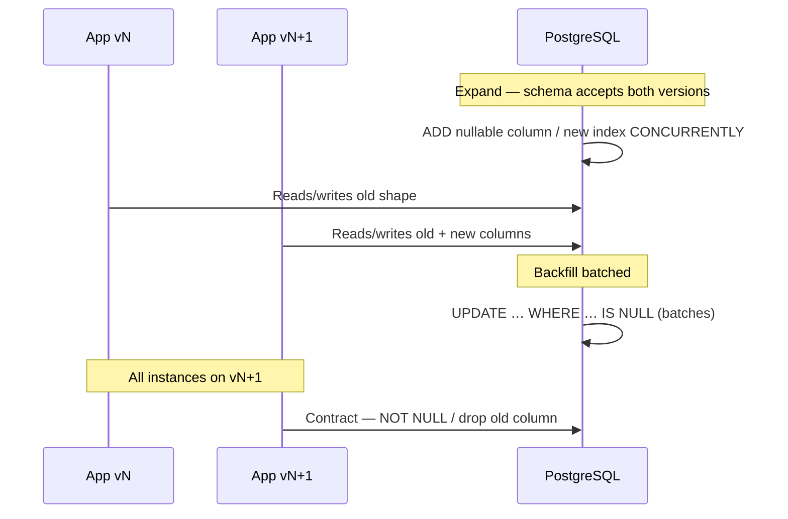

# Schema Migration Checklist

Production PostgreSQL migrations should be **online**, **backward compatible**, and **measurable** — especially when the app rolls out with old and new code running together.

> **Related:** Deploy coupling → [deployment-strategies/includes/12-schema-migrations-and-deploy.md](../../deployment-strategies/includes/12-schema-migrations-and-deploy.md) · Bulk backfills → [12-bulk-operations-and-concurrency.md](12-bulk-operations-and-concurrency.md) · Locking → [12-bulk-operations-and-concurrency.md](12-bulk-operations-and-concurrency.md)

---

## At a glance

| Migration type | Production approach |
|----------------|---------------------|
| **Add column** | Nullable first; backfill; then `NOT NULL` in contract phase |
| **Add index** | `CREATE INDEX CONCURRENTLY` |
| **Drop column** | Contract phase only — after all app instances upgraded |
| **Rename** | Add new column → copy → switch app → drop old |
| **Change type** | New column + backfill; avoid in-place cast on huge tables |
| **Add FK** | `NOT VALID` then `VALIDATE CONSTRAINT` |

**Rule of thumb:** If rolling deploy is in use, assume **two app versions** hit the database simultaneously.

---

## Expand / contract examples



### Add required column safely

```sql
-- Expand (release N)
ALTER TABLE orders ADD COLUMN priority text;

-- Backfill in batches (job, not one transaction)
UPDATE orders SET priority = 'normal' WHERE priority IS NULL AND id BETWEEN $1 AND $2;

-- Contract (release N+1 or N+2, after all apps write priority)
ALTER TABLE orders ALTER COLUMN priority SET NOT NULL;
```

### Add index without blocking writes

```sql
CREATE INDEX CONCURRENTLY idx_orders_tenant_created
  ON orders (tenant_id, created_at DESC);
```

Monitor: `pg_stat_progress_create_index` for progress; failed concurrent index leaves invalid index — drop and retry.

---

## Lock and duration risks

| DDL | Lock level | Mitigation |
|-----|------------|------------|
| `ADD COLUMN` (nullable) | Brief | Usually safe |
| `CREATE INDEX` (default) | **Blocks writes** | Use `CONCURRENTLY` |
| `ALTER COLUMN TYPE` | Exclusive | New column + backfill |
| `DROP COLUMN` | Exclusive | Contract phase; low traffic window |
| `ADD CONSTRAINT` (immediate) | Validates all rows | `NOT VALID` + validate later |

Check active queries before long DDL: `pg_stat_activity`, cancel or wait for idle window.

---

## Backfill patterns

| Pattern | When |
|---------|------|
| **Batched UPDATE** | Medium tables; `id` ranges + `sleep` between batches |
| **INSERT … SELECT** | New table from old |
| **Trigger dual-write** | Zero-downtime cutover (complex) |
| **`COPY` + swap** | Very large tables — see [§12 bulk operations](12-bulk-operations-and-concurrency.md) |

Backfills must be **idempotent** and **resumable** (track watermark in a table or job state).

---

## Verification before and after

```sql
-- Row count sanity
SELECT count(*) FROM orders;

-- Index valid and used
SELECT indexrelid::regclass, indisvalid
FROM pg_index JOIN pg_class ON pg_class.oid = indexrelid
WHERE relname = 'idx_orders_tenant_created';

-- Planner uses new index
EXPLAIN (ANALYZE, BUFFERS)
SELECT * FROM orders WHERE tenant_id = $1 ORDER BY created_at DESC LIMIT 20;
```

---

## Migration checklist

- [ ] Backward compatible with **previous** application version
- [ ] Expand and contract split across releases if needed
- [ ] Indexes use `CONCURRENTLY` on production-sized tables
- [ ] Backfill batched; no single long transaction on millions of rows
- [ ] Rollback plan: revert app without contract migration
- [ ] Tested on staging with production-like volume
- [ ] `statement_timeout` and lock timeout set for migration session
- [ ] Event projectors / read models updated in correct order

---

## Common mistakes

| Mistake | Fix |
|---------|-----|
| `CREATE INDEX` without `CONCURRENTLY` on prod | Blocks writes for full build |
| `NOT NULL` + default in one step on huge table | Rewrite table — plan expand/contract |
| Drop column while old pods run | `SELECT *` or ORM breaks |
| Backfill in one transaction | WAL(Write-Ahead Log) bloat; long locks |
| No `ANALYZE` after large change | Bad plans post-migration |

---

## See also

- [deployment-strategies §12](../../deployment-strategies/includes/12-schema-migrations-and-deploy.md) — release order with rolling/canary
- [04-schema-design.md](04-schema-design.md) — upfront schema choices that ease migrations