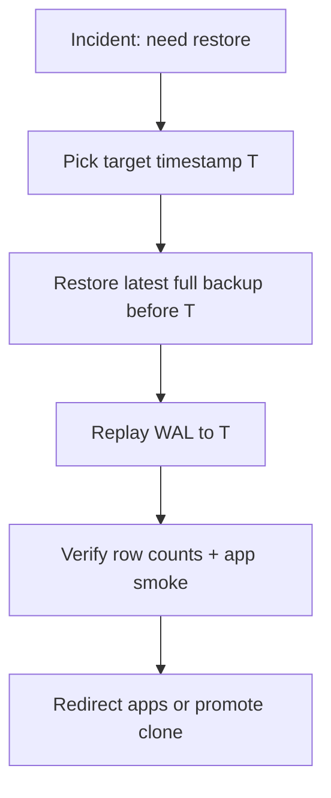

# Backup, Restore, and PITR

Operational PostgreSQL recovery — backups, WAL(Write-Ahead Log), point-in-time restore, and verification drills. Pair with org DR policy in [database-connection §12](../../database-connection-and-security/includes/12-credential-rotation-and-dr.md).

> **Related:** DR policy and RPO(Recovery Point Objective)/RTO(Recovery Time Objective) → [database-connection §12](../../database-connection-and-security/includes/12-credential-rotation-and-dr.md) · Migrations during restore → [§15 Schema migration checklist](15-schema-migration-checklist.md) · Multi-tenant slice restore → [§18](18-schema-and-database-per-tenant.md#tenant-restore-drills) · Runbook template → [RUNBOOK-TEMPLATE.md](../../RUNBOOK-TEMPLATE.md)

---

## At a glance

| Concept | Meaning |
|---------|---------|
| **Full backup** | Snapshot of data files at a point in time |
| **WAL / continuous archiving** | Log of changes since backup |
| **PITR** | Restore to any second within retention window |
| **RPO** | Max acceptable data loss (backup + WAL gap) |
| **RTO** | Max time to restore service |

**Rule of thumb:** Managed RDS / Cloud SQL(Structured Query Language) / Azure DB: enable automated backups + PITR; **still run quarterly restore drills** — [database-connection §12](../../database-connection-and-security/includes/12-credential-rotation-and-dr.md).

---

## What to enable (managed PostgreSQL)

| Setting | Typical value | Notes |
|---------|---------------|-------|
| Automated backups | Daily | Provider-managed snapshot |
| PITR retention | 7–35 days | Compliance-driven |
| WAL archiving | On (managed) | Required for PITR |
| Cross-region backup copy | Regulated workloads | DR region |

Self-hosted: `archive_mode = on`, `archive_command` to S3/GCS, base backups via `pg_basebackup` or volume snapshots.

---

## Restore flow (PITR)

| Step | Action |
|------|--------|
| 1 | Stop writes to affected DB (or fail over to standby) |
| 2 | Restore snapshot to staging clone |
| 3 | PITR to timestamp **before** bad migration or data event |
| 4 | Run verification queries (counts, checksums, sample orders) |
| 5 | Either promote clone or export repaired subset |

Document provider-specific CLI in your runbook — RDS `restore-db-instance-to-point-in-time`, Cloud SQL clone, etc.

---

## Logical vs physical backup

| Type | Tool | Use when |
|------|------|----------|
| **Physical** | Snapshot, `pg_basebackup` | Full instance PITR, DR |
| **Logical** | `pg_dump`, `pg_dumpall` | Single schema, cross-version migrate, dev seeds |

| | Physical | Logical |
|--|----------|---------|
| **PITR** | ✅ | ❌ (point snapshot only) |
| **Selective table** | Hard | `pg_dump -t` |
| **Restore speed** | Fast at scale | Slow for large DBs |

Bulk export patterns → [§12 Bulk operations](12-bulk-operations-and-concurrency.md).

---

## Verification checklist

- [ ] Automated backup job success alert (not only email on failure)
- [ ] Monthly restore to **staging** with app smoke test
- [ ] Quarterly PITR drill to specific timestamp
- [ ] Documented RPO/RTO vs actual restore time from last drill
- [ ] Runbook: who approves production cutover after restore
- [ ] After restore: `ANALYZE`; check replication if re-attaching replica

---

## Common mistakes

| Mistake | Fix |
|---------|-----|
| Backups enabled, never restored | Scheduled drill |
| PITR window shorter than deploy rollback need | Extend retention |
| Restore without `ANALYZE` | Planner stats stale → slow queries |
| Logical dump as sole DR strategy | Physical + WAL for production |

---

## Pros and cons

### Managed PITR

**Pros:** One-click restore; WAL handled by provider.

**Cons:** Cost scales with retention; cross-account restore needs planning.