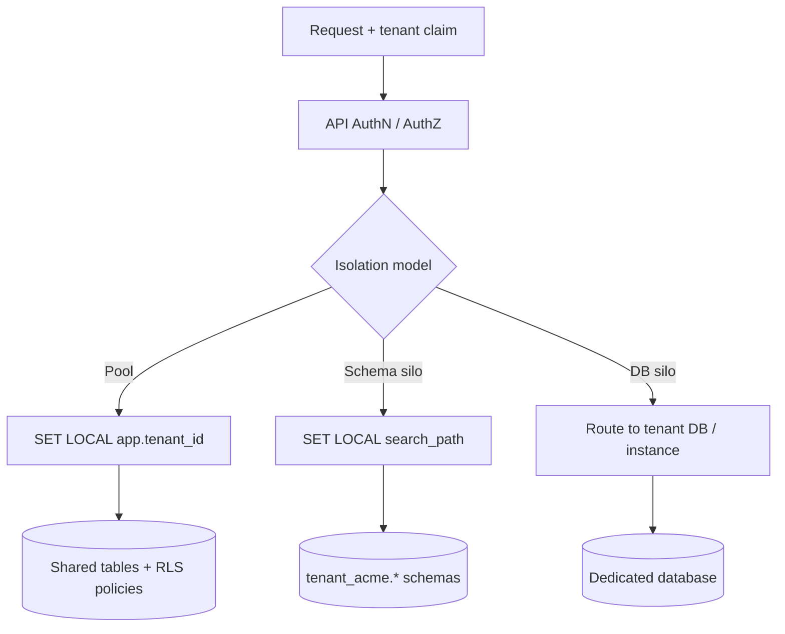

# Row-Level Security for Multi-Tenant Data

PostgreSQL **RLS(Row-Level Security)** adds a database-enforced filter on every row access. Use it as a **safety net** alongside application checks — not as the only AuthZ(Authorization) layer.

> **Scope:** **Shared-table (pool) isolation** — `tenant_id` + RLS mechanics. Product-level pool vs silo choice → [architecture-decisions §10](../../architecture-decisions/includes/10-multi-tenant-system-models.md). Schema/DB-per-tenant ops → [§18](18-schema-and-database-per-tenant.md).
>
> **Related:** Multi-tenant API(Application Programming Interface) patterns → [api-design §16](../../api-design-and-protection/includes/16-multi-tenant-apis.md) · Security barrier views → [§9 views](09-views-functions-and-scale-out-terminology.md#security-barrier-views) · Composite indexes → [§2 indexing](02-indexing.md) · Connection pooling → [§7](07-connection-management.md) · DB security checklist → [database-connection §2](../../database-connection-and-security/includes/02-prod-db-security.md)

---

## At a glance

| Step | Action |
|------|--------|
| 1 | Add `tenant_id` column + composite unique/FK constraints + indexes |
| 2 | `ALTER TABLE ... ENABLE ROW LEVEL SECURITY` |
| 3 | Create policies comparing `tenant_id` to session variable |
| 4 | App sets `SET LOCAL app.tenant_id = ...` at start of each transaction |
| 5 | Use non-superuser DB roles without `BYPASSRLS` in application paths |

**Rule of thumb:** RLS catches forgotten `WHERE tenant_id = ?` in ad-hoc queries and ORM bugs. It does **not** replace token validation, object ownership checks, or gateway AuthZ.

## Isolation models (visual)

Compare **pool + RLS** (this section) with silos ([§18](18-schema-and-database-per-tenant.md)) before you pick ops cost:



| Model | Boundary | Ops cost | Typical trigger |
|-------|----------|----------|-----------------|
| **Pool + RLS** | Row filter in shared schema | Lowest | Default multi-tenant SaaS(Software as a Service) |
| **Schema silo** | PostgreSQL schema | High (migration fan-out) | Soft compliance / customization |
| **DB silo** | Database or instance | Highest | Contract, residency, noisy neighbor |

Product-level choice → [architecture-decisions §10](../../architecture-decisions/includes/10-multi-tenant-system-models.md).

---

## Schema baseline

Every tenant-scoped table needs `tenant_id` on the row and indexes that lead with it:

```sql
CREATE TABLE orders (
  id          bigint GENERATED ALWAYS AS IDENTITY,
  tenant_id   uuid NOT NULL,
  status      text NOT NULL,
  created_at  timestamptz NOT NULL DEFAULT now(),
  PRIMARY KEY (tenant_id, id)
);

CREATE INDEX idx_orders_tenant_status_created
  ON orders (tenant_id, status, created_at DESC);
```

Child tables inherit tenant scope — either duplicate `tenant_id` on the child (simplest for RLS) or enforce via join in policy (harder to maintain). Prefer **denormalized `tenant_id` on every child row**.

---

## Composite keys and foreign keys

Put `tenant_id` in uniqueness and FK(Foreign Key) constraints so the schema cannot attach a child row to another tenant's parent:

```sql
CREATE TABLE order_items (
  id         bigint GENERATED ALWAYS AS IDENTITY,
  tenant_id  uuid NOT NULL,
  order_id   bigint NOT NULL,
  sku        text NOT NULL,
  PRIMARY KEY (tenant_id, id),
  UNIQUE (tenant_id, order_id, sku),
  FOREIGN KEY (tenant_id, order_id)
    REFERENCES orders (tenant_id, id)
);

CREATE INDEX idx_order_items_tenant_order
  ON order_items (tenant_id, order_id);
```

| Constraint | Why |
|------------|-----|
| **`PRIMARY KEY (tenant_id, id)`** | Natural tenant partition of the key space; matches RLS filter leading column |
| **`UNIQUE (tenant_id, …)`** | Business uniqueness is per tenant (email, SKU, slug) — not global |
| **Composite FK including `tenant_id`** | Blocks cross-tenant parent references even if app/RLS is buggy |
| **Index `(tenant_id, fk_col)`** | FK checks and child lookups stay cheap — [§4 schema](04-schema-design.md#foreign-keys) |

Global surrogate PKs (`id` alone) still work if every unique/FK that crosses tables also includes `tenant_id`. Pick one convention and stick to it in migrations.

---

## Shared vs tenant-scoped tables

Not every table is tenant data. Classify before enabling RLS:

| Kind | Examples | RLS? |
|------|----------|------|
| **Tenant-scoped** | orders, users, settings, audit events for a customer | Yes — standard policy |
| **Shared / platform** | feature catalog, pricing plans, geo seed data, schema migrations | Usually no — read-only for `app_api`, write via admin role |
| **Hybrid** | `tenant_features` (plan row + tenant override) | Tenant side RLS; platform catalog without |

```sql
-- Platform catalog: no RLS; grant SELECT only to app
CREATE TABLE plans (
  id   text PRIMARY KEY,
  name text NOT NULL
);
GRANT SELECT ON plans TO app_api;

-- Tenant override: RLS applies
CREATE TABLE tenant_plan (
  tenant_id uuid PRIMARY KEY,
  plan_id   text NOT NULL REFERENCES plans(id)
);
ALTER TABLE tenant_plan ENABLE ROW LEVEL SECURITY;
ALTER TABLE tenant_plan FORCE ROW LEVEL SECURITY;
```

Cross-tenant analytics and support tools need a **separate role** (often `BYPASSRLS` or a warehouse export) — never the request-path `app_api` role. See [When to skip shared-table RLS](#when-to-skip-shared-table-rls).

---

## Enable RLS and create policies

```sql
ALTER TABLE orders ENABLE ROW LEVEL SECURITY;
ALTER TABLE orders FORCE ROW LEVEL SECURITY;

CREATE POLICY orders_tenant_isolation ON orders
  USING (tenant_id = current_setting('app.tenant_id', true)::uuid)
  WITH CHECK (tenant_id = current_setting('app.tenant_id', true)::uuid);
```

| Clause | Purpose |
|--------|---------|
| `USING` | Filters rows on `SELECT`, `UPDATE`, `DELETE` |
| `WITH CHECK` | Validates rows on `INSERT`, `UPDATE` |
| `FORCE ROW LEVEL SECURITY` | Applies policies even to table owner (except superuser) |
| `current_setting(..., true)` | Returns NULL if unset — row invisible until tenant is set |

Repeat for each tenant-scoped table, or use a shared policy pattern via migration tooling.

---

## Set tenant context from the application

Set the session variable **once per request**, inside the **same transaction** as queries:

```sql
-- After validating JWT / API key tenant claim
-- is_local = true → SET LOCAL (transaction-scoped)
SELECT set_config('app.tenant_id', '550e8400-e29b-41d4-a716-446655440000', true);
```

```text
Request → validate token → derive tenant_id → BEGIN → SET LOCAL app.tenant_id → queries → COMMIT
```

| Language / layer | Pattern |
|------------------|---------|
| **Raw SQL(Structured Query Language)** | `SET LOCAL app.tenant_id = '...'` inside transaction |
| **Connection pool** | Prefer `SET LOCAL` so tenant clears on `COMMIT`/`ROLLBACK`; never reuse stale tenant |
| **ORM** | Middleware or `before_query` hook sets session variable **per transaction** |
| **Migrations / admin** | Separate role with `BYPASSRLS` or superuser — never in app runtime |

**Never** take `tenant_id` from the request body alone — bind from the authenticated token ([api-design §16](../../api-design-and-protection/includes/16-multi-tenant-apis.md)).

---

## PgBouncer and poolers

Transaction-mode poolers (common with PgBouncer) return the server connection after each transaction. Session `SET` (without `LOCAL`) can leak tenant context to the next client on that connection.

| Pooler mode | Tenant context rule |
|-------------|---------------------|
| **Transaction** (recommended for APIs) | Use `SET LOCAL` / `set_config(..., true)` inside the TX only — [§7 pooling modes](07-connection-management.md#pgbouncer-pooling-modes) |
| **Session** | `SET` survives for the client session; still reset on checkout/return as defense in depth |
| **Statement** | Unsafe for multi-statement tenant work — avoid |

```text
Bad:  SET app.tenant_id = '...'          -- session-level; survives checkout under session pooling
Good: SET LOCAL app.tenant_id = '...'    -- dies with the transaction
```

Also reset any app-level connection state on pool return. Pair with [database-connection §9](../../database-connection-and-security/includes/09-pgbouncer-proxy-password.md) for production PgBouncer layout.

---

## Roles and BYPASSRLS

| Role | Typical use | RLS |
|------|-------------|-----|
| **`app_api`** | Application queries | Policies enforced |
| **`app_readonly`** | Read replicas / reports | Policies enforced |
| **`app_migration`** | Schema migrations | Often `BYPASSRLS` or superuser — CI(Continuous Integration) only |
| **`postgres` superuser** | Break-glass admin | Bypasses RLS — never for app |

```sql
CREATE ROLE app_api LOGIN PASSWORD '...' NOSUPERUSER NOBYPASSRLS;
GRANT SELECT, INSERT, UPDATE, DELETE ON orders TO app_api;
```

Audit which roles have `BYPASSRLS` — see [database-connection §2](../../database-connection-and-security/includes/02-prod-db-security.md).

---

## Security barrier views (optional layer)

Views can centralize the tenant predicate for read paths:

```sql
CREATE VIEW tenant_orders
WITH (security_barrier) AS
SELECT * FROM orders
WHERE tenant_id = current_setting('app.tenant_id', true)::uuid;
```

`security_barrier` prevents the planner from pushing untrusted user filters below the tenant predicate. Full context → [§9 security barrier views](09-views-functions-and-scale-out-terminology.md#security-barrier-views).

RLS on base tables is still recommended when apps query tables directly.

---

## RLS vs application checks

| Layer | Strength | Weakness |
|-------|----------|----------|
| **Gateway / JWT(JSON Web Token)** | Stops unauthenticated cross-tenant calls | No row-level guarantee |
| **Application** | Object ownership, field-level AuthZ | Easy to miss one query |
| **RLS** | DB-wide default deny for wrong tenant | Policy drift; admin role mistakes |
| **Schema / DB per tenant** | Strongest isolation | Highest ops cost |

Use **JWT claim + app check + RLS** for shared-table B2B(Business-to-Business) SaaS(Software as a Service). Enterprise silos may drop shared RLS in favor of dedicated databases.

---

## RLS performance

RLS is a **per-row predicate** applied on every access. Keep policies simple and index-aligned.

| Concern | Guidance |
|---------|----------|
| **Policy shape** | Prefer `tenant_id = current_setting(...)::uuid` — avoid subqueries/joins in `USING` on hot tables |
| **Indexes** | Leading `tenant_id` on hot indexes so the planner can combine RLS with index scans — [§2](02-indexing.md) |
| **`EXPLAIN (ANALYZE, BUFFERS)`** | Confirm plans still use indexes after enabling RLS; watch for seq scans on large tables |
| **App `WHERE` still useful** | Explicit `WHERE tenant_id = $1` helps the planner and documents intent; RLS remains the safety net |
| **Security barrier views** | Extra planner guard for read paths; not a substitute for base-table RLS — [§9](09-views-functions-and-scale-out-terminology.md#security-barrier-views) |
| **Hot paths under extreme load** | Measure first; if policy overhead shows up, simplify policy / improve indexes before dropping RLS |

Do **not** disable RLS for speed without a measured plan and an alternate isolation model ([§18](18-schema-and-database-per-tenant.md) or dedicated DB).

---

## Testing RLS

```sql
BEGIN;
SELECT set_config('app.tenant_id', 'aaaaaaaa-aaaa-aaaa-aaaa-aaaaaaaaaaaa', true);
SELECT count(*) FROM orders;  -- only tenant A rows

SELECT set_config('app.tenant_id', 'bbbbbbbb-bbbb-bbbb-bbbb-bbbbbbbbbbbb', true);
SELECT count(*) FROM orders;  -- only tenant B rows
ROLLBACK;
```

Add integration tests that:

1. Set tenant A, insert row, verify visible under A
2. Switch to tenant B, verify row **not** visible
3. Attempt `INSERT` with wrong `tenant_id` — should fail `WITH CHECK`
4. Attempt child insert with parent from another tenant — should fail composite FK
5. Run a request under transaction-mode pooling twice on the same client — second request must not see the first tenant's rows

---

## Common mistakes

| Mistake | Problem | Fix |
|---------|---------|-----|
| RLS enabled but no policies | All rows hidden (or none, pre-policy) | Add explicit `USING` / `WITH CHECK` policies |
| App uses superuser or `BYPASSRLS` role | RLS never applies | Dedicated `app_api` role |
| Session `SET` under transaction pooling | Cross-tenant leak on connection reuse | `SET LOCAL` / `set_config(..., true)` inside TX |
| `tenant_id` only in app, not on child rows | Join leaks rows | Denormalize `tenant_id` or strict join policies |
| FK without `tenant_id` | Child can reference another tenant's parent | Composite FK `(tenant_id, parent_id)` |
| RLS replaces AuthZ review | BOLA(Broken Object-Level Authorization) within same tenant | Object ownership checks in app |
| Missing `(tenant_id, ...)` index | Seq scans under load | Composite indexes — [§2](02-indexing.md) |
| Complex policy with joins | Planner surprises; latency cliffs | Simple equality on `tenant_id`; measure with `EXPLAIN` |
| Background job without tenant context | Worker sees no rows or wrong rows | Set `app.tenant_id` per job from message metadata |
| RLS on platform catalog tables | App cannot read shared config | Classify shared vs tenant-scoped — [above](#shared-vs-tenant-scoped-tables) |

---

## When to skip shared-table RLS

| Situation | Approach |
|-----------|----------|
| Dedicated DB per enterprise customer | DB-level isolation; RLS optional — [§18](18-schema-and-database-per-tenant.md) |
| Schema-per-tenant | Schema boundary replaces shared-table RLS — [§18](18-schema-and-database-per-tenant.md) |
| Heavy cross-tenant analytics | Separate read role, warehouse, or materialized aggregates |
| Citus / sharded by tenant | Shard key replaces shared-table RLS pattern |

---

## See also

- [Schema and database per tenant](18-schema-and-database-per-tenant.md) — silo ops, `search_path`, migration fan-out
- [Multi-tenant system models](../../architecture-decisions/includes/10-multi-tenant-system-models.md) — pool vs silo decision
- [Multi-tenant APIs](../../api-design-and-protection/includes/16-multi-tenant-apis.md) — cache, queue, and API patterns
- [Indexing](02-indexing.md) — `(tenant_id, created_at DESC)` and partial indexes
- [Schema migration checklist](15-schema-migration-checklist.md) — `CREATE INDEX CONCURRENTLY` with tenant indexes
- [Connection management](07-connection-management.md) — PgBouncer modes
- [Read scaling and caching](11-read-scaling-and-caching.md) — replicas still need tenant scope in queries