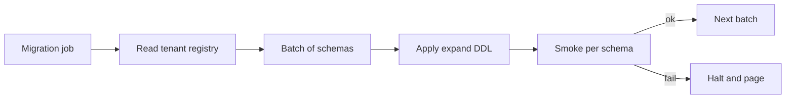
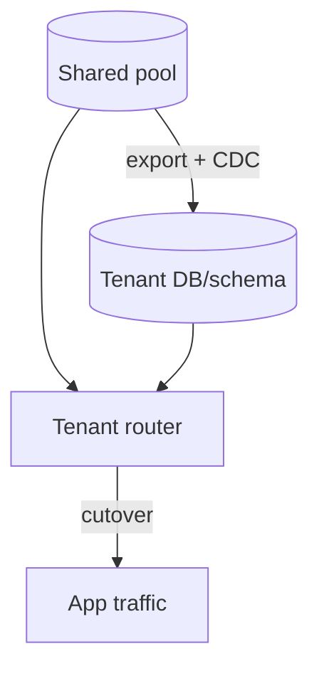

# Schema and Database per Tenant

Operational playbook for **schema-per-tenant** and **database-per-tenant** silos — when pooled RLS(Row-Level Security) is not enough.

> **Scope:** **Silo mechanics** (`search_path`, connection routing, migration fan-out, restore). Product-level tenancy choice → [architecture-decisions §10](../../architecture-decisions/includes/10-multi-tenant-system-models.md). Shared-table RLS → [§17](17-row-level-security-multi-tenant.md).
>
> **Related:** Migrations → [§15](15-schema-migration-checklist.md) · Backup/PITR(Point-in-Time Recovery) → [§16](16-backup-restore-and-pitr.md) · Pooling → [§7](07-connection-management.md) · API(Application Programming Interface) tenancy → [api-design §16](../../api-design-and-protection/includes/16-multi-tenant-apis.md)

---

## At a glance

| Model | Isolation boundary | Typical trigger |
|-------|--------------------|-----------------|
| **Schema per tenant** | PostgreSQL schema (`tenant_acme.orders`) | Mid-market customizations; softer compliance story than shared rows |
| **Database per tenant** | Separate database (often separate instance) | Enterprise contract, noisy neighbor, data residency cell |

**Rule of thumb:** Stay on **pool + RLS** ([§17](17-row-level-security-multi-tenant.md)) until a concrete driver (contract, residency, performance isolation) forces a silo. Schema-per-tenant looks cheap and often becomes the most expensive ops model.

## Request routing (visual)

```mermaid
sequenceDiagram
    participant C as Client
    participant API as API
    participant Reg as Tenant registry
    participant PG as PostgreSQL

    C->>API: Request + tenant context
    API->>Reg: Resolve isolation mode
    alt Pool + RLS
        API->>PG: BEGIN; SET LOCAL app.tenant_id
        API->>PG: SQL on shared tables
    else Schema silo
        API->>PG: BEGIN; SET LOCAL search_path TO tenant_x, public
        API->>PG: SQL resolves to tenant_x.*
    else Database silo
        API->>PG: Connect to tenant DB endpoint / pool
        API->>PG: SQL in that database
    end
    API-->>C: Response
```

Side-by-side model diagram → [§17 Isolation models](17-row-level-security-multi-tenant.md#isolation-models-visual).

---

## When to choose which

| Driver | Prefer |
|--------|--------|
| Thousands of small tenants | Pool + RLS — not schema-per-tenant |
| One large tenant starving shared CPU/IO | DB (or instance) silo for that tenant |
| Regulator / contract requires dedicated store | Database (or stack) silo |
| Per-tenant **schema drift** (custom columns) | Schema or DB silo — accept migration complexity |
| Many tenants needing only logical isolation | Pool + RLS |

Decision matrix and hybrid tiers → [architecture-decisions §10](../../architecture-decisions/includes/10-multi-tenant-system-models.md).

---

## Schema-per-tenant

```text
public.tenants          -- registry (which schema, status)
tenant_acme.orders
tenant_globex.orders
```

### Connection routing

| Approach | How | Risk |
|----------|-----|------|
| **`search_path` per request** | `SET LOCAL search_path TO tenant_acme, public` after auth | Forget `LOCAL` under poolers → cross-tenant schema leak |
| **Qualified names** | App always queries `tenant_acme.orders` | Verbose; easy to hardcode wrong schema |
| **One DB user per tenant** | `SET ROLE` / login role owns only that schema | Stronger; role sprawl at scale |

Prefer **`SET LOCAL search_path`** inside the request transaction (same pooler rules as RLS — [§17 PgBouncer](17-row-level-security-multi-tenant.md#pgbouncer-and-poolers)). Keep `public` for shared extensions and a small registry only.

```sql
BEGIN;
SELECT set_config('search_path', 'tenant_acme, public', true);
SELECT * FROM orders;  -- resolves to tenant_acme.orders
COMMIT;
```

### Provisioning

1. Insert registry row (`tenant_id`, `schema_name`, `status`)
2. `CREATE SCHEMA tenant_<slug> AUTHORIZATION app_api`
3. Run baseline DDL(Data Definition Language) into that schema (same migration pack as pool, applied to one schema)
4. Smoke-test connect + `search_path` + one write/read
5. Mark registry `active` and route traffic

### Migration fan-out

Every schema change is **N schemas**, not one:

| Pattern | Fit |
|---------|-----|
| **Expand/contract per schema** | Same [§15](15-schema-migration-checklist.md) rules; loop schemas in batches |
| **Version column on registry** | Track which tenants are on migration version `k` |
| **Canary schemas first** | Internal + one willing tenant before fleet |
| **Stop the line on failure** | Do not leave half the fleet on a bad DDL |



**Ops cost scales with tenant count.** Past a few hundred active schemas, prefer DB-per-tenant for the large ones and keep the long tail pooled — or avoid schema-per-tenant entirely.

### Schema drift

Custom columns per tenant fight a single product codebase.

| Approach | Guidance |
|----------|----------|
| **Discourage DDL drift** | Prefer JSONB extension fields or feature flags over per-tenant columns |
| **If drift exists** | Versioned “tenant extension” migrations owned by a platform team; never hand-edited prod schemas |
| **ORM** | One model pack; dynamic `search_path` — avoid generating a model per tenant |

---

## Database-per-tenant

```text
App → tenant router → db_acme | db_globex | db_pool (SMB long tail)
```

| Concern | Practice |
|---------|----------|
| **Routing** | Map `tenant_id` → connection string / pool name from a control-plane registry (not from the client) |
| **Credentials** | Per-DB secrets or IAM(Identity and Access Management) auth — [database-connection](../../database-connection-and-security/README.md) |
| **Pooling** | Separate PgBouncer pool (or entry) per database; size for that tenant’s concurrency — [§7](07-connection-management.md) |
| **Migrations** | Same fan-out discipline as schemas; often a job queue with concurrency limits |
| **Version skew** | Pin minimum schema version before app deploy; block tenants lagging too far behind |
| **Observability** | Tag metrics with `tenant_id` **and** `db_name`; watch cardinality |

Hybrid is normal: **pooled DB for SMB(Small and Medium Business)**, dedicated DBs for enterprise tier — [architecture-decisions §10](../../architecture-decisions/includes/10-multi-tenant-system-models.md).

---

## Pool → silo migration

Moving one tenant out of a shared database without dual-running forever:

| Phase | Actions |
|-------|---------|
| **1. Export** | Logical dump of tenant slice (`COPY`/`pg_dump` with `tenant_id` filter) or CDC(Change Data Capture) stream filtered by tenant |
| **2. Provision** | Create target schema or database; apply schema at current version |
| **3. Dual-run** | Replicate ongoing writes (trigger/CDC) until lag is near zero; reads still on pool |
| **4. Cutover** | Maintenance window or dual-write pause; flip router to silo; verify row counts + checksums |
| **5. Drain** | Keep pool rows read-only briefly; then delete or archive tenant slice from pool |
| **6. RLS/app** | Silos often drop shared RLS; keep app tenant checks; update backup/restore runbooks |



Record the move in an ADR — [architecture-decisions §5](../../architecture-decisions/includes/05-adrs-and-design-docs.md). Full product checklist → [architecture-decisions §10 migration](../../architecture-decisions/includes/10-multi-tenant-system-models.md#migration-between-models).

**Silo → pool** is rare; require customer consent, strong RLS, and a proven import path.

---

## Tenant restore drills

Isolation model dictates restore procedure — [§16 backup/PITR](16-backup-restore-and-pitr.md).

| Model | Restore one tenant without exposing others |
|-------|--------------------------------------------|
| **Pool + RLS** | Restore to a **staging clone**; `COPY`/logical export filtered by `tenant_id`; import into prod under change control — never restore whole prod PITR for one tenant’s mistake |
| **Schema per tenant** | Restore clone; copy one schema; or maintain per-schema logical dumps |
| **Database per tenant** | PITR or snapshot **that database only**; swap connection string after verify |

### Checklist

- [ ] Runbook names the isolation model and exact restore path per tier
- [ ] Quarterly drill: corrupt/delete a **non-prod** tenant slice and restore it
- [ ] Verify no other tenant’s data appears in the restored artifact
- [ ] Measure RTO(Recovery Time Objective) for “single large tenant” vs “full instance”
- [ ] Post-restore: `ANALYZE`; re-enable routing; confirm RLS/`search_path`/router config

Broader product restore expectations → [architecture-decisions §10](../../architecture-decisions/includes/10-multi-tenant-system-models.md#tenant-restore-drill).

---

## Common mistakes

| Mistake | Problem | Fix |
|---------|---------|-----|
| Schema-per-tenant for thousands of SMB tenants | Migration toil; connection/`search_path` bugs | Pool + RLS; silo only when needed |
| Session `SET search_path` under transaction pooling | Cross-tenant schema leak | `SET LOCAL` / `set_config(..., true)` |
| Hand-migrating one enterprise schema in prod | Drift from fleet; untested rollback | Same migration pack, fan-out job, version registry |
| App trusts client-supplied schema/DB name | Tenant escape | Router derives target from auth token + registry |
| Full-cluster PITR to fix one tenant | Blast radius; downtime for everyone | Slice restore / dedicated DB restore |
| No version skew policy | App deploy breaks lagging silos | Minimum schema version gate |

---

## Pros and cons

| Model | Pros | Cons |
|-------|------|------|
| **Schema per tenant** | Stronger than row filter; one PostgreSQL instance | Fan-out migrations; `search_path` footguns; poor at huge N |
| **Database per tenant** | Clear blast radius; independent PITR/scale | Cost; connection and secret sprawl; version skew |
| **Hybrid (pool + silo tier)** | Cost-efficient default + enterprise packaging | Two operational paths to test and document |

---

## See also

- [Row-level security](17-row-level-security-multi-tenant.md) — pooled default
- [Multi-tenant system models](../../architecture-decisions/includes/10-multi-tenant-system-models.md) — when to silo
- [Schema migration checklist](15-schema-migration-checklist.md) — expand/contract
- [Backup, restore, and PITR](16-backup-restore-and-pitr.md) — instance-level recovery
- [Dynamo-style multi-tenant](../../nosql-and-key-value-stores/includes/03-dynamo-style-multi-tenant.md) — key-level isolation contrast