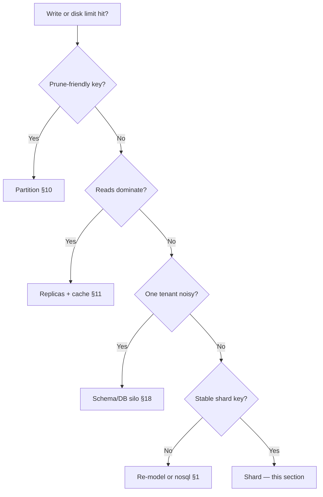

# Sharding and Resharding

**Sharding** splits one logical dataset across multiple PostgreSQL instances so **write throughput** and **storage** can scale beyond one node. It is expensive operationally — treat it as a **last resort** after partitioning, read replicas, connection pooling, and honest capacity math.

> **Scope:** When to shard vs partition/replica, shard key choice, Citus vs app-level routing, and resharding cutover. Terminology → [§9](09-views-functions-and-scale-out-terminology.md). Single-node splits → [§10](10-partitioning.md). Pool + RLS(Row-Level Security) → [§17](17-row-level-security-multi-tenant.md). Schema/DB silos → [§18](18-schema-and-database-per-tenant.md). Tenancy architecture → [architecture §10](../../architecture-decisions/includes/10-multi-tenant-system-models.md). When PG stops fitting → [nosql §1](../../nosql-and-key-value-stores/includes/01-when-to-choose.md).
>
> **Related:** Read scaling → [§11](11-read-scaling-and-caching.md) · Consistency costs → [§14](14-consistency-promises-and-costs.md) · Backup/PITR(Point-in-Time Recovery) per shard → [§16](16-backup-restore-and-pitr.md) · DR(Disaster Recovery) orchestration → [sre §12A](../../sre-and-incidents/includes/12A-disaster-recovery-playbook.md)

---

## At a glance

| Technique | Scales | Stays on one node? | Cross-shard queries |
|-----------|--------|--------------------|---------------------|
| **Partitioning** ([§10](10-partitioning.md)) | Maintenance, retention, prune | Yes | N/A |
| **Read replicas** ([§11](11-read-scaling-and-caching.md)) | Read QPS | Yes (writes) | N/A |
| **Schema/DB per tenant** ([§18](18-schema-and-database-per-tenant.md)) | Isolation | No (per tenant) | Rare |
| **Sharding** | Write + storage | No | Hard / avoided |

**Rule of thumb:** If most queries need **joins across tenants or arbitrary filters**, fix schema and indexes first. Sharding wins when **one dominant key** (tenant, user, order) owns almost all access paths.

---

## Decision ladder



| Signal | Prefer before sharding |
|--------|------------------------|
| Table bloat / slow vacuum | Partition by time — [§10](10-partitioning.md) |
| Read-heavy dashboards | Replicas, MVs, warehouse — [§11](11-read-scaling-and-caching.md) |
| One enterprise tenant | DB silo — [§18](18-schema-and-database-per-tenant.md) |
| Hot row on single entity | Queue, aggregate table, or domain split |

---

## Shard key choice

| Key | Good when | Bad when |
|-----|-----------|----------|
| **`tenant_id`** | B2B(Business-to-Business) SaaS(Software as a Service); queries scoped to tenant — [§17](17-row-level-security-multi-tenant.md) | Massive single tenant (celebrity shard) |
| **`user_id`** | Consumer social, per-user inbox | Cross-user admin reports |
| **`order_id` / time** | Append-only event log | Updates span shards |
| **Hash of id** | Even spread; no natural tenant | Range scans impossible |

**Requirements:** High cardinality, even distribution, and **queries that filter on the key**. Unique constraints and foreign keys must include the shard key or live inside one shard.

---

## Citus vs app-level routing

| | **Citus (extension)** | **App / proxy routing** |
|--|----------------------|-------------------------|
| **Routing** | Coordinator plans distributed SQL(Structured Query Language) | App picks shard from key |
| **Cross-shard SQL** | Possible; often slow | You avoid or fan-out explicitly |
| **Ops** | Cluster topology, rebalance jobs | Your router + per-shard pools — [§7](07-connection-management.md) |
| **Fit** | Mostly single-key queries; some distributed aggregates | Strict key-value access; full control |

Do not expect PostgreSQL sharding to behave like a warehouse. Cross-shard joins and global uniqueness without the shard key are **design smells**.

---

## Resharding and cutover

Resharding moves key ranges between nodes — plan as a **migration project**, not a config flip.

```mermaid
sequenceDiagram
    participant App as App
    participant Old as Old shard map
    participant New as New shard map
    participant DB as Shards

    Note over App,DB: Phase 1 — dual-write both maps
    App->>Old: Write (legacy routing)
    App->>New: Write (new routing)
    Note over App,DB: Phase 2 — backfill + verify counts
    Note over App,DB: Phase 3 — read new; stop dual-write
    App->>New: Read/write
```

| Phase | Action |
|-------|--------|
| **Design** | Target shard count; rehash or range split documented |
| **Dual-write** | Write to old and new placement; compare row counts |
| **Backfill** | Copy historical rows; verify checksums |
| **Read cutover** | Route reads to new map; monitor errors/lag |
| **Cleanup** | Drop dual-write; decommission old placement |

Use **expand/contract** discipline — [deployment §12](../../deployment-strategies/includes/12-schema-migrations-and-deploy.md). Freeze risky schema changes during cutover. Per-shard backup/restore drills — [§16](16-backup-restore-and-pitr.md).

---

## Multi-tenant interaction

| Model | Sharding note |
|-------|---------------|
| **Pool + RLS** ([§17](17-row-level-security-multi-tenant.md)) | Shard by `tenant_id`; RLS still valuable inside shard |
| **Cells** ([architecture §10A](../../architecture-decisions/includes/10A-regional-cells-and-residency.md)) | Shard within cell; do not cross region for one row |
| **DB per tenant** ([§18](18-schema-and-database-per-tenant.md)) | Already “sharded”; problem is **too many DBs** — consolidate tiers |

---

## Operational checklist

- [ ] Dominant queries documented with `EXPLAIN` on representative load
- [ ] Shard map versioned; app logs routing decision on errors
- [ ] Rebalance runbook; celebrity-tenant mitigation defined
- [ ] Cross-shard operations list (should be near empty)
- [ ] Resharding drill on staging with dual-write metrics

---

## Common mistakes

| Mistake | Fix |
|---------|-----|
| Shard before partitioning time-series | Range partition first — [§10](10-partitioning.md) |
| Global secondary index across shards | Denormalize or async index per access path |
| ORM hides shard key | Explicit tenant/user in every query |
| Reshard without dual-write | Data loss or long read-only window |
| Sharding when Dynamo/Cassandra fits | See [nosql §1](../../nosql-and-key-value-stores/includes/01-when-to-choose.md) |

---

## Pros and cons

**Pros:** Horizontal write scale; smaller working set per node; blast radius per shard.

**Cons:** No free joins; resharding projects; observability multiplied; ORM and migration tooling break assumptions.
