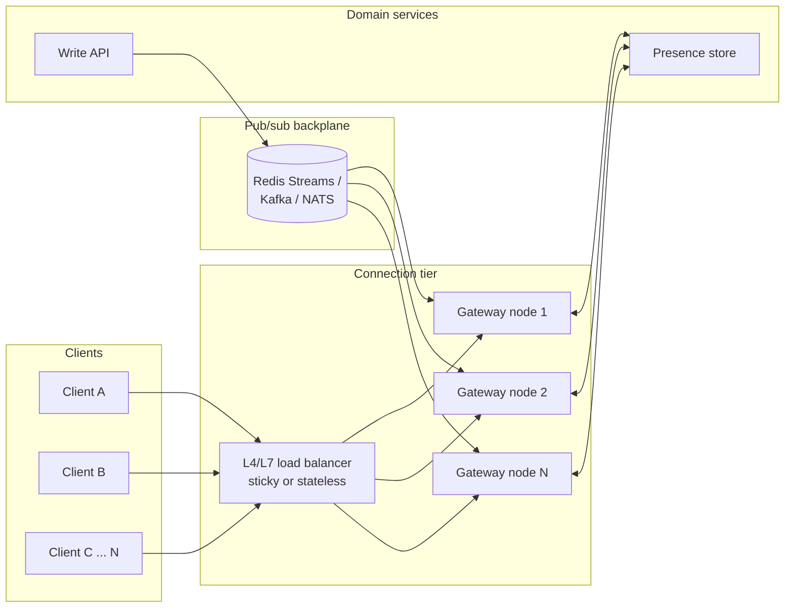

# Overview — Realtime at Scale

Realtime at scale is a **fan-out problem**: one write (a chat message, a cursor move, a price tick) must reach some fraction of millions of open connections in well under a second, without falling over when a single hot room or a single celebrity account gets 100x the traffic of everyone else.

**Rule of thumb:** Connection count and message fan-out are two different scaling problems. Solve "how many sockets can one box hold" (§1) before solving "how does one event reach all of them" (§2) — conflating the two is why realtime rewrites happen twice.

> **Related:**
> - Client transport choice and reconnect UX → [fullstack-bff-and-clients §5](../../fullstack-bff-and-clients/includes/05-realtime-ux.md)
> - HTTP(Hypertext Transfer Protocol) streaming/long-poll contract → [api-design-and-protection §10C](../../api-design-and-protection/includes/10C-async-streaming.md)
> - Broker throughput fundamentals → [high-throughput-systems §14](../../high-throughput-systems/includes/14-message-brokers-and-queues.md)
> - Capstone → [05-decision-guide.md](05-decision-guide.md)

---

## At a glance

| Layer | Job | Section |
|-------|-----|---------|
| **Connection tier** | Hold millions of long-lived sockets; authenticate; heartbeat | [§1](01-connection-fanout.md) |
| **Backplane** | Route one event to the connection(s) that need it, across boxes | [§2](02-pubsub-backplanes.md) |
| **Presence** | Track who is online/typing without a write per heartbeat | [§3](03-presence-and-typing.md) |
| **Conflict resolution** | Merge concurrent edits from multiple clients | [§4](04-crdt-and-ot.md) |

---

## Where realtime at scale sits

Every gateway node subscribes to the topics/channels its connected clients care about, and re-publishes inbound backplane events to only the sockets that are subscribed — the backplane is what lets any gateway node reach a client connected to *any other* node.

---

## Document map

| # | Topic | File |
|---|-------|------|
| 1 | Connection fan-out at scale | [01-connection-fanout.md](01-connection-fanout.md) |
| 2 | Pub/sub backplanes | [02-pubsub-backplanes.md](02-pubsub-backplanes.md) |
| 3 | Presence and typing indicators | [03-presence-and-typing.md](03-presence-and-typing.md) |
| 4 | CRDT(Conflict-free Replicated Data Type) and OT(Operational Transformation) for collaborative editing | [04-crdt-and-ot.md](04-crdt-and-ot.md) |
| 5 | Decision guide | [05-decision-guide.md](05-decision-guide.md) |

---

## Default stack (chat / notifications product)

1. Terminate WebSocket or SSE(Server-Sent Events) at a stateless gateway tier — [§1](01-connection-fanout.md)
2. Fan out through Redis Streams or Kafka depending on replay/ordering needs — [§2](02-pubsub-backplanes.md)
3. Track presence with TTL heartbeats, not per-event writes — [§3](03-presence-and-typing.md)
4. Add CRDT/OT only when two users can edit the *same* field concurrently — [§4](04-crdt-and-ot.md)
5. Confirm transport and reconnect UX with [fullstack §5](../../fullstack-bff-and-clients/includes/05-realtime-ux.md) before building custom protocol logic

---

## Common mistakes

| Mistake | Fix |
|---------|-----|
| Sticky sessions used as the *only* fan-out mechanism | Sticky sessions solve routing, not delivery — still need a backplane for cross-node fan-out |
| One giant Redis Pub/Sub channel for all rooms | Partition by room/tenant; Pub/Sub has no backpressure or replay |
| Building OT from scratch for a simple counter | Use a CRDT counter; reserve OT for text-heavy editors with existing libraries |
| No reconnect budget on the connection tier | Rolling deploys evict all sockets at once — stagger drains, jitter client reconnects |
| Treating presence as durable state | Presence is ephemeral; derive it from heartbeats with TTLs, don't write it like an order |