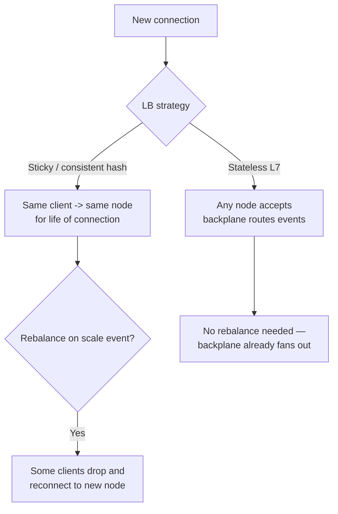
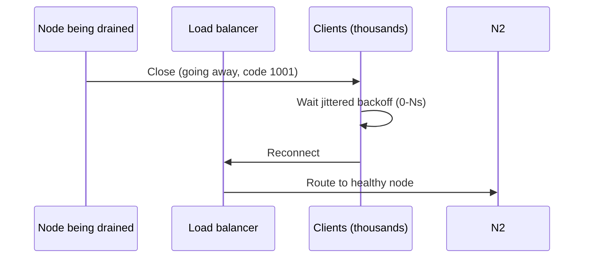

# Connection Fan-out at Scale

Holding millions of concurrent WebSocket (or SSE(Server-Sent Events)) connections open is a **memory and scheduler** problem before it is a networking problem. Get the connection tier's shape right first — everything else in this guide assumes it.

> **Scope:** **Server-side connection tier design** — how many sockets per box, how to load balance them, and how to survive a deploy. Client reconnect UX and backoff → [fullstack-bff-and-clients §5](../../fullstack-bff-and-clients/includes/05-realtime-ux.md).
>
> **Related:** Fan-out across nodes → [§2 Pub/sub backplanes](02-pubsub-backplanes.md) · Overload protection → [HTS §9](../../high-throughput-systems/includes/09-backpressure-and-limits.md) · Bulkheads → [resilience-patterns §4](../../resilience-patterns/includes/04-bulkheads.md)

---

## At a glance

| Concern | Typical answer |
|---------|-----------------|
| **Protocol** | WebSocket for bidirectional; SSE for server→client only |
| **Sockets per box** | 50k–250k depending on runtime, RAM, and per-connection buffer size |
| **Load balancing** | L4(Layer 4) sticky (consistent hash) or stateless L7(Layer 7) + shared backplane |
| **Auth** | Short-lived ticket at connect; re-validate on resume, not per message |
| **Heartbeat** | Application-level ping/pong; detect half-open sockets TCP(Transmission Control Protocol) won't |
| **Deploys** | Drain, don't kill — staggered connection close with client-side jittered reconnect |

**Rule of thumb:** Budget memory **per connection**, not per request. A WebSocket connection that sits idle for hours still holds a TCP socket, TLS(Transport Layer Security) session state, and application buffers — multiply by your peak concurrent count, not your request rate.

---

## Per-connection cost

| Cost | Driver | Mitigation |
|------|--------|------------|
| **Kernel socket + TLS session** | ~10–50 KB per connection | Terminate TLS at a proxy layer (envoy/nginx) in front of app processes if app-level TLS adds too much per-conn overhead |
| **Application buffers** | Read/write buffers, subscription set | Keep subscription lists small; use IDs/bitmaps not string sets |
| **Language runtime** | Thread-per-connection models don't scale past a few thousand | Use event-loop / async I/O runtimes (Node.js, Go goroutines with bounded pool, Netty, Elixir/BEAM) |
| **GC pauses** | Large per-connection object graphs | Keep hot-path state small and flat; move cold state to a store, not the connection object |

Thread-per-connection servers hit a wall in the low thousands because each OS thread reserves its own stack and the scheduler thrashes under context switches. Every mainstream realtime stack (Node.js, Go, Elixir/Phoenix, Netty/Vert.x) instead multiplexes many connections onto a small pool of OS threads via an event loop or lightweight (green) thread — that is what unlocks 100k+ sockets per box.

---

## Load balancing strategies

| Strategy | Pros | Cons |
|----------|------|------|
| **Sticky (consistent hash / IP hash)** | Simple; node "owns" its clients | Scaling the fleet reshuffles hash ring, drops connections; hot nodes if key distribution skews |
| **Stateless + backplane** | Any node can serve any client; trivial to scale in/out | Requires a working pub/sub backplane (§2) for *every* fan-out, even same-node |
| **Gateway registry (who's connected where)** | Enables direct point-to-point push, skip backplane for 1:1 | Extra moving part (a connection directory) to keep consistent |

Most systems at scale use **stateless connection nodes + backplane**, and add a lightweight **connection registry** (e.g. `user_id -> node_id` in Redis) only for point-to-point delivery paths where paying the pub/sub hop for a 1:1 message is wasteful.

---

## Heartbeats and half-open detection

TCP does not tell an application layer promptly when a peer disappears without a clean close (crashed client, network partition, sleeping mobile device). Without an application heartbeat, a connection tier accumulates "zombie" sockets that count against your concurrency budget but deliver nothing.

- Send an app-level ping every 20–30s; expect pong within a shorter window (e.g. 10s) or close.
- On mobile, back off heartbeat frequency in the background to save battery — but shorten the client's assumed "still live" window accordingly.
- Track **zombie ratio** (sockets closed by heartbeat timeout vs clean close) as a health signal — a spike usually means a network change (carrier NAT(Network Address Translation) timeout, VPN flap) upstream of your service.

---

## Deploys and reconnect storms

Rolling a connection-tier deploy closes every socket on the node being replaced. If every client reconnects immediately, the next node (or the load balancer) sees a spike proportional to sockets-per-node — repeated across every node in the rollout.

- **Server side:** send a "going away" close frame before killing the process; drain over tens of seconds, not instantly — see [deployment-strategies](../../deployment-strategies/README.md).
- **Client side:** jittered exponential backoff on reconnect (this is the fullstack-owned half — see [fullstack §5](../../fullstack-bff-and-clients/includes/05-realtime-ux.md)).
- **Capacity headroom:** keep enough spare capacity on remaining nodes to absorb one node's worth of reconnects during a rolling deploy.
- **Rate-limit accepts** on the load balancer/gateway during a mass-reconnect event so the connection tier fails closed on *new* connections before it falls over entirely — see [HTS §9 backpressure](../../high-throughput-systems/includes/09-backpressure-and-limits.md).

---

## Common mistakes

| Mistake | Fix |
|---------|-----|
| Thread-per-connection runtime past a few thousand sockets | Event-loop / lightweight-thread runtime |
| No heartbeat — relying on TCP keepalive alone | App-level ping/pong with a short dead-peer window |
| Hard-killing nodes on deploy | Graceful close frame + staggered drain |
| Sticky LB with no rebalance plan | Either accept drop-and-reconnect on scale events, or go stateless + backplane |
| Counting "requests per second" instead of "concurrent connections" in capacity planning | Budget per-connection memory against peak concurrency |
| Per-message auth re-check hitting a shared DB | Cache identity/AuthZ(Authorization) decision on the connection object; re-validate on token refresh only |