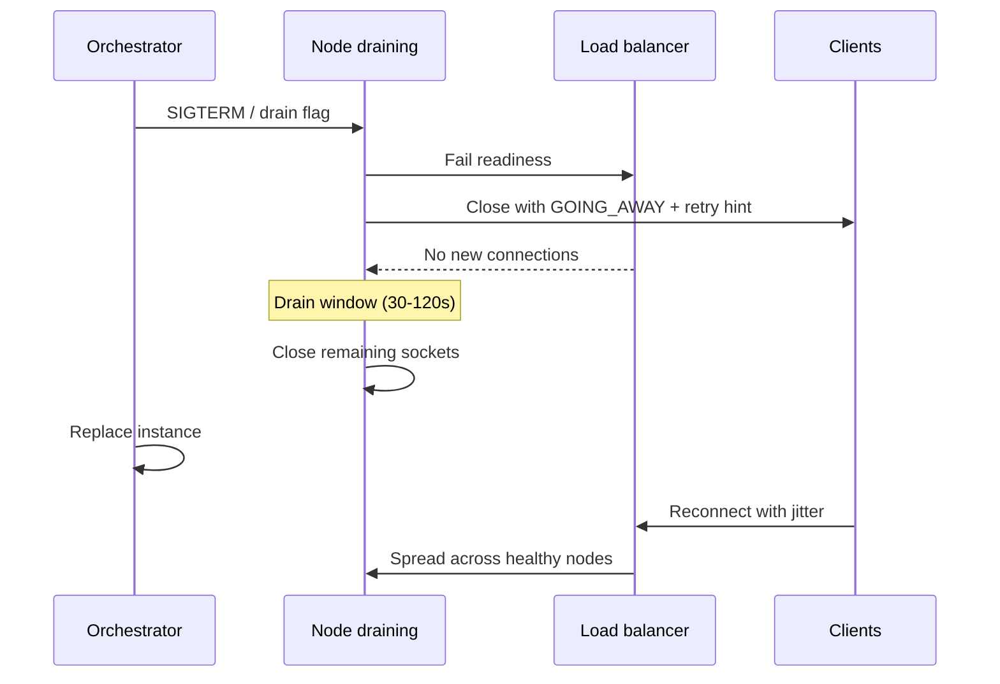

# Reconnect Storms and Drain

Deploying or draining connection tiers without client cooperation causes **reconnect storms**: synchronized retries that overload DNS(Domain Name System), load balancers, and auth — undoing the deploy you just shipped. Connection fan-out basics — [§1](01-connection-fanout.md) — assume graceful drain; this section operationalizes drain, jitter, and storm protection with [resilience §14](../../resilience-patterns/includes/14-graceful-shutdown-and-drain.md) and deployment practice.

> **Scope:** Server-side drain, client reconnect backoff, and deploy sequencing for WebSocket/SSE(Server-Sent Events) tiers. Connection math → [§1](01-connection-fanout.md). Graceful shutdown → [resilience §14](../../resilience-patterns/includes/14-graceful-shutdown-and-drain.md).
>
> **Related:** [§1 Connection fan-out](01-connection-fanout.md) · [resilience §14 Graceful shutdown](../../resilience-patterns/includes/14-graceful-shutdown-and-drain.md) · Client UX → [fullstack §5](../../fullstack-bff-and-clients/includes/05-realtime-ux.md) · Progressive deploy → [deployment §10](../../deployment-strategies/includes/10-progressive-delivery.md)

---

## At a glance

| Concern | Default |
|---------|---------|
| **Drain signal** | Server `GOING_AWAY` / close frame before process exit |
| **Drain window** | Long enough for LB(Load Balancer) to stop new connects |
| **Client backoff** | Full jitter exponential; cap max delay |
| **Auth at reconnect** | Short-lived connect ticket; avoid hammering IdP(Identity Provider) |
| **Deploy shape** | Staggered %; never 100% connection tier at once |
| **Storm guard** | Rate limit handshakes; priority queue for existing users |

**Rule of thumb:** Treat reconnect traffic like a **load test you didn’t schedule** — design for it on every connection-tier deploy.

---

## Deploy drain sequence

Align process drain with [resilience §14](../../resilience-patterns/includes/14-graceful-shutdown-and-drain.md) — readiness fail before socket kill.

---

## Client reconnect contract

Document in [fullstack §5](../../fullstack-bff-and-clients/includes/05-realtime-ux.md):

| Parameter | Guidance |
|-----------|----------|
| Initial delay | 1–2s + random jitter |
| Multiplier | 2x exponential |
| Max delay | 30–60s cap |
| Reset | Reset backoff after stable session > N minutes |
| Resume | Pass last event ID / cursor when protocol supports |

**Thundering herd:** synchronize jitter per device, not globally — global timers recreate the storm.

---

## Server-side storm controls

| Control | Purpose |
|---------|---------|
| **Handshake rate limit** | Protect CPU/TLS(Transport Layer Security) on edge |
| **Token bucket per IP/device** | Slow abusive reconnect loops |
| **Separate auth tier scaling** | IdP not on connection box — [§1](01-connection-fanout.md) |
| **Progressive deploy** | Limit simultaneous draining nodes — [deployment §10](../../deployment-strategies/includes/10-progressive-delivery.md) |
| **Synthetic reconnect test** | Pre-release load with forced mass disconnect |

---

## When storms still happen

| Symptom | Mitigation |
|---------|------------|
| DNS flapping | Low TTL(Time To Live) only at connection subdomain; stable apex |
| LB stampede | Consistent hash + adequate warm pool |
| Auth 429s | Cache connect tickets; scale IdP read path |
| Backplane overload | Shed non-critical channels first — [§2](02-pubsub-backplanes.md) |

Run **game days** that kill 30% of connection nodes during peak — [SRE §9](../../sre-and-incidents/includes/09-game-days-and-drills.md).

---

## Common mistakes

| Mistake | Fix |
|---------|-----|
| Kill -9 without drain | Grace period + GOING_AWAY — [§14](../../resilience-patterns/includes/14-graceful-shutdown-and-drain.md) |
| Fixed 1s reconnect interval | Full jitter exponential |
| Full connection tier replace | Rolling with max unavailable cap |
| Re-auth full OAuth(Open Authorization) on every reconnect | Short-lived connect ticket |
| No load test for mass disconnect | Synthetic storm in CI(Continuous Integration) or staging |
| Ignore mobile background retry | OS-level retry policies — [fullstack §5](../../fullstack-bff-and-clients/includes/05-realtime-ux.md) |
