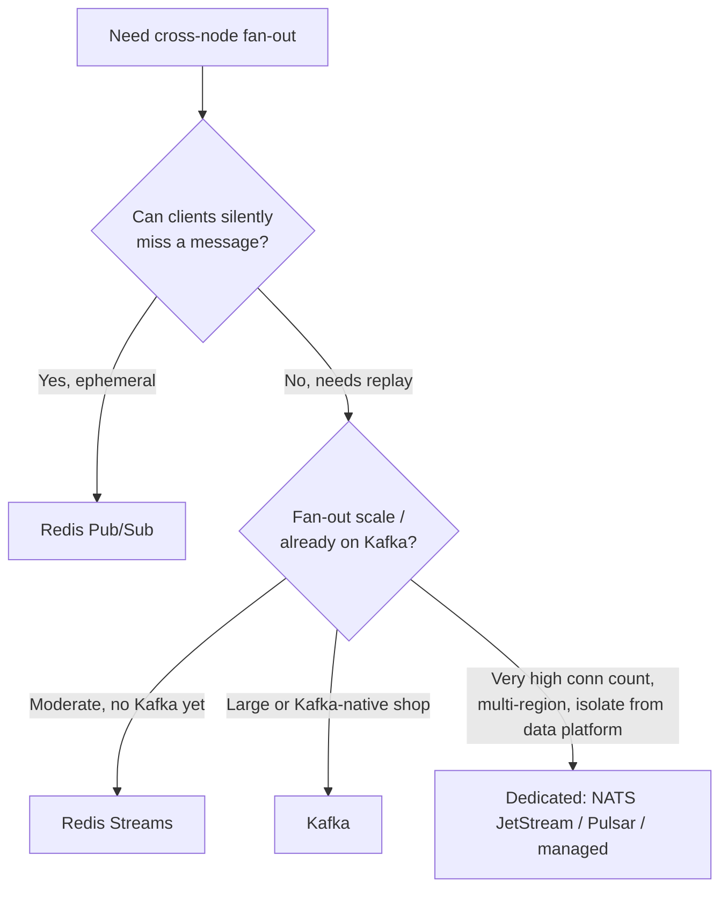

# Pub/Sub Backplanes

The backplane is what lets an event published on one connection-tier node reach a client socket held open on a different node. Pick it based on **replay, ordering, and fan-out shape** — not familiarity.

> **Related:** Connection tier → [§1](01-connection-fanout.md) · Kafka internals → [apache-kafka](../../apache-kafka/README.md) · Redis roles beyond pub/sub → [data-platforms §3](../../data-platforms/includes/03-redis-and-in-memory.md) · Delivery semantics → [resilience-patterns §8](../../resilience-patterns/includes/08-delivery-semantics.md)

---

## At a glance

| Backplane | Persistence | Ordering | Replay | Best fit |
|-----------|-------------|----------|--------|----------|
| **Redis Pub/Sub** | None — fire-and-forget | Per-connection FIFO(First In, First Out), best-effort | No | Ephemeral fan-out (presence pings, cursor moves) where a missed message is fine |
| **Redis Streams** | Bounded log, consumer groups | Per-stream order | Yes, within retention | Rooms/channels needing "catch up since last seen" without full Kafka ops cost |
| **Kafka** | Durable log, long retention | Per-partition order | Yes, full history | High fan-out with audit/replay needs, or already-adopted Kafka platform |
| **Dedicated (NATS, Pulsar, managed realtime)** | Varies (NATS core = none, JetStream = yes) | Per-subject/partition | Depends on tier | Very high connection counts, multi-region fan-out, or when you want the realtime layer fully decoupled from your data-platform Kafka cluster |

**Rule of thumb:** If a client that reconnects after 30 seconds must **not** miss messages, you need a backplane with replay (Streams, Kafka, JetStream) — Redis Pub/Sub alone cannot give you that.

---

## Decision flow

---

## Redis Pub/Sub

Simplest option: `PUBLISH channel message`, subscribers get it if and only if they are connected **right now**. No storage, no backpressure, no consumer groups.

- Good for: presence heartbeats, cursor positions, typing indicators — state where the *next* update supersedes a missed one.
- Bad for: chat history, notifications, anything a reconnecting client must not lose.
- **Fan-out cost is O(subscribers)** per publish inside Redis — a single very hot channel (e.g. one viral livestream room) can dominate a shared Redis instance's CPU. Shard hot channels across multiple Redis nodes by room ID.

## Redis Streams

Adds an append-only log per stream key, consumer groups, and `XREADGROUP` semantics (at-least-once, ack-based).

- Each gateway node runs a consumer group member per stream/room it has active subscribers for.
- Clients that reconnect can resume from their last-seen `entry-id` — the fix for Pub/Sub's "you missed it" problem.
- Set `MAXLEN`/time-based trimming; Streams are not meant as unbounded history — pair with a durable store (Kafka, or the domain database) for anything beyond a short catch-up window.
- Operationally lighter than Kafka: no separate cluster, reuse existing Redis investment — but scales to one Redis deployment's ceiling, not Kafka's partition-parallelism ceiling.

## Kafka

Full durable log with partitions, consumer groups, and long retention — see [apache-kafka](../../apache-kafka/README.md) for internals.

- Partition by room/tenant ID so ordering is preserved per room while different rooms fan out in parallel across partitions.
- Natural fit when the realtime feed **is** a projection of an existing event-sourced/Kafka-backed domain — see [event-sourcing-and-cqrs §5](../../event-sourcing-and-cqrs/includes/05-async-integration.md).
- Consumer lag becomes your fan-out latency metric — a gateway node that falls behind on its partition delays every client connected to it. Alert on per-partition consumer lag, not just cluster health.
- Heavier operationally than Redis for a team without existing Kafka expertise — see [apache-kafka §9 cluster setup](../../apache-kafka/includes/09-cluster-setup-and-requirements.md) before committing.

## Dedicated backplanes (NATS, Pulsar, managed realtime)

- **NATS core** behaves like Redis Pub/Sub (no persistence); **NATS JetStream** adds a persistent log similar in spirit to Streams/Kafka but purpose-built for very high subject-fan-out counts and multi-region clustering.
- **Pulsar** separates the broker (stateless) from storage (BookKeeper), which scales fan-out and storage independently — attractive when connection counts are extreme and multi-tenant isolation between rooms matters.
- **Managed realtime platforms** (e.g. Ably, PubNub, Pusher) trade control and cost for offloading the entire connection tier and backplane — evaluate against [finops-and-cost](../../finops-and-cost/README.md) build-vs-buy analysis; this guide covers the architecture you're buying or replacing, not vendor feature comparisons.
- Reach for a dedicated backplane when the realtime workload's scale or isolation needs would otherwise force you to over-provision your primary Redis or Kafka cluster for a workload with very different access patterns (millions of tiny messages vs your domain's larger, less frequent events).

---

## Partitioning and hot channels

Every backplane above shares one failure mode: **one abnormally hot room/channel** (breaking news, a viral stream, a company-wide announcement) can starve everyone else sharing its shard.

| Mitigation | How |
|------------|-----|
| **Partition/shard by room ID** | Hash room ID to a shard; hot room only saturates its own shard |
| **Fan-out ceiling per room** | Cap subscriber-side delivery rate; coalesce rapid updates (e.g. cursor moves) before publish |
| **Dedicated shard for known-hot rooms** | Detect and re-route (e.g. official/verified accounts) to isolated infrastructure |
| **Backpressure at the gateway** | Drop or coalesce to slow clients rather than let one slow reader block a fan-out loop — see [HTS §9](../../high-throughput-systems/includes/09-backpressure-and-limits.md) |

---

## Common mistakes

| Mistake | Fix |
|---------|-----|
| Using bare Redis Pub/Sub for anything that must not be lost | Redis Streams, Kafka, or JetStream |
| One Redis instance for both rate limiting/caching and realtime fan-out with no isolation | Bulkhead: dedicated Redis (or cluster) for the realtime backplane |
| No plan for a viral/hot room | Partition by room; cap fan-out rate; coalesce |
| Treating Kafka consumer lag as a batch-pipeline metric only | Alert on it as user-facing latency for realtime consumers |
| Unbounded Redis Streams | Set `MAXLEN`/TTL(Time To Live) trimming |

## Pros and cons

| | Redis Pub/Sub | Redis Streams | Kafka | Dedicated (NATS/Pulsar/managed) |
|--|---------------|----------------|-------|----------------------------------|
| **Pros** | Simplest, lowest latency | Replay, reuses Redis ops | Durable, huge scale, unifies with data platform | Purpose-built for connection-scale fan-out |
| **Cons** | No replay, no backpressure | Bounded by one Redis deployment | Heaviest ops cost | New platform/vendor to operate or pay for |