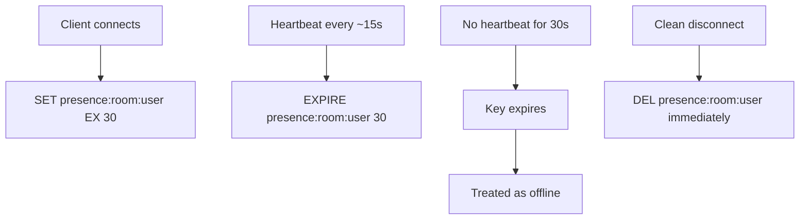

# Presence and Typing Indicators

Presence ("who's online", "who's in this room", "who's typing") looks like a simple boolean but is one of the most abused write paths in realtime systems — done naively, it generates more load than the actual chat messages it sits beside.

> **Related:** Backplane choice → [§2](02-pubsub-backplanes.md) · Connection tier → [§1](01-connection-fanout.md) · Client presence UX → [fullstack-bff-and-clients §5](../../fullstack-bff-and-clients/includes/05-realtime-ux.md)

---

## At a glance

| Signal | Durability | Mechanism |
|--------|------------|-----------|
| **Online/offline** | Ephemeral, derived | TTL(Time To Live) key per connection; expire = offline |
| **Away/idle** | Ephemeral, derived | Last-activity timestamp compared against a threshold, computed on read |
| **Typing indicator** | Ephemeral, fire-and-forget | Pub/sub event with a client-side auto-expire (no ack needed) |
| **"Last seen"** | Durable, low write rate | Written on disconnect / periodic flush, not per heartbeat |

**Rule of thumb:** Presence state should be **derived from TTLs, not written like a domain record.** If your presence write rate scales with connection count × heartbeat frequency, you're generating a self-inflicted DDoS(Distributed Denial of Service) on your own store.

---

## TTL-based online/offline

- Store presence keys in Redis (or an equivalent in-memory store) with a short TTL, refreshed on each heartbeat.
- On **clean disconnect**, delete the key immediately rather than waiting for TTL expiry — this is the difference between "offline in 1s" and "offline in up to 30s".
- On **unclean disconnect** (crash, network drop), the TTL expiry is your only signal — this is why the connection tier's heartbeat interval (§1) directly sets your worst-case presence staleness.
- **Never** poll a database for presence on every page view at scale — subscribe to presence *change* events instead (see below) and let the client render the last known state optimistically.

## Multi-device aggregation

A user online on phone and laptop simultaneously should show as one "online" state, not flicker between online/offline as each device's heartbeat lands at different times.

| Approach | How |
|----------|-----|
| **Per-device keys, aggregate on read** | `presence:user:{deviceId}` keys; user is "online" if any key exists — cheap, most common |
| **Reference-counted presence** | Increment on connect, decrement on disconnect/expiry; online while count > 0 |
| **CRDT(Conflict-free Replicated Data Type) set of active devices** | Overkill for presence; reserve CRDTs for §4's collaborative-editing problem |

Prefer **per-device keys aggregated on read** — it is simple, naturally self-heals via TTL, and avoids the coordination CRDTs are built for but presence doesn't need.

## Fan-out: only tell who cares

Presence changes should **not** broadcast to every connected client — a 10,000-person room does not need 10,000 × 10,000 presence events per state change.

- Publish presence deltas to a per-room channel; only clients subscribed to that room's roster receive them (reuse the backplane from §2).
- For very large rooms, batch presence into periodic roster snapshots (e.g. every few seconds) instead of per-user delta events — trade a little staleness for a large reduction in event volume.
- Client renders an optimistic "you are online" immediately on connect; don't block UI on a presence round-trip.

## Typing indicators

Typing indicators are the purest case of "correctness doesn't matter, only recency does":

- Client sends a `typing` event on keypress, **debounced/throttled** (e.g. at most once every 2–3s while actively typing).
- Server fans it out via Redis Pub/Sub (§2) — no persistence, no replay needed. A missed "stopped typing" event just times out client-side.
- Client-side: show the indicator, then auto-clear it after a short timeout (e.g. 5s) even if no explicit "stopped typing" event arrives — never trust an unbounded on/off signal for a UX affordance this disposable.
- Do **not** run typing events through a durable backplane (Streams/Kafka) — the ops cost and latency are unjustified for state nobody needs to replay.

---

## Common mistakes

| Mistake | Fix |
|---------|-----|
| Writing presence to the primary domain database per heartbeat | Ephemeral store (Redis) with TTLs |
| Broadcasting every presence change to every client in a large room | Scope fan-out to subscribers of that room; batch for very large rooms |
| Typing indicators sent through a durable, ordered backplane | Fire-and-forget Pub/Sub; client-side auto-expire |
| No client-side timeout on typing indicator | Auto-clear after a few seconds regardless of "stopped" event |
| Flickering online/offline across a user's multiple devices | Aggregate presence per-user across per-device keys |
| Treating TTL expiry latency as instant | Document worst-case staleness = heartbeat interval + TTL grace |