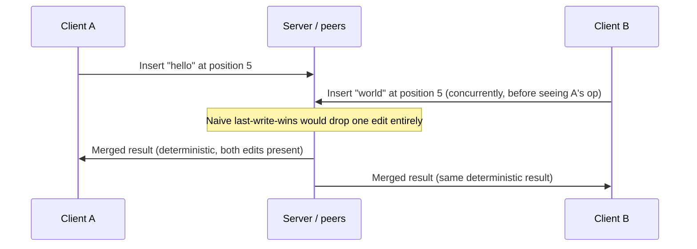
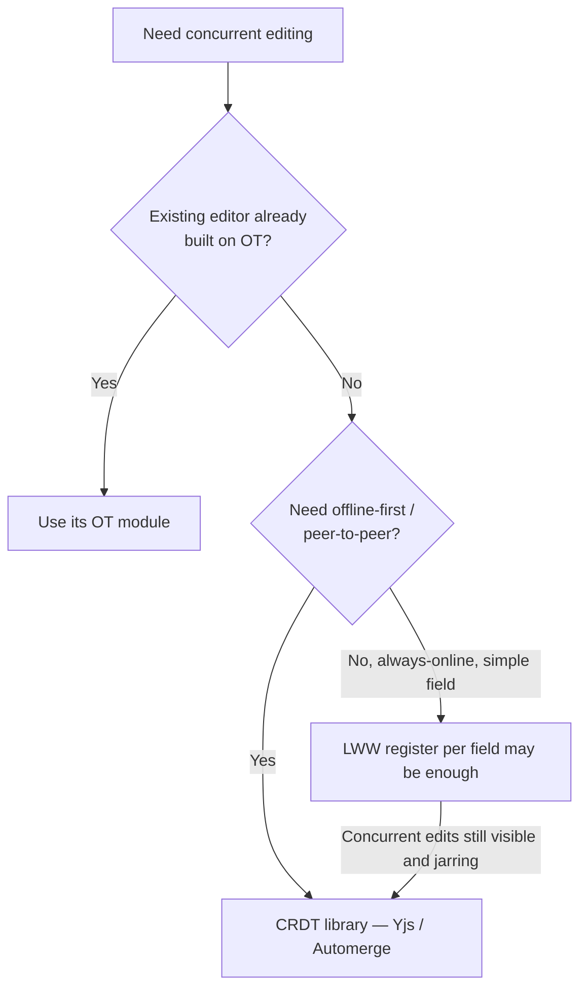

# CRDT and OT for Collaborative Editing

When two or more clients can edit the **same field or document concurrently**, you need a conflict-resolution strategy stronger than last-write-wins on a whole record. The two dominant approaches are CRDT(Conflict-free Replicated Data Type) and OT(Operational Transformation).

> **Related:** Backplane delivery of ops → [§2](02-pubsub-backplanes.md) · Treating ops as an append-only log → [event-sourcing-and-cqrs §1](../../event-sourcing-and-cqrs/includes/01-core-concepts.md) · Saga-style multi-step coordination is a different problem — see [event-sourcing-and-cqrs §7](../../event-sourcing-and-cqrs/includes/07-sagas-and-distributed-workflows.md) if you're tempted to reach for it here

---

## At a glance

| | CRDT | OT |
|--|------|-----|
| **Coordination** | None required — merge is mathematically well-defined | Requires a central server (or agreed sequencing) to transform concurrent ops against each other |
| **Offline support** | Excellent — merge whenever peers reconnect, in any order | Weak — ops must be transformed against a known, ordered history |
| **Peer-to-peer** | Natural fit | Needs a central sequencer in practice |
| **Maturity / libraries** | Yjs, Automerge, Redis CRDTs | ShareDB, Google Docs' internal OT, ProseMirror collab (OT-based) |
| **Text editing cost** | Larger per-op/metadata overhead (tombstones, unique IDs per character or block) | Smaller wire format; well-understood for rich text |
| **Failure mode** | Can grow storage (tombstones) if not garbage-collected | A single bad transform bug corrupts all subsequent history |

**Rule of thumb:** Default to a **CRDT library** (Yjs or Automerge) for new collaborative editing features — it removes an entire class of server-sequencing bugs and gives you offline-first for free. Reach for OT only when integrating with an existing OT-based ecosystem (e.g. an editor already built on ProseMirror collab).

---

## The problem both solve

Both clients edited "at position 5" without knowing about each other's change. A record-level last-write-wins would silently discard one user's edit. CRDTs and OT both guarantee that concurrent edits converge to the **same final state on every replica**, without losing either edit — they differ in *how* they get there.

---

## CRDT: merge without coordination

A CRDT is a data structure with a merge function that is commutative, associative, and idempotent — apply operations in any order, any number of times, and every replica converges to the same state.

| CRDT type | Use case |
|-----------|----------|
| **G-Counter / PN-Counter** | Like counts, view counts — increment/decrement from any replica |
| **LWW(Last-Write-Wins) Register** | Single-value fields (a title, a status) where "most recent wins" is an acceptable policy |
| **OR-Set(Observed-Remove Set)** | Tags, reactions, participant lists — add/remove without conflicts |
| **Sequence CRDT (RGA, Yjs's structure)** | Rich text — each character/block gets a unique, position-stable ID so concurrent inserts interleave deterministically |

- CRDTs need **no central server** to resolve conflicts — any two replicas that have seen the same set of ops (in any order) converge. This is what makes them work offline: a client can edit for hours disconnected, then merge on reconnect.
- The cost is **metadata**: sequence CRDTs for text keep per-character or per-block identifiers and tombstones for deleted content. Libraries like Yjs and Automerge implement compaction/garbage collection to keep this bounded — don't hand-roll a text CRDT from scratch.
- A server or backplane is still useful for **relay and persistence** (broadcast ops to other peers, snapshot state) — it just isn't required to *resolve* conflicts the way an OT server is.

## OT: transform against history

Operational Transformation keeps a sequenced, agreed history of operations. When a client's operation arrives that was authored against an older document version, the server (or peers) **transform** it — adjust its position/content — against the operations that happened in between, then apply and broadcast the transformed op.

- Requires a component that knows the **canonical order** of operations — historically a central server (Google Docs, Etherpad); some libraries support peer-to-peer OT but it's harder to get right.
- Transform functions are notoriously easy to get subtly wrong for anything beyond plain text — every operation type pair needs a correct transform, and bugs compound silently over a long document history.
- Well-suited to editors already built around it (e.g. ProseMirror's collab module) where switching to a CRDT would mean a rewrite, not a library swap.

---

## Choosing

| Scenario | Recommendation |
|----------|-----------------|
| New rich-text collaborative editor | CRDT (Yjs/Automerge) |
| Existing ProseMirror/Quill app already on OT | Stay on OT unless offline support is now required |
| Shared counters, tags, reaction lists | Small purpose-built CRDTs (counters, OR-sets) — don't pull in a full text-CRDT library |
| Single-owner form field, rare concurrent edits | Plain LWW with a version/`updated_at` check; full CRDT is overkill |
| Whiteboard / canvas with shapes | CRDT per-object (each shape is its own LWW/OR-Set entry) rather than one CRDT for the whole canvas |

---

## Delivery and persistence

- Broadcast ops (CRDT updates or OT operations) through the pub/sub backplane from [§2](02-pubsub-backplanes.md) — pick a backplane with replay if clients must catch up on reconnect (Streams/Kafka), not bare Pub/Sub.
- Persist periodic **snapshots** of merged document state, not just the raw op log, so cold loads don't replay the full history — this mirrors [event-sourcing-and-cqrs](../../event-sourcing-and-cqrs/README.md) snapshotting for the same reason.
- Garbage-collect CRDT tombstones once you're confident no replica still holds pre-merge state (all active sessions have synced past that point).

---

## Common mistakes

| Mistake | Fix |
|---------|-----|
| Hand-rolling a text CRDT or OT transform function | Use Yjs, Automerge, or an established OT library |
| Using record-level last-write-wins for concurrent rich-text edits | CRDT sequence type or OT |
| No snapshotting — replaying full op history on every load | Periodic snapshots + tail of recent ops |
| Never garbage-collecting CRDT tombstones | Compact once all replicas have synced past a point |
| Reaching for a full CRDT library for a single boolean/status field | Plain LWW register with a version check |
| Assuming OT works peer-to-peer as easily as CRDTs | OT needs a sequencer; default to CRDTs for offline/peer-to-peer |

## Pros and cons

| | CRDT | OT |
|--|------|-----|
| **Pros** | No central sequencer, offline-first, mature libraries | Compact wire format, deep editor ecosystem support |
| **Cons** | Metadata/storage overhead, less familiar to most teams | Requires correct central sequencing; transform bugs are severe |