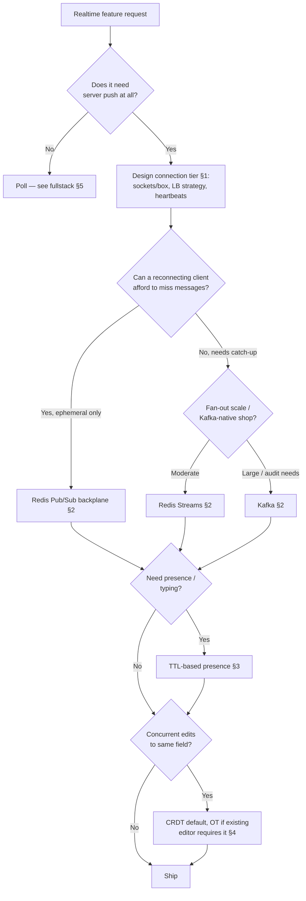

# Decision Guide — Realtime at Scale

When to reach for which layer, and the mistakes that turn a realtime feature into an incident.

> **Related:** Overview map → [00-overview.md](00-overview.md) · Client transport/UX → [fullstack-bff-and-clients §5](../../fullstack-bff-and-clients/includes/05-realtime-ux.md) · Streaming HTTP(Hypertext Transfer Protocol) contracts → [api-design-and-protection §10C](../../api-design-and-protection/includes/10C-async-streaming.md)

---

## Master decision flow

---

## Scenario recommendations

| Scenario | Recommended approach |
|----------|----------------------|
| Live notification badge / count | Poll or SSE(Server-Sent Events); no WebSocket needed — [fullstack §5](../../fullstack-bff-and-clients/includes/05-realtime-ux.md) |
| Chat app, thousands of rooms | WebSocket gateway tier + Redis Streams backplane, partitioned by room |
| Trading/price ticker, millions of viewers, one hot symbol | Stateless gateway + Kafka or dedicated backplane; shard hot symbols to isolated partitions |
| Multiplayer cursor / whiteboard | WebSocket + Redis Pub/Sub (ephemeral) for cursor moves; CRDT(Conflict-free Replicated Data Type) per shape for content |
| Collaborative document editor | CRDT library (Yjs/Automerge); backplane with replay for reconnect catch-up |
| "Who's online in this room" | TTL(Time To Live) presence keys + per-room fan-out — [§3](03-presence-and-typing.md) |
| Existing ProseMirror app | Keep its OT(Operational Transformation) module unless offline support is now required |
| Realtime feed that's a projection of a Kafka-backed domain | Kafka as the backplane; reuse existing topics/consumer groups |
| Team with no Kafka/Redis-Streams expertise, moderate scale | Redis Streams first; revisit Kafka only if scale or audit needs it |
| Extreme connection counts, multi-region | Dedicated backplane (NATS JetStream, Pulsar) or managed realtime platform — evaluate cost with [finops-and-cost](../../finops-and-cost/README.md) |

---

## Priority checklist

- [ ] Connection tier runtime is event-loop/lightweight-thread based, not thread-per-connection
- [ ] Load balancing strategy (sticky vs stateless + backplane) chosen deliberately, not by default
- [ ] Application-level heartbeat with a documented dead-peer window
- [ ] Backplane replay guarantee matches what reconnecting clients actually need
- [ ] Hot channel/room mitigation in place (sharding, fan-out cap, coalescing)
- [ ] Presence and typing use TTL/ephemeral state, not durable per-heartbeat writes
- [ ] Collaborative editing uses a maintained CRDT or OT library, not hand-rolled merge logic
- [ ] Deploys drain connections with a close frame and headroom for reconnect spikes
- [ ] Dashboards for concurrent connections, backplane consumer lag, and zombie-socket ratio

---

## Common mistakes

| Mistake | Why it hurts | Fix |
|---------|---------------|-----|
| Redis Pub/Sub for anything needing replay | Reconnecting clients silently miss data | Streams/Kafka/JetStream |
| No hot-room sharding | One viral room saturates the shared backplane | Partition by room ID; isolate known-hot rooms |
| Presence written like a domain record | Write amplification scales with connections × heartbeat rate | TTL-derived ephemeral state |
| Hand-rolled OT/CRDT merge logic | Silent data loss or corruption under concurrency | Established libraries (Yjs, Automerge, ShareDB) |
| Mass reconnect storms on deploy | Connection tier or LB falls over during rollout | Staggered drains + jittered client backoff + headroom |
| Treating this guide's fan-out as the same problem as [event-sourcing sagas](../../event-sourcing-and-cqrs/includes/07-sagas-and-distributed-workflows.md) | Sagas coordinate business steps; realtime fan-out just delivers events — pulling in saga machinery adds needless complexity | Keep fan-out simple; reach for sagas only for multi-step business workflows |

---

## Quick decision summary

| Question | Default answer |
|----------|-----------------|
| WebSocket or SSE/poll? | SSE/poll unless the client also needs to send frequently on the same connection |
| Sticky LB or stateless + backplane? | Stateless + backplane, for easier scaling |
| Which backplane? | Redis Streams by default; Kafka if already Kafka-native or need long retention; dedicated for extreme scale |
| CRDT or OT? | CRDT by default; OT only for existing OT-based editors |
| How to track presence? | TTL heartbeat keys, aggregated per-user across devices |
| How to survive a deploy? | Graceful drain + jittered client reconnect + spare capacity |

---

## See also

| Guide | Topics |
|-------|--------|
| [fullstack-bff-and-clients](../../fullstack-bff-and-clients/README.md) | Transport UX, reconnect backoff, BFF(Backend for Frontend) socket termination |
| [api-design-and-protection](../../api-design-and-protection/README.md) | Streaming/long-poll HTTP contracts, webhooks |
| [high-throughput-systems](../../high-throughput-systems/README.md) | Backpressure, broker throughput, observability |
| [apache-kafka](../../apache-kafka/README.md) | Kafka as a backplane |
| [resilience-patterns](../../resilience-patterns/README.md) | Bulkheads and load shedding for connection tiers |
| [event-sourcing-and-cqrs](../../event-sourcing-and-cqrs/README.md) | Ops-as-log, snapshotting patterns shared with CRDT/OT |