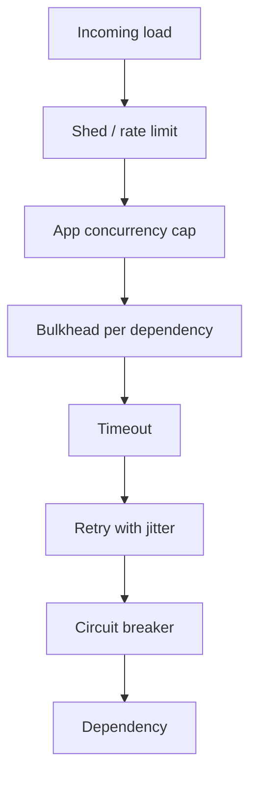

# Overview — Resilience Patterns

Resilience is the ability to **stay useful when dependencies fail or overload** — not the absence of failure.

**Rule of thumb:** Every outbound call needs a **deadline**, a **retry policy** (or explicit none), and a **isolation boundary**. Missing any one invites cascading outage.

> **Related:**
> - Backpressure and limits → [HTS §9](../../high-throughput-systems/includes/09-backpressure-and-limits.md)
> - Rate limits and 429 → [api-rate-limiting](../../api-rate-limiting/README.md)
> - HTTP(Hypertext Transfer Protocol) contracts → [api-design-and-protection](../../api-design-and-protection/README.md)
> - Failure domains → [architecture-decisions §11](../../architecture-decisions/includes/11-failure-domains.md)
> - Capstone → [11-decision-guide.md](11-decision-guide.md)

---

## At a glance

| Pattern | Job |
|---------|-----|
| **Timeouts** | Bound wait time; free resources |
| **Retries + jitter** | Survive transient faults without stampedes |
| **Circuit breakers** | Stop calling a sick dependency |
| **Bulkheads** | Limit blast radius of one dependency |
| **Load shedding / degrade** | Protect core journeys under overload |
| **Idempotency** | Make retries safe |
| **Delivery semantics** | Define async truth (at-least-once + dedup) |
| **Chaos** | Prove the above before customers do |

---

## Defense in depth

Pair edge limits ([api-rate-limiting](../../api-rate-limiting/README.md)) with in-process patterns here.

---

## Document map

| # | Topic | File |
|---|-------|------|
| 1 | Timeouts | [01-timeouts.md](01-timeouts.md) |
| 2 | Retries, backoff, jitter | [02-retries-backoff-jitter.md](02-retries-backoff-jitter.md) |
| 3 | Circuit breakers | [03-circuit-breakers.md](03-circuit-breakers.md) |
| 4 | Bulkheads | [04-bulkheads.md](04-bulkheads.md) |
| 5 | Load shedding and degradation | [05-load-shedding-and-degradation.md](05-load-shedding-and-degradation.md) |
| 6 | Idempotency systemwide | [06-idempotency-systemwide.md](06-idempotency-systemwide.md) |
| 7 | Distributed locks | [07-distributed-locks.md](07-distributed-locks.md) |
| 8 | Delivery semantics | [08-delivery-semantics.md](08-delivery-semantics.md) |
| 9 | Cascading failure | [09-cascading-failure.md](09-cascading-failure.md) |
| 10 | Chaos and failure injection | [10-chaos-and-failure-injection.md](10-chaos-and-failure-injection.md) |
| 11 | Decision guide | [11-decision-guide.md](11-decision-guide.md) |

---

## Default stack (sync dependency)

1. Set connect + request timeouts shorter than caller budget — [§1](01-timeouts.md)
2. Retry only idempotent / explicitly safe calls — [§2](02-retries-backoff-jitter.md) + [§6](06-idempotency-systemwide.md)
3. Trip a breaker on sustained errors — [§3](03-circuit-breakers.md)
4. Cap concurrency per dependency — [§4](04-bulkheads.md)
5. Degrade T1 features before failing T0 — [§5](05-load-shedding-and-degradation.md)

---

## Common mistakes

| Mistake | Fix |
|---------|-----|
| Infinite waits on HTTP clients | Explicit timeouts everywhere |
| Eager retries without jitter | Exponential backoff + jitter |
| Retries on non-idempotent POSTs | Idempotency keys or no retry |
| One shared thread pool for all deps | Bulkheads |
| No game days | Chaos drills — [§10](10-chaos-and-failure-injection.md) |