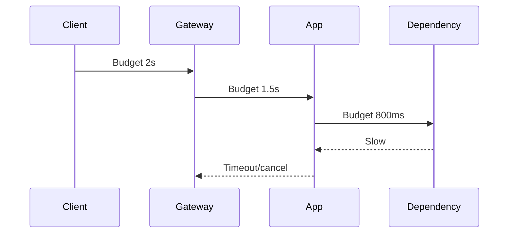

# Timeouts

Deadlines for connects, requests, and end-to-end budgets — the foundation every other resilience pattern assumes.

> **Related:** Retries → [02-retries-backoff-jitter.md](02-retries-backoff-jitter.md) · Policy placement → [11-policy-placement.md](11-policy-placement.md) · Cascading failure → [09-cascading-failure.md](09-cascading-failure.md) · Hop budget → [architecture §2](../../architecture-decisions/includes/02-service-boundaries-and-decomposition.md)

---

## At a glance

| Timeout | Bounds |
|---------|--------|
| **Connect** | TCP(Transmission Control Protocol)/TLS(Transport Layer Security) handshake wait |
| **Request / read** | Time to first byte or full response |
| **Idle** | Keep-alive unused connection |
| **End-to-end deadline** | Total user-facing budget propagated downstream |

**Rule of thumb:** Child timeouts must be **shorter** than the parent deadline. Leaving defaults (often infinite or minutes) is a production incident waiting to happen.

---

## Deadline propagation

| Practice | Why |
|----------|-----|
| Propagate remaining budget (header or context) | Avoid work after client gone |
| Cancel on timeout | Free threads and DB connections |
| Separate connect vs request | Distinguish network vs app slowness |
| Align with LB/gateway timeouts | Prevent retry amplification at edges |

---

## Setting values

| Layer | Starting point |
|-------|----------------|
| User-facing API(Application Programming Interface) | p99 healthy × 2–3, capped by UX |
| Internal sync dependency | Fraction of parent (e.g. 30–50%) |
| Auth dependency | Tight (fail fast) |
| Batch/worker outbound | Longer, but still finite |

Measure p99 under load before freezing numbers — [HTS §1](../../high-throughput-systems/includes/01-measurement-and-slo.md).

---

## Timeouts vs retries

A timeout without a retry policy still frees resources. A retry without a timeout multiplies load. Configure **together** — [§2](02-retries-backoff-jitter.md).

| Anti-pattern | Result |
|--------------|--------|
| Gateway 60s, app 120s | Work continues after client left |
| App 100ms, DB pool wait 30s | Thread stuck in pool queue |
| No connect timeout | Hung DNS(Domain Name System)/TCP fills workers |

---

## Common mistakes

| Mistake | Fix |
|---------|-----|
| Library default timeouts | Set explicitly in client config |
| One global 30s for everything | Per-dependency policies |
| Ignoring pool acquire time | Cap wait; fail fast — [PG pooling](../../postgresql-performance/includes/07-connection-management.md) |
| No cancellation | Use contexts/cancellation tokens |

## Pros and cons

| | Aggressive timeouts | Very loose timeouts |
|--|---------------------|---------------------|
| **Pros** | Fast failure, free capacity | Fewer false timeouts |
| **Cons** | More retries/errors under load | Cascades, thread exhaustion |