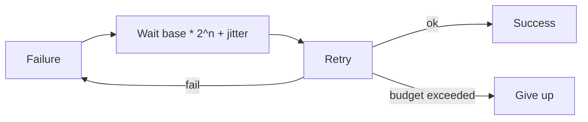

# Retries, Backoff, and Jitter

How to retry transient failures without turning an outage into a self-inflicted stampede.

> **Related:** Timeouts → [01-timeouts.md](01-timeouts.md) · Idempotency → [06-idempotency-systemwide.md](06-idempotency-systemwide.md) · Rate-limit 429 handling → [api-rate-limiting §9](../../api-rate-limiting/includes/09-response-strategies.md)

---

## At a glance

| Control | Guidance |
|---------|----------|
| **What to retry** | Transient: timeouts, 408/425/429/503, connection resets |
| **What not to retry** | 400/401/403/404/422; most non-idempotent writes |
| **How many** | Usually 0–2 at app; budget total time |
| **Backoff** | Exponential (e.g. 50ms → 100ms → 200ms) |
| **Jitter** | Full or equal jitter — mandatory at scale |

**Rule of thumb:** Retries are safe only when the operation is **idempotent** or protected by an idempotency key. Otherwise prefer fail fast or async queue.

---

## Exponential backoff with jitter

| Strategy | Behavior |
|----------|----------|
| **No jitter** | Thundering herd after outage |
| **Equal jitter** | `random(0, backoff)` — good default |
| **Full jitter** | Similar; widely used in AWS guidance |
| **Decorrelated** | `random(base, prev * 3)` — smooths load |

Honor `Retry-After` on 429/503 when present.

---

## Retry budgets

| Budget type | Example |
|-------------|---------|
| **Count** | Max 2 retries |
| **Time** | All attempts within remaining deadline |
| **Ratio** | ≤10% of traffic may be retries (adaptive) |

Without a budget, a slow dependency + retries can consume 100% of capacity — classic cascade — [§9](09-cascading-failure.md).

---

## Where to retry

| Layer | Role |
|-------|------|
| **Client SDK** | Few retries; respect idempotency |
| **App** | Per-dependency policy |
| **Queue consumer** | Backoff + DLQ(Dead Letter Queue) |
| **Gateway** | Usually **do not** retry POSTs blindly |

Workers should use visibility timeouts and bounded redelivery — [§8](08-delivery-semantics.md).

---

## Common mistakes

| Mistake | Fix |
|---------|-----|
| Retry POST creating orders | Idempotency-Key — [api-design §13](../../api-design-and-protection/includes/13-idempotency.md) |
| Immediate parallel retries | Serial with backoff |
| Infinite consumer retries | Max attempts → DLQ + alert |
| Ignoring 429 Retry-After | Sleep as instructed |
| Retrying 401/403 | Fix auth; don't amplify |

## Pros and cons

| | Retries with jitter | No retries |
|--|---------------------|------------|
| **Pros** | Survive blips | Predictable load |
| **Cons** | Amplify outages if misused | More user-visible blips |