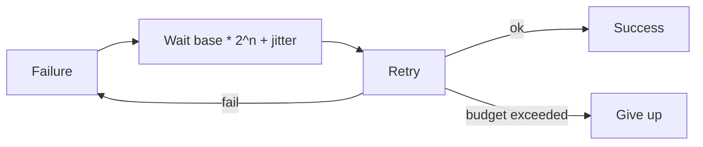

# Retries, Backoff, and Jitter

How to retry transient failures without turning an outage into a self-inflicted stampede.

> **Related:** Timeouts → [01-timeouts.md](01-timeouts.md) · Idempotency → [06-idempotency-systemwide.md](06-idempotency-systemwide.md) · Policy placement → [11-policy-placement.md](11-policy-placement.md) · Rate-limit 429 handling → [api-rate-limiting §9](../../api-rate-limiting/includes/09-response-strategies.md)

---

## At a glance

| Control | Guidance |
|---------|----------|
| **What to retry** | Transient: timeouts, 408/425/429/503, connection resets |
| **What not to retry** | 400/401/403/404/422; most non-idempotent writes |
| **How many** | Usually 0–2 at app; budget total time |
| **Backoff** | Exponential (e.g. 50ms → 100ms → 200ms) |
| **Jitter** | Full or equal jitter — mandatory at scale |

**Rule of thumb:** Retries are safe only when the operation is **idempotent** or protected by an idempotency key. Otherwise prefer fail fast or async queue.

---

## Exponential backoff with jitter

| Strategy | Behavior |
|----------|----------|
| **No jitter** | Thundering herd after outage |
| **Equal jitter** | `random(0, backoff)` — good default |
| **Full jitter** | Similar; widely used in AWS guidance |
| **Decorrelated** | `random(base, prev * 3)` — smooths load |

Honor `Retry-After` on 429/503 when present.

---

## Retry budgets

| Budget type | Example |
|-------------|---------|
| **Count** | Max 2 retries |
| **Time** | All attempts within remaining deadline |
| **Ratio** | ≤10% of traffic may be retries (adaptive) |

Without a budget, a slow dependency + retries can consume 100% of capacity — classic cascade — [§9](09-cascading-failure.md).

---

## Layer ownership — one owner retries

**Rule:** By default, **only one layer** retries a given hop. Everyone else fails fast or honors `Retry-After`. Stacked retries (browser + gateway + mesh + app) turn a blip into a stampede — [§9](09-cascading-failure.md), [§11 policy placement](11-policy-placement.md).

| Layer | Default role |
|-------|----------------|
| **Browser / mobile** | Usually **no** automatic POST retry; user retry or idempotent GET refresh |
| **Edge / gateway** | Retry **safe GETs** only if documented; never blind POST/PUT |
| **Service mesh** | Prefer **timeouts + outlier ejection**; disable retry if the app already retries |
| **App outbound client** | **Owner** of per-dependency retry policy (count, budget, jitter) |
| **Queue consumer** | Bounded redelivery + DLQ(Dead Letter Queue) — [§8](08-delivery-semantics.md) |
| **Client SDK** | Few retries; respect idempotency; document so callers do not double-retry |

Document the owner next to each dependency. “Retry somewhere” without an owner is how amplification ships.

---

## Hedged (speculative) requests

For **read-heavy, latency-sensitive** paths, send a second request if the first is slow — then cancel the loser. This is **not** a substitute for retries on writes.

| Use when | Avoid when |
|----------|------------|
| Tail latency dominated by a few slow instances | Writes / non-idempotent calls |
| Cheap, cacheable reads with headroom | Dependency already near capacity |
| You can cancel in-flight work | No cancellation → doubles load always |

| Control | Guidance |
|---------|----------|
| **Hedge delay** | Start after p95 or a fixed fraction of budget (not immediately) |
| **Max hedges** | Usually 1; rare cases 2 |
| **Budget** | Hedge must still fit parent deadline — [§1](01-timeouts.md) |
| **Idempotency** | Reads only, or ops with server-side dedup |

Hedges amplify load under brownout. Pair with bulkheads and adaptive admission — [§4](04-bulkheads.md), [§5](05-load-shedding-and-degradation.md).

---

## Common mistakes

| Mistake | Fix |
|---------|-----|
| Retry POST creating orders | Idempotency-Key — [api-design §13](../../api-design-and-protection/includes/13-idempotency.md) |
| Retries at mesh **and** app | Pick one owner — [§11](11-policy-placement.md) |
| Immediate parallel retries | Serial with backoff (or deliberate hedge with cancel) |
| Hedging writes | Never; use idempotent keys + serial retry at most |
| Infinite consumer retries | Max attempts → DLQ + alert |
| Ignoring 429 Retry-After | Sleep as instructed |
| Retrying 401/403 | Fix auth; don't amplify |

## Pros and cons

| | Retries with jitter | No retries |
|--|---------------------|------------|
| **Pros** | Survive blips | Predictable load |
| **Cons** | Amplify outages if misused | More user-visible blips |