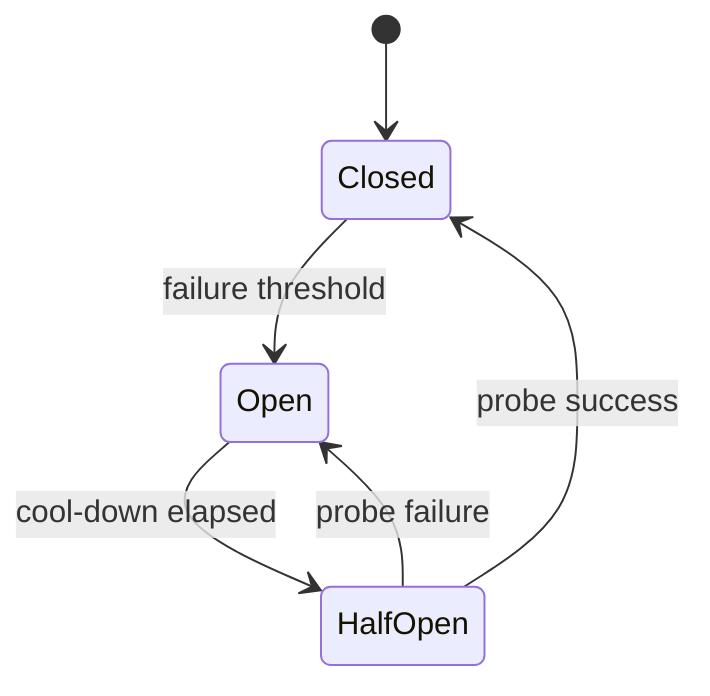

# Circuit Breakers

Stop calling a failing dependency so the system can shed load and recover — instead of piling up threads and retries.

> **Related:** Timeouts → [01-timeouts.md](01-timeouts.md) · Bulkheads → [04-bulkheads.md](04-bulkheads.md) · Cascading failure → [09-cascading-failure.md](09-cascading-failure.md)

---

## At a glance

| State | Behavior |
|-------|----------|
| **Closed** | Calls flow; errors counted |
| **Open** | Fail fast; no calls to dependency |
| **Half-open** | Probe with limited calls; success → closed |

**Rule of thumb:** Trip on **sustained** error rate or consecutive failures — not a single blip. Combine with timeouts; a breaker without timeouts still waits forever on hung calls.

---

## State machine

| Parameter | Guidance |
|-----------|----------|
| **Failure threshold** | e.g. 50% errors in rolling window, min request volume |
| **Cool-down** | Seconds to minutes; align with dependency recovery |
| **Half-open permits** | Small (1–few) concurrent probes |
| **Scope** | Per dependency **and** often per downstream instance/shard |

---

## What counts as failure

| Count | Usually ignore |
|-------|----------------|
| Timeouts, 5xx, connection errors | 4xx from bad client input |
| Rejected by bulkhead (optional) | Business “not found” |

Do not open the breaker because **your** validation failed.

---

## Fail open vs fail closed

| Mode | When |
|------|------|
| **Fail closed** (deny when open) | Writes, payments, authZ — safer default |
| **Fail open** (allow when breaker/store down) | Rare; only for non-critical reads with monitoring |

Edge rate limits have the same debate — [api-rate-limiting §12](../../api-rate-limiting/includes/12-distributed-rate-limiting.md).

---

## Placement

| Place breaker | Avoid |
|---------------|-------|
| Outbound clients to T0/T1 deps | Around pure in-memory CPU |
| Per-tenant only if noisy neighbor | One global breaker for unrelated APIs |

Pair with degradation: when open, return cached/partial UX — [§5](05-load-shedding-and-degradation.md).

---

## Common mistakes

| Mistake | Fix |
|---------|-----|
| Breaker without timeout | Always set deadlines |
| Trip on one error | Rolling window + min volume |
| Shared breaker for all deps | Per-dependency breakers |
| No metrics on state changes | Alert on open; dashboard half-open |
| Half-open stampede | Limit probe concurrency |

## Pros and cons

| | Circuit breaker | Retries only |
|--|-----------------|--------------|
| **Pros** | Protects both sides during outage | Simpler |
| **Cons** | Tuning; false opens | Can melt dependency |