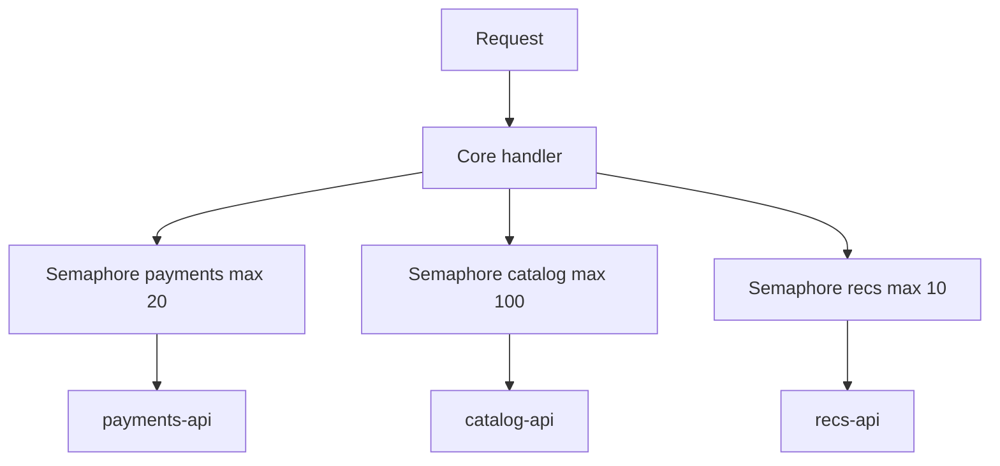

# Bulkheads

Isolate resources so one slow or failing dependency cannot exhaust the whole process.

> **Related:** Failure domains → [architecture §11](../../architecture-decisions/includes/11-failure-domains.md) · Connection pools → [PG §7](../../postgresql-performance/includes/07-connection-management.md) · Circuit breakers → [03-circuit-breakers.md](03-circuit-breakers.md)

---

## At a glance

| Bulkhead type | Isolates |
|---------------|----------|
| **Thread / async semaphore** | In-flight calls per dependency |
| **Connection pool** | DB or HTTP(Hypertext Transfer Protocol) connections per target |
| **Queue / worker pool** | Async workload classes |
| **Process / container** | Blast radius across services |
| **Cell / shard** | Tenants or key ranges |

**Rule of thumb:** Cap **concurrent** calls to each dependency. A shared unlimited executor is how one hung payment call freezes checkout **and** browse.

---

## In-process bulkhead

| When semaphore full | Behavior |
|---------------------|----------|
| T0 dependency | Fail fast 503/429 with retry guidance |
| T1 dependency | Degrade — skip section |
| Async path | Queue with bounded depth |

---

## Pool bulkheads

| Resource | Cap |
|----------|-----|
| PostgreSQL via PgBouncer | Pool size per service — [database-connection](../../database-connection-and-security/README.md) |
| HTTP client per host | Max connections + max per route |
| Redis | Separate clients for cache vs locks if needed |

Retries must respect the same caps — [§2](02-retries-backoff-jitter.md).

---

## Queue bulkheads

| Pattern | Use |
|---------|-----|
| Dedicated queues per workload | Exports vs emails vs payments |
| Priority queues | T0 work ahead of batch |
| Separate consumer groups | Failure isolation |

Prevent a DLQ(Dead Letter Queue) replay from starving live traffic (separate pool).

---

## Health checks are not bulkheads

Orchestrator probes route traffic and restart processes — they do **not** replace per-dependency concurrency caps.

| Probe | Ask | Never |
|-------|-----|-------|
| **Liveness** | Is this process wedged? | Deep-call payment/DB as the only check |
| **Readiness** | Should this instance take traffic? | Stay “ready” while critical pools are exhausted without shedding |
| **Startup** | Finished init? | Share blindly with liveness |

Pointing **liveness** at a sick dependency causes restart storms under the exact outage bulkheads are meant to survive. Full probe guidance → [cicd §7](../../cicd-and-environments/includes/07-containers-and-health.md). Shutdown drain → [§14](14-graceful-shutdown-and-drain.md).

---

## Common mistakes

| Mistake | Fix |
|---------|-----|
| One giant thread pool | Per-dependency limits |
| Bulkhead larger than dependency capacity | Size to protect the smaller side |
| No timeout on semaphore acquire | Fail fast |
| Ignoring DB pool as bulkhead | Tune pools deliberately |
| Liveness = dependency health | Shallow process check — [cicd §7](../../cicd-and-environments/includes/07-containers-and-health.md) |
| Cell architecture without request routing | Route consistently — [architecture §10](../../architecture-decisions/includes/10-multi-tenant-system-models.md) |

## Pros and cons

| | Bulkheads | Fully shared resources |
|--|-----------|------------------------|
| **Pros** | Contained slowdowns | Higher peak efficiency |
| **Cons** | Some idle capacity | Cascading exhaustion |