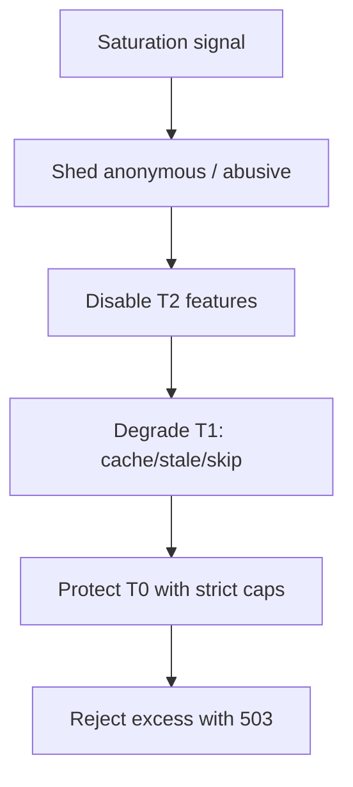

# Load Shedding and Degradation

Protect core user journeys when the system is overloaded — reject or simplify work deliberately.

> **Related:** Backpressure → [HTS §9](../../high-throughput-systems/includes/09-backpressure-and-limits.md) · Rate limits → [api-rate-limiting](../../api-rate-limiting/README.md) · Dependency tiers → [architecture §11](../../architecture-decisions/includes/11-failure-domains.md)

---

## At a glance

| Mode | Meaning |
|------|---------|
| **Load shedding** | Refuse some work (429/503) to save the rest |
| **Degradation** | Serve partial/simpler responses |
| **Admission control** | Bound concurrency before queues explode |

**Rule of thumb:** Shed **non-critical** and **expensive** work first. Never “try harder” with unbounded queues when CPU, pools, or dependencies are saturated.

---

## Shedding order

| Signal | Action |
|--------|--------|
| Queue depth high | Stop accepting heavy jobs |
| Pool wait spiking | Shed reads that hit DB |
| p99 past SLO(Service Level Objective) | Enable degrade flags |
| Dependency breaker open | Cached or empty optional sections |

---

## Degradation patterns

| Pattern | Example |
|---------|---------|
| **Stale cache** | Show last known profile |
| **Feature flag off** | Hide recommendations |
| **Approximate answers** | Count estimates |
| **Async fallback** | Accept write, process later |
| **Static fallback page** | Maintenance-lite for T2 sites |

Product must agree what “degraded” means before the incident.

---

## Relation to rate limiting

| Layer | Role |
|-------|------|
| Edge / gateway limits | Fairness and abuse — [api-rate-limiting](../../api-rate-limiting/README.md) |
| App admission | Protect local resources |
| Dependency bulkhead | Protect outbound |

Use `Retry-After` and clear errors so well-behaved clients back off — [api-rate-limiting §9](../../api-rate-limiting/includes/09-response-strategies.md).

---

## Common mistakes

| Mistake | Fix |
|---------|-----|
| Unbounded in-memory queue | Cap + shed |
| Shedding randomly including checkout | Priority by tier |
| Degrade without metrics | Track degrade mode rate |
| Only shedding at edge | Also shed in workers |
| Fail-open on expensive writes | Fail closed under uncertainty |

## Pros and cons

| | Controlled shed/degrade | No admission control |
|--|-------------------------|----------------------|
| **Pros** | Survives overload with core UX | — |
| **Cons** | Needs product design | Meltdown for everyone |