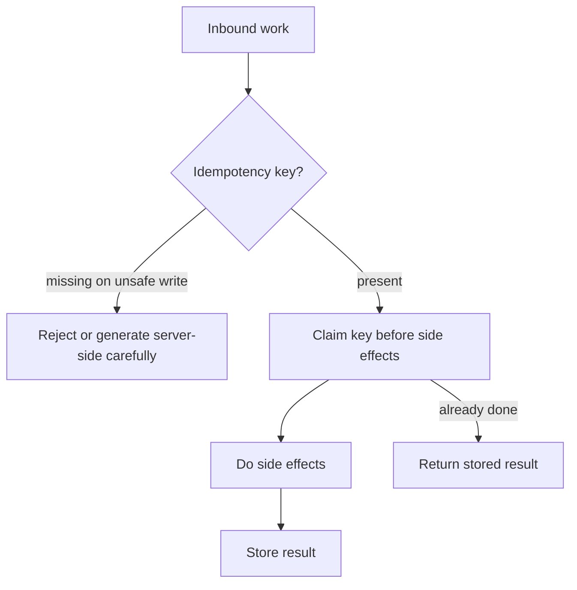

# Idempotency Systemwide

Idempotency as a **system rule** across sync APIs, workers, and consumers — so retries and redelivery are safe.

> **Scope:** **System-wide rule** — when and where to require idempotent handlers, keys, and dedup stores. HTTP(Hypertext Transfer Protocol) `Idempotency-Key` contract, storage patterns, and OpenAPI → [api-design §13](../../api-design-and-protection/includes/13-idempotency.md).
>
> **Related:** Retries → [02-retries-backoff-jitter.md](02-retries-backoff-jitter.md) · Delivery semantics → [08-delivery-semantics.md](08-delivery-semantics.md) · Saga idempotency → [ES §7B](../../event-sourcing-and-cqrs/includes/07B-sagas-compensation-idempotency.md)

---

## At a glance

| Surface | Mechanism |
|---------|-----------|
| **HTTP writes** | `Idempotency-Key` / natural keys — [api-design §13](../../api-design-and-protection/includes/13-idempotency.md) |
| **Queue consumers** | Dedup table or idempotent upsert by message ID |
| **Event handlers** | Effect store keyed by event ID + handler name |
| **Cron / batch** | Lease + watermark; safe re-run |
| **Webhooks inbound** | Provider event ID dedup |

**Rule of thumb:** Assume **at-least-once** delivery everywhere. Design handlers so processing twice does not double-charge, double-email, or double-provision.

---

## System rule

1. **Claim before side effects** (payment, email, ticket create).
2. **Store outcome** for replay.
3. **TTL** long enough for max retry window.
4. **Shared store** in multi-instance apps — not memory.

---

## Natural vs synthetic keys

| Key type | Example |
|----------|---------|
| **Natural** | `PUT /users/{id}`, upsert by email unique |
| **Synthetic** | Client `Idempotency-Key`, broker message ID |
| **Composite** | `(consumer_name, event_id)` |

Prefer natural keys when the domain has them; otherwise require synthetic keys on unsafe operations.

---

## Cross-component checklist

- [ ] HTTP POSTs with side effects covered — [api-design §13](../../api-design-and-protection/includes/13-idempotency.md)
- [ ] Consumers commit offsets **after** successful idempotent handling (or store-then-commit pattern)
- [ ] Outbox publishers safe under retry — [ES §5](../../event-sourcing-and-cqrs/includes/05-async-integration.md)
- [ ] Webhook receivers dedup
- [ ] Metrics: duplicate hit rate, claim conflicts

---

## Common mistakes

| Mistake | Fix |
|---------|-----|
| Retry without idempotency | Add keys or stop retrying writes |
| Dedup only in memory | Shared Redis/PG |
| Key too coarse (one key for unrelated ops) | Scope per operation |
| Side effects before claim | Reorder — claim first |
| Ignoring consumer rebalance redelivery | Treat as normal |

## Pros and cons

| | Systemwide idempotency | Best-effort once |
|--|------------------------|------------------|
| **Pros** | Safe retries, simpler ops | Less storage |
| **Cons** | Key/store design cost | Duplicate disasters |