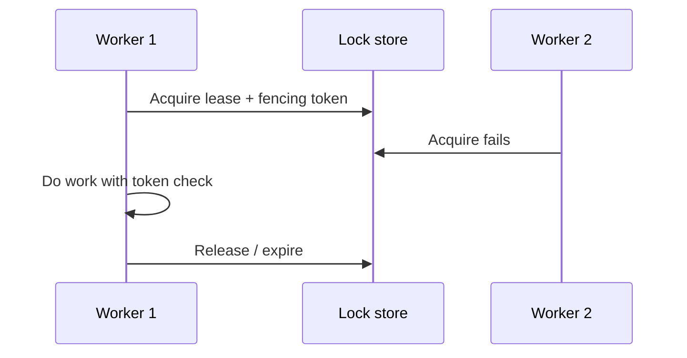

# Distributed Locks

When a distributed lock is justified — and when it is a smell for missing ownership or idempotency.

> **Related:** Idempotency → [06-idempotency-systemwide.md](06-idempotency-systemwide.md) · Data ownership → [architecture §8](../../architecture-decisions/includes/08-data-ownership.md) · DB concurrency → [PG §12](../../postgresql-performance/includes/12-bulk-operations-and-concurrency.md)

---

## At a glance

| Use a lock when… | Prefer instead… |
|------------------|-----------------|
| Exactly one worker must run a **non-partitioned** critical section | Shard by key; single-writer ownership |
| Leader election for a singleton job | Managed scheduler with fencing |
| Short mutual exclusion on a rare resource | Idempotent upsert / compare-and-set |

**Rule of thumb:** If you need a distributed lock for **correctness of business writes**, first ask whether **idempotency + single owner** removes the need. Locks are easy to get subtly wrong (TTL, fencing, clocks).

---

## When locks help

| Scenario | Pattern |
|----------|---------|
| Nightly singleton report | Lock with TTL(Time To Live) + owner token; renew while running |
| Rare admin mutation | Short lock or DB transaction on one row |
| Leader for partition set | Ephemeral lock / lease with fencing token |

---

## When to avoid

| Smell | Better approach |
|-------|-----------------|
| Lock around multi-service saga | Orchestration + idempotent steps |
| Long lock held during external HTTP(Hypertext Transfer Protocol) | Outbox + async; don't hold locks over network calls |
| Lock to prevent duplicate messages | Dedup keys — [§6](06-idempotency-systemwide.md) |
| Lock because shared DB | Fix ownership — [architecture §8](../../architecture-decisions/includes/08-data-ownership.md) |
| “Redis `SET NX` forever” | TTL always; handle expiry with fencing |

---

## Safety properties

| Requirement | Practice |
|-------------|----------|
| **TTL** | Always; assume holder can die |
| **Fencing token** | Monotonic; storage rejects stale writers |
| **Clock skew** | Don't rely on client clocks for expiry alone |
| **Reentrancy** | Document; usually avoid |
| **Observability** | Metrics on wait time, steal, expiry |

PostgreSQL `FOR UPDATE SKIP LOCKED` often beats Redis locks for job queues — [PG §12](../../postgresql-performance/includes/12-bulk-operations-and-concurrency.md).

---

## Common mistakes

| Mistake | Fix |
|---------|-----|
| Lock without TTL | Hard deadlock on crash |
| Work after lease lost | Check fencing token on each write |
| Holding lock across user requests | Redesign flow |
| Global lock for high QPS path | Partition / ownership |
| Ignoring lock store outage | Define fail policy (reject vs risky proceed) |

## Pros and cons

| | Distributed lock | Ownership + idempotency |
|--|------------------|-------------------------|
| **Pros** | Simple mental mutex | Safer under retries/partitions |
| **Cons** | Expiry/fencing bugs | Requires domain design |