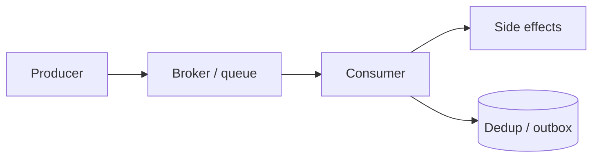

# Delivery Semantics

At-least-once, deduplication, and EOS(Exactly-Once Semantics) — what systems can promise and what apps must still do.

> **Related:** Kafka producers/consumers → [apache-kafka §3](../../apache-kafka/includes/03-producers-and-delivery-guarantees.md) · [apache-kafka §4](../../apache-kafka/includes/04-consumers-and-consumer-groups.md) · Idempotency → [06-idempotency-systemwide.md](06-idempotency-systemwide.md) · Outbox → [ES §5](../../event-sourcing-and-cqrs/includes/05-async-integration.md)

---

## At a glance

| Semantic | Promise | App still needs |
|----------|---------|-----------------|
| **At-most-once** | Never redelivered; may lose | Rarely acceptable for money |
| **At-least-once** | No loss under retry; may duplicate | **Idempotent handlers** |
| **Effectively once** | Dupes suppressed end-to-end | Dedup store + careful commits |
| **EOS (broker)** | Kafka transactions / idempotent producer in scope | Still design consumer effects |

**Rule of thumb:** Build for **at-least-once + idempotent consumers**. Treat broker “exactly-once” as **narrow** (read Kafka docs for transactional boundaries) — not a substitute for domain dedup.

---

## Pipeline view

| Hop | Failure → effect |
|-----|------------------|
| Producer timeout | Unknown: maybe published → retry needs idempotent produce or outbox |
| Consumer crash after effect before ack | Redelivery → duplicate unless deduped |
| Rebalance | Inflight redelivery |

---

## Kafka-oriented guidance

Deep mechanics → [apache-kafka §3 delivery](../../apache-kafka/includes/03-producers-and-delivery-guarantees.md).

| Goal | Typical knobs |
|------|----------------|
| No lost produces | `acks=all`, idempotent producer |
| Ordered per key | One partition key; careful compaction |
| EOS in Kafka Streams / tx | Transactions; understand read-process-write scope |
| Consumer safety | Commit after durable effect; or store offsets with effects |

---

## Dedup patterns

| Pattern | Use |
|---------|-----|
| **Message ID unique constraint** | Simple consumers |
| **Idempotent upsert** | State converges |
| **Outbox + inbox tables** | Cross-DB reliability |
| **Kafka transactional ID** | Producer failover without dupes *in Kafka* |

---

## Choosing semantics

| Workload | Prefer |
|----------|--------|
| Metrics / logs | At-most or at-least with cheap dups |
| Email / webhook | At-least + dedup by ID |
| Payments | At-least + strong idempotency keys |
| Ledger projection | Inbox pattern / transactional outbox |

---

## Common mistakes

| Mistake | Fix |
|---------|-----|
| “Kafka EOS means no app dedup” | Dedup side effects anyway |
| Commit offset before DB write | Reverse order or transaction pattern |
| At-most-once for checkout events | Don't |
| Infinite retries without DLQ(Dead Letter Queue) | Bound + alert — [§2](02-retries-backoff-jitter.md) |

## Pros and cons

| Semantic | Pros | Cons |
|----------|------|------|
| At-least-once | Durable | Duplicates |
| At-most-once | Simple | Loss |
| Effectively once | Best UX | Complexity + storage |