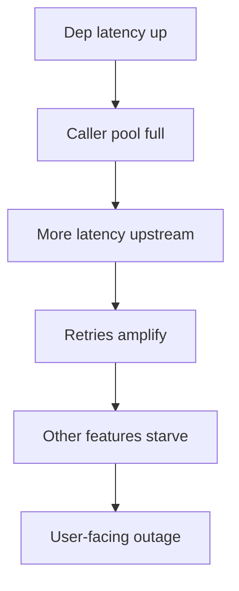

# Cascading Failure

How small dependency problems become site-wide outages — and the pattern stack that stops the spread.

> **Related:** Failure domains → [architecture §11](../../architecture-decisions/includes/11-failure-domains.md) · Overview stack → [00-overview.md](00-overview.md) · Backpressure → [HTS §9](../../high-throughput-systems/includes/09-backpressure-and-limits.md)

---

## At a glance

| Stage | What happens |
|-------|--------------|
| **1. Dependency slows** | Latency rises |
| **2. Threads/connections pile up** | Pools exhaust |
| **3. Callers retry** | Load multiplies |
| **4. Healthy nodes fail** | Cascade / meltdown |
| **5. Recovery herd** | Second outage on restart |

**Rule of thumb:** Cascades are usually **resource exhaustion + retry amplification**, not a single bug. Prevent with deadlines, bulkheads, breakers, and shed.

---

## Anatomy

| Amplifier | Mitigation |
|-----------|------------|
| Missing timeouts | [§1](01-timeouts.md) |
| Aggressive retries | [§2](02-retries-backoff-jitter.md) |
| Shared thread pool | [§4](04-bulkheads.md) |
| No breaker | [§3](03-circuit-breakers.md) |
| Unbounded queues | [§5](05-load-shedding-and-degradation.md) |
| Sync deep chains | Reduce hops — [architecture §2](../../architecture-decisions/includes/02-service-boundaries-and-decomposition.md) |

---

## Detection signals

| Signal | Suggests |
|--------|----------|
| Pool wait time ↑ | Exhaustion forming |
| Dependency p99 ↑ + caller concurrency ↑ | Saturation |
| Error rate ↑ after deploy of retries | Amplification |
| Breaker flapping | Thresholds wrong or dep unstable |
| Queue depth ↑ while RPS flat | Shed needed |

Triage with RED(Rate, Errors, Duration)/USE(Utilization, Saturation, Errors) — [HTS §11](../../high-throughput-systems/includes/11-observability.md).

---

## Recovery without a second cascade

1. **Shed** load; disable T2; open breakers deliberately if needed.
2. **Fix or scale** the root dependency.
3. **Warm** with limited traffic (canary) — [deployment-strategies](../../deployment-strategies/README.md).
4. **Release** breakers gradually; keep retry budgets low.
5. **Postmortem** — [sre-and-incidents](../../sre-and-incidents/README.md).

---

## Common mistakes

| Mistake | Fix |
|---------|-----|
| Scale callers first | Cap concurrency; fix dep |
| Blindly increase retries in incident | Decrease retries; shed |
| Shared DB across services | Ownership — [architecture §8](../../architecture-decisions/includes/08-data-ownership.md) |
| No load test of failure modes | Chaos — [§10](10-chaos-and-failure-injection.md) |

## Pros and cons

| | Defense-in-depth stack | Hope + horizontal scale |
|--|------------------------|-------------------------|
| **Pros** | Contained blast radius | — |
| **Cons** | Tuning effort | Cascades at larger scale |