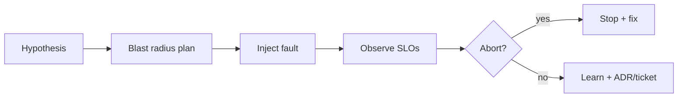

# Chaos and Failure Injection

Prove resilience with controlled failure — game days, fault injection, and continuous experiments.

> **Related:** Cascading failure → [09-cascading-failure.md](09-cascading-failure.md) · Resilience metrics → [13-observability-for-resilience.md](13-observability-for-resilience.md) · Incidents → [sre-and-incidents](../../sre-and-incidents/README.md) · Testing strategy → [testing-strategy](../../testing-strategy/README.md) · Environments → [cicd-and-environments](../../cicd-and-environments/README.md)

---

## At a glance

| Practice | Scope |
|----------|-------|
| **Unit/integration fault tests** | Inject timeouts/errors in CI(Continuous Integration) |
| **Staging game day** | Scripted dependency kills |
| **Production chaos** | Small blast radius, strong abort criteria |
| **Failover drills** | Region/AZ and data restore |

**Rule of thumb:** If you have never failed a dependency on purpose, you do not know whether breakers, bulkheads, and degrade paths work.

---

## Experiment loop

| Hypothesis example | Injection |
|--------------------|-----------|
| “Catalog latency should not block checkout” | Delay catalog 5s |
| “Breaker opens under 50% 5xx” | Error inject payments |
| “Worker DLQ(Dead Letter Queue) alerts” | Poison message |
| “Region failover RTO(Recovery Time Objective)” | Block primary region |

---

## Safety rails

| Rail | Why |
|------|-----|
| **Allowlist** services/envs | Prevent accidental prod wide blast |
| **Abort SLO(Service Level Objective)** | Auto-stop on error budget burn |
| **Time box** | Experiments end |
| **Comms** | On-call aware |
| **Runbook link** | Fast remediation |

Prefer staging fidelity first — [cicd-and-environments](../../cicd-and-environments/README.md).

---

## What to inject

| Layer | Faults |
|-------|--------|
| Network | Latency, loss, partition |
| Dependency | 5xx, slow body, TLS(Transport Layer Security) errors |
| Resource | CPU starve, FD limits, pool exhaustion |
| Data | Replica lag, disk full (careful) |
| Clock | Skew for lease/TTL bugs — [§7](07-distributed-locks.md) |

---

## Continuous vs game day

| Mode | Cadence |
|------|---------|
| **CI fault tests** | Every PR for critical clients |
| **Weekly game day** | One scenario, documented |
| **Continuous chaos** | Mature platform only; tiny blast radius |

Track findings as tickets; promote systemic gaps to ADRs — [architecture §5](../../architecture-decisions/includes/05-adrs-and-design-docs.md).

---

## Common mistakes

| Mistake | Fix |
|---------|-----|
| Chaos without metrics/abort | Instrument first |
| Only killing random pods | Target dependency contracts |
| No product degrade validation | Check UX for T1 skips |
| Untested restore/failover | Schedule DR drills |
| Blaming chaos for finding bugs | That is success |

## Pros and cons

| | Chaos practice | Untested resilience config |
|--|----------------|----------------------------|
| **Pros** | Real confidence | — |
| **Cons** | Engineering time; prod risk if unsafe | False confidence |