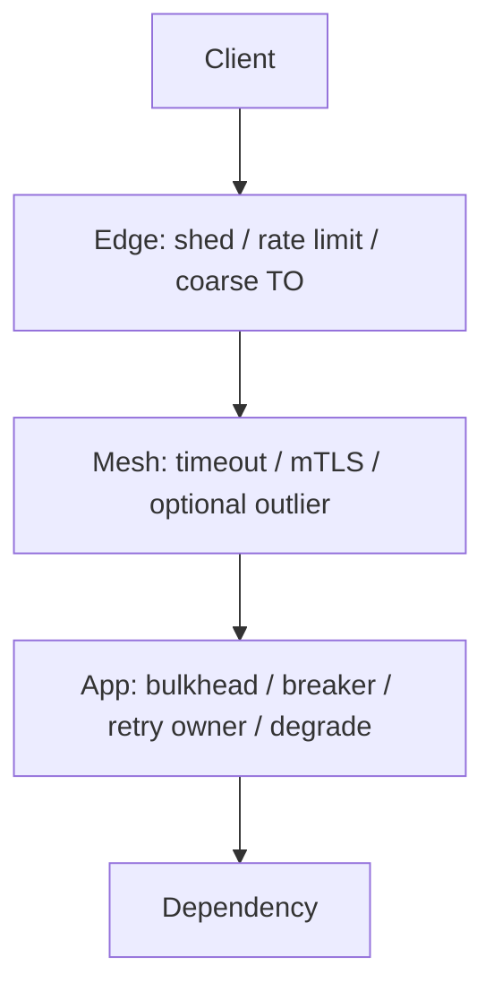

# Policy Placement — App, Gateway, Mesh

Where timeouts, retries, breakers, and shedding should live — so layers do not fight each other.

> **Related:** Layer ownership of retries → [§2](02-retries-backoff-jitter.md) · Discovery / mesh → [distributed-systems-primitives §5](../../distributed-systems-primitives/includes/05-service-discovery.md) · Edge limits → [api-rate-limiting](../../api-rate-limiting/README.md) · Implementation knobs → [§15](15-implementation-map.md)

---

## At a glance

| Layer | Best at | Poor at |
|-------|---------|---------|
| **Edge / gateway** | Abuse shedding, TLS(Transport Layer Security) terminate, coarse timeouts, auth | Business degrade UX, per-domain idempotency |
| **Service mesh** | Uniform connect/request timeouts, mTLS(Mutual Transport Layer Security), outlier ejection, observability | Product-aware fallbacks; knowing which POSTs are safe |
| **App / BFF(Backend for Frontend)** | Per-dependency budgets, bulkheads, breakers tied to tiers, fallback contracts | Replacing edge abuse controls |
| **Worker / consumer** | Redelivery, DLQ(Dead Letter Queue), replay rate limits | Serving interactive deadlines |

**Rule of thumb:** Put **admission and abuse** at the edge; put **dependency policy** next to the call (app or mesh — pick one owner); put **product degrade** in the app/BFF(Backend for Frontend).

---

## Placement matrix

| Control | Prefer | Notes |
|---------|--------|-------|
| Connect + request timeout | App **or** mesh (one owner) | Align with gateway idle/timeouts — [§1](01-timeouts.md) |
| Retry + jitter | App outbound client | Disable mesh retries if app retries — [§2](02-retries-backoff-jitter.md) |
| Circuit breaker / outlier | App breaker **or** mesh outlier ejection | Same signal; do not double-open confusingly |
| Bulkhead / concurrency | App (semaphores, pools) | Mesh concurrency limits help; app still owns DB pools |
| Load shed (429/503) | Edge + app admission | Edge for abuse; app for local saturation — [§5](05-load-shedding-and-degradation.md) |
| Feature degrade | App / BFF + flags | Mesh cannot omit “recs” from a JSON body |
| Idempotency keys | App + data store | Gateway must **forward** keys, not invent policy — [§6](06-idempotency-systemwide.md) |

---

## Anti-pattern: stacked retries

| Stack | What happens |
|-------|--------------|
| Browser retries + gateway retries + mesh 3× + app 3× | One timeout → dozens of dependency calls |
| Gateway 60s, mesh 30s, app 120s | Work continues after the user is gone |
| Mesh retries POST, app also retries POST | Double charge risk even with partial idempotency |

**Default:** mesh/gateway = timeouts (+ maybe safe GET retry); app = retry policy owner for that dependency.

---

## Choosing mesh vs app for outbound policy

| Choose mesh-centric when | Choose app-centric when |
|--------------------------|-------------------------|
| Many languages/services need one baseline | Fallbacks and breakers are product-specific |
| Platform team owns Envoy/Istio/Linkerd | Few services; library already wraps clients |
| You need consistent mTLS and RED(Rate, Errors, Duration) metrics | Workers and non-HTTP(Hypertext Transfer Protocol) deps need the same rules |

Hybrid is fine: **mesh timeouts + app retries/breakers/degrade**, with mesh retries **off**.

---

## Liveness vs readiness (routing, not resilience policy)

Probes decide whether an instance receives traffic or restarts. They are not a substitute for bulkheads or breakers.

| Probe | Role | Trap |
|-------|------|------|
| **Liveness** | Restart wedged processes | Deep dependency check → restart storm |
| **Readiness** | Remove from LB while not ready | Stay ready with exhausted pools and no shed |

Details → [cicd §7](../../cicd-and-environments/includes/07-containers-and-health.md) · Drain → [§14](14-graceful-shutdown-and-drain.md).

---

## Common mistakes

| Mistake | Fix |
|---------|-----|
| “Mesh has retries, we’re resilient” | Still need app budgets, idempotency, degrade contracts |
| Different timeout owners with no deadline propagation | Propagate remaining budget — [§1](01-timeouts.md) |
| Edge-only shed | App still melts on expensive authenticated traffic |
| Copy-paste retry defaults on every client | Per-dependency policy + documented owner |

## Pros and cons

| | Explicit placement | Every layer retries “just in case” |
|--|--------------------|-------------------------------------|
| **Pros** | Predictable amplification | Feels safer locally |
| **Cons** | Needs platform/app agreement | Cascades under load |