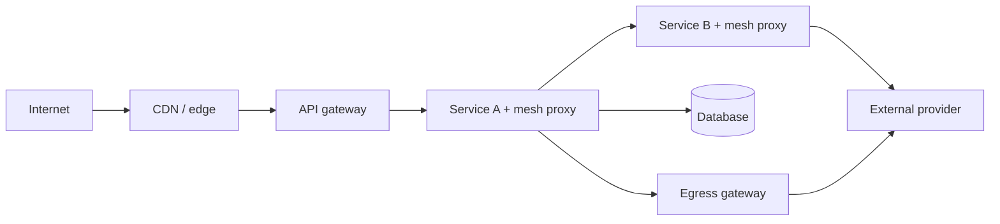

# Service Mesh Topology

> **Scope:** This section chooses mesh, gateway, and application ownership for service-to-service mTLS(Mutual Transport Layer Security), timeouts, retries, and traffic policy. It is topology and operating-model guidance, not an Istio, Linkerd, or Envoy installation cookbook.

> **Related:** [§11 Policy placement](11-policy-placement.md) · [API gateway architecture](../../api-design-and-protection/includes/03-api-gateway.md) · [§1 Timeouts](01-timeouts.md)

---

## At a glance

| Concern | Default owner | Reason |
|---------|---------------|--------|
| Internet ingress, WAF(Web Application Firewall), coarse limits | Gateway/edge | Knows client and public contract |
| Workload identity and service mTLS | Mesh | Uniform between languages |
| Per-call deadline and business retry | Application client | Knows idempotency and user budget |
| Commodity connect timeout/outlier detection | Mesh, if named owner | Consistent fleet baseline |
| Fallback response and partial UI | App/BFF(Backend for Frontend) | Requires product context |

**Rule of thumb:** A mesh secures and observes the network path; it does not know whether retrying “charge card” is safe or what response the customer can accept.

---

## Topology before features

A mesh is an internal traffic layer, usually implemented by proxies or node-level networking. A gateway is an ingress/egress policy point. An application remains responsible for its resource pools, data invariants, and customer-visible behavior.



| Layer | Identity it understands | Policy it should own |
|-------|--------------------------|---------------------|
| Edge/gateway | User, API(Application Programming Interface) key, client IP, public route | AuthN(Authentication), abuse limits, public TLS(Transport Layer Security) |
| Mesh | Workload/service identity | mTLS, service discovery, baseline telemetry |
| Application | Tenant, order state, idempotency, feature flags | AuthZ(Authorization), retries, fallback, data access |
| Egress gateway | Destination and service identity | Allowlist, external TLS, audit, coarse egress control |

Use direct application networking when there are few services, a single language, and mature client libraries. Introduce a mesh when uniform identity, encryption, observability, and policy across many workloads offset its debugging and upgrade cost.

---

## Choose a policy owner

Duplicated policy is worse than missing policy because it amplifies work and obscures the actual deadline. Write the owner into the service contract.

| Control | Mesh-first case | App-first case |
|---------|-----------------|----------------|
| Request timeout | Uniform internal RPC(Remote Procedure Call) baseline | Different operations require different budgets |
| Retry | Safe idempotent read, one retry, platform-owned | Writes, external calls, or product-specific fallback |
| Outlier ejection | A sick instance affects many callers | Caller has bespoke dependency health criteria |
| Circuit breaker | Simple transport failures | Breaker needs business error classification |
| Rate/concurrency control | Shared network protection | Tenant tier or expensive operation protection |

The safe hybrid is mesh-owned mTLS and connect timeout, application-owned total deadline, retries, breakers, and degradation. If the mesh retries, the app must not retry the same failure class.

```mermaid
sequenceDiagram
    participant C as Caller app
    participant M as Mesh proxy
    participant D as Dependency
    C->>M: deadline 500 ms
    M->>D: connect timeout 100 ms
    D-->>M: 503 after 250 ms
    M-->>C: 503; no retry
    C->>C: decide fallback or one safe retry
```

---

## Timeouts and retries

Propagate an absolute deadline or remaining budget. Each hop must reserve time for its own work and downstream cleanup. A gateway idle timeout, mesh request timeout, and application client timeout need a documented order; a downstream operation must not outlive its caller.

| Situation | Policy |
|-----------|--------|
| Idempotent catalog read | Mesh connect timeout; application may retry once with jitter inside budget |
| Payment authorization | Application owns idempotency key and retry decision; mesh retries off |
| Long report | Convert to async job; neither mesh nor gateway should hold a short interactive timeout |
| Streaming response | Explicit idle and stream lifetime limits; test proxy buffering |
| Broker consumer | Broker redelivery policy, not mesh request retry |

Retry only transient failures, use exponential backoff with jitter, and cap attempts. A mesh cannot reliably infer idempotency from `POST`; HTTP(Hypertext Transfer Protocol) method is not sufficient evidence. See [§2 retries](02-retries-backoff-jitter.md) and [§6 idempotency](06-idempotency-systemwide.md).

---

## Identity and authorization boundaries

Mesh mTLS authenticates the calling workload. It does not replace end-user authorization, object ownership checks, or audit requirements. Pass verified user/tenant context in an application-level signed or trusted contract where needed, and re-check authorization at the resource-owning service.

| Question | Mesh answer | Application answer |
|----------|-------------|--------------------|
| Which workload called? | Service identity/certificate | Map to allowed service action |
| Which user owns this order? | Not known | Enforce object-level AuthZ |
| Is traffic encrypted? | Yes, between enrolled workloads | Encrypt sensitive fields/at rest as needed |
| Can service call the internet? | Egress policy | Validate destination semantics and response |

Avoid forwarding client identity headers blindly through every hop. Define which service is allowed to assert them, sign or bind them where the threat model demands it, and log the workload identity separately from user identity.

---

## Traffic topology and failure domains

Start with same-region service routing. Add locality-aware routing to avoid a healthy local dependency being bypassed for a remote one. Cross-zone and cross-region failover consumes latency budget and can overload the destination; it needs capacity planning, not just a routing rule.

| Pattern | Benefit | Cost / guardrail |
|---------|---------|------------------|
| Sidecar proxy | Strong per-workload isolation | Memory, CPU, port/debug complexity |
| Ambient/node proxy | Lower per-pod overhead | Different security and troubleshooting model |
| Egress gateway | Central external controls | Avoid a single bottleneck; scale by region |
| Zone-local routing | Lower latency and blast radius | Ensure replicas exist per zone |
| Multi-cluster failover | Regional resilience | Explicit data consistency and warm capacity |

Test failure scenarios with the actual topology: one bad instance, DNS(Domain Name System) failure, certificate rotation, egress provider timeout, and a full-zone drain. A green Kubernetes readiness probe does not prove mesh routing or downstream capacity is healthy.

---

## Operational model

Istio, Linkerd, and Envoy-based platforms differ in configuration and data-plane shape, but all need clear ownership. The platform team owns upgrades, certificates, defaults, and telemetry; service teams own declared dependencies, deadlines, and behavior under failure.

| Operational item | Evidence to require |
|------------------|---------------------|
| Certificate rotation | Staged rotation test and expiration alert |
| Proxy resource use | CPU/memory requests measured at peak connection count |
| Config rollout | Versioned policy, canary, and rollback path |
| Debug access | Authorized way to view routes, clusters, and config |
| Metrics | Per-service success, latency, retry, and ejection counters |
| Escape hatch | Documented bypass only for incident use, audited afterward |

Do not expose every proxy knob to every service. Provide opinionated policy templates with named budgets, then allow reviewed exceptions for unusual protocols or latency-critical paths.

---

## Adoption checklist

1. Inventory service protocols, trust boundaries, and outbound destinations.
2. Establish workload identity and mTLS before adding resilience features.
3. Name exactly one retry and total-timeout owner per dependency.
4. Publish gateway, mesh, and application defaults with their precedence.
5. Canary proxy/config upgrades and measure added latency and resource cost.
6. Exercise certificate, dependency, and regional failure runbooks.

## Common mistakes

| Mistake | Fix |
|---------|-----|
| Assume mTLS performs user authorization | Enforce AuthZ in the resource-owning service |
| Enable mesh and application retries | Assign one owner and cap total attempts |
| Use a universal request timeout | Set route/dependency budgets and propagate deadlines |
| Route across regions as a first response | Prefer local capacity; plan cross-region failure explicitly |
| Treat proxy defaults as invisible infrastructure | Version, test, canary, and observe policy changes |
| Adopt a mesh to avoid client libraries | Keep app-level contracts for idempotency and fallback |