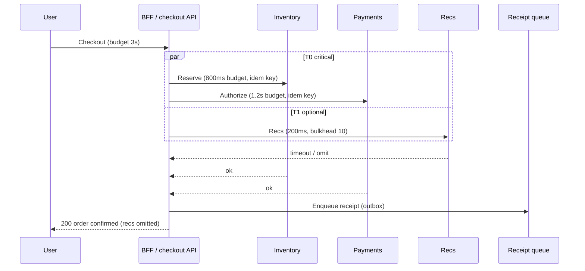

# Worked Example — Checkout Journey

Apply the full resilience stack to one user journey: cart → pay → confirm → receipt.

> **Related:** Fallback contracts → [§5](05-load-shedding-and-degradation.md) · Payments hardening → [payments-and-fintech](../../payments-and-fintech/README.md) · Failure domains / tiers → [architecture §11](../../architecture-decisions/includes/11-failure-domains.md) · Decision guide → [§16](16-decision-guide.md)

---

## At a glance

| Dependency | Tier | Sync on request? | Policy sketch |
|------------|------|------------------|---------------|
| **Inventory reserve** | T0 | Yes | Tight timeout; **no** blind retry; idempotent reserve key |
| **Payments authorize** | T0 | Yes | Tight timeout; breaker; Idempotency-Key; fail closed |
| **Pricing / tax** | T0 | Yes | Timeout + bulkhead; retry only if idempotent GET/calc |
| **Recommendations** | T1 | Yes (optional) | Bulkhead; omit on failure; never block pay |
| **Loyalty points** | T1 | Prefer async | Degrade to “points pending”; queue update |
| **Email / push receipt** | T2 | No | Outbox / queue; at-least-once + dedup |

**Rule of thumb:** Checkout succeeds when **T0** succeeds. Everything else degrades or waits.

---

## Request path

---

## Pattern stack on this journey

| Step | Pattern | Concrete choice |
|------|---------|-----------------|
| 1 | Deadline propagation — [§1](01-timeouts.md) | User 3s → BFF children sum under 3s; cancel on client gone |
| 2 | Bulkheads — [§4](04-bulkheads.md) | Separate semaphores: pay, inventory, recs |
| 3 | Retries — [§2](02-retries-backoff-jitter.md) | Recs: 0–1 GET retry; pay/inventory: **0** unless safe + idempotent |
| 4 | Breakers — [§3](03-circuit-breakers.md) | Open on sustained pay 5xx/timeouts; fail closed |
| 5 | Fallback contract — [§5](05-load-shedding-and-degradation.md) | Recs → omit; loyalty → async; pay → hard error |
| 6 | Idempotency — [§6](06-idempotency-systemwide.md) | `Idempotency-Key` on authorize; reserve key on inventory |
| 7 | Delivery — [§8](08-delivery-semantics.md) | Receipt: at-least-once + dedup by `order_id` |
| 8 | Placement — [§11](11-policy-placement.md) | Edge sheds abuse; app owns pay retry=none; mesh timeouts only |
| 9 | Observe — [§13](13-observability-for-resilience.md) | Pay breaker state, pool wait, omit-recs rate, authorize latency |
| 10 | Prove — [§10](10-chaos-and-failure-injection.md) | Inject pay latency; assert checkout still fails closed without melting browse |

---

## Overload behavior (product-agreed)

| Saturation | Action |
|------------|--------|
| Recs pool full | Omit section; checkout continues |
| Global CPU / DB wait high | Shed anonymous browse first; protect `/checkout` |
| Payments breaker open | `503` + clear message; **no** silent “success” |
| Receipt queue deep | Accept order; delay email; alert on lag SLO |

---

## What “done” looks like for this journey

- [ ] Tier list in service README (T0/T1/T2 as above)
- [ ] Per-dep timeouts + bulkheads in client config
- [ ] Pay/inventory idempotency keys end-to-end
- [ ] Fallback contracts documented for BFF + UI
- [ ] Retry owner documented (app; mesh retries off for these routes)
- [ ] Dashboard + alert on pay breaker open and authorize p99
- [ ] Chaos: slow recs does not increase checkout error rate
- [ ] Chaos: pay 5xx does not exhaust checkout thread pool (bulkhead)

Money-specific double-charge classes → [payments-and-fintech §2](../../payments-and-fintech/includes/02-idempotency-and-double-charge.md).

---

## Common mistakes

| Mistake | Fix |
|---------|-----|
| Recs on the critical path with pay | Bulkhead + short timeout + omit |
| Retry authorize on timeout without key | Idempotency-Key or fail and reconcile |
| Gateway retries checkout POST | Disable; app/user driven only |
| Success response before reserve+pay commit | Transactional outbox / dual confirm rules |
| No degrade copy in UI | Product strings for omit/pending states |
