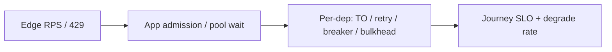

# Observability for Resilience

Metrics and signals that prove timeouts, retries, breakers, bulkheads, and shed are working — or silently failing.

> **Related:** RED/USE baselines → [HTS §11](../../high-throughput-systems/includes/11-observability.md) · SLOs → [sre-and-incidents](../../sre-and-incidents/README.md) · Cascading detection → [§9](09-cascading-failure.md) · Chaos abort criteria → [§10](10-chaos-and-failure-injection.md)

---

## At a glance

| Signal | Why it matters |
|--------|----------------|
| **Timeout / cancel rate** | Deadlines actually fire; clients not waiting forever |
| **Retry rate + retry ratio** | Amplification under control (budget) |
| **Breaker state + open rate** | Dependency isolation engaged |
| **Bulkhead reject / queue wait** | Isolation caps hit before process melt |
| **Shed / degrade hit rate** | Intentional protection vs accidental errors |
| **Pool acquire wait** | Classic cascade leading indicator |

**Rule of thumb:** If you cannot see **retry ratio**, **breaker state**, and **pool wait** per dependency, you are flying blind when hardening.

---

## Must-have metrics (per dependency)

| Metric | Good starting alert |
|--------|---------------------|
| `outbound_timeouts_total` / rate | Sustained spike vs baseline |
| `outbound_retries_total` and **retry_ratio** = retries / (attempts) | Ratio above budget (e.g. 10%) for N minutes |
| `circuit_breaker_state` (closed/open/half-open) | Open on T0; flapping |
| `bulkhead_in_use` / `bulkhead_rejections` | Rejections climbing with latency |
| `pool_acquire_wait_seconds` (p99) | Wait approaching request timeout |
| `shed_responses_total` (429/503 reason=overload) | Unexpected shed on T0 paths |
| `degrade_mode_total{feature=...}` | T1 omit/stale rate for product visibility |
| `deadline_canceled_total` | Parent cancel propagating |

Label by `dependency`, `route` or `journey`, and `tier` (T0/T1/T2) where possible.

---

## Traces and logs

| Practice | Why |
|----------|-----|
| Propagate trace + **deadline budget** | See which hop burned the budget — [§1](01-timeouts.md) |
| Span events: retry, breaker open, bulkhead reject | Distinguish user error from protection |
| Log **idempotency key** on writes (not secrets) | Dedupe incidents and double-submit debug |
| Structured `outcome=timeout\|shed\|degraded\|ok` | Dashboard-friendly |

---

## Dashboards that match the stack

| Panel group | Includes |
|-------------|----------|
| **Journey** | Checkout/browse SLO, error budget burn |
| **Protection** | Shed rate, degrade rate by feature |
| **Dependencies** | Latency, error, timeout, retry ratio, breaker |
| **Saturation** | CPU, threads, DB/HTTP pool wait |

Tie panels to version/build for deploy correlation — [deployment-strategies](../../deployment-strategies/README.md).

---

## Alerting hygiene

| Alert | Prefer |
|-------|--------|
| Breaker open on T0 | Page; runbook link |
| Retry ratio high | Warn → page if coupled with dep p99 |
| Pool wait high | Page before timeout meltdown |
| Degrade rate high | Ticket/product for T1; page only if T0 impacted |
| Single timeout blip | Do not page — use burn rates / windows |

Error budgets decide when to stop shipping features and fix resilience gaps — [sre-and-incidents](../../sre-and-incidents/README.md).

---

## Proving patterns in CI and game days

| Check | Signal |
|-------|--------|
| Fault test: dep 5xx | Breaker opens; bulkhead rejects; retry ratio capped |
| Fault test: dep delay | Timeouts fire; parent deadline cancels children |
| Game day: omit T1 | Degrade metric ↑; T0 SLO holds |

See [§10](10-chaos-and-failure-injection.md) and [testing-strategy §5](../../testing-strategy/includes/05-load-soak-resilience-tests.md).

---

## Common mistakes

| Mistake | Fix |
|---------|-----|
| Only RED on inbound | Also outbound per dependency |
| Breaker without state metric | Export state + transition counters |
| Alerting on every retry | Alert on ratio / budget burn |
| No degrade metric | Cannot tell intentional omit from bug |
| Dashboards without journey view | Start from checkout/browse SLO |

## Pros and cons

| | Instrument protection paths | Only node CPU/RAM |
|--|----------------------------|-------------------|
| **Pros** | Tune and trust patterns | Cheap |
| **Cons** | Label cardinality discipline | Miss cascades forming |
