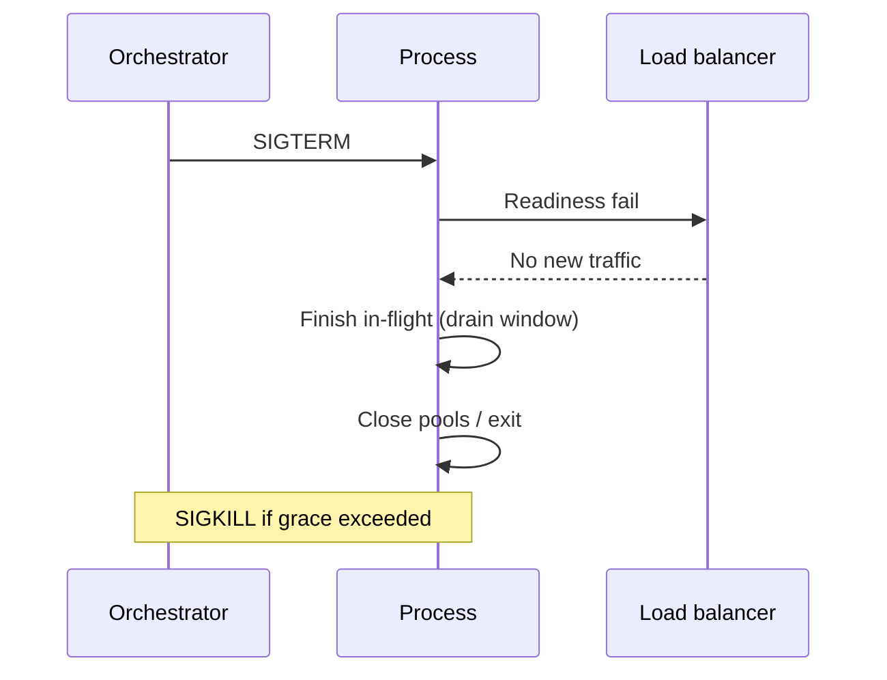

# Graceful Shutdown and Drain

Keep in-flight work safe when instances stop — deploys, scale-in, and crashes you can still prepare for.

> **Related:** LB draining → [HTS §16](../../high-throughput-systems/includes/16-networking-fundamentals.md) · Container probes → [cicd §7](../../cicd-and-environments/includes/07-containers-and-health.md) · Rolling/canary → [deployment-strategies](../../deployment-strategies/README.md) · Bulkheads → [§4](04-bulkheads.md)

---

## At a glance

| Phase | Behavior |
|-------|----------|
| **Stop admitting** | Fail readiness; refuse new requests/jobs |
| **Drain** | Finish or cancel in-flight within a deadline |
| **Release** | Close pools, flush logs/metrics, exit 0 |
| **Hard stop** | Orchestrator SIGKILL after grace period |

**Rule of thumb:** Shutdown is a resilience path. A kill mid-write without idempotency is a **duplicate or lost** side effect waiting to happen — [§6](06-idempotency-systemwide.md).

---

## HTTP / API process

| Step | Practice |
|------|----------|
| 1 | On `SIGTERM`, fail **readiness** immediately |
| 2 | Stop accepting new connections (server shutdown) |
| 3 | Wait in-flight up to `terminationGracePeriod` / drain timeout |
| 4 | Cancel work that cannot finish; rely on client retry **only** if idempotent |
| 5 | Close DB/HTTP pools; exit |

Align app drain with LB idle timeout and mesh drain — [HTS §16](../../high-throughput-systems/includes/16-networking-fundamentals.md).

---

## Workers and consumers

| Concern | Practice |
|---------|----------|
| In-flight message | Finish handler or extend visibility; do not ack then die |
| Long jobs | Checkpoint; make steps idempotent for redelivery |
| Stop signal | Stop polling; drain active handlers with a deadline |
| Replay after kill | Expect at-least-once — [§8](08-delivery-semantics.md) |

---

## Interaction with other patterns

| Pattern | During drain |
|---------|----------------|
| **Timeouts** | Keep deadlines; do not start work that cannot finish |
| **Retries** | Prefer not to start new retry loops on shutting instance |
| **Bulkheads** | In-flight counts should fall to zero before exit |
| **Breakers** | Unchanged; do not “help” by retrying harder on shutdown |
| **Idempotency** | Required for any client/orchestrator retry after kill |

---

## Config checklist

- [ ] Readiness fails on shutdown signal before drain
- [ ] Grace period ≥ p99 request (or job slice) + margin
- [ ] Gateway/mesh drain ≥ app drain
- [ ] No new queue leases after stop
- [ ] Idempotency on T0 writes (survive redelivery)
- [ ] PreStop hook only if runtime does not drain on SIGTERM alone

---

## Common mistakes

| Mistake | Fix |
|---------|-----|
| SIGKILL-first deploys | Handle SIGTERM; set grace period |
| Readiness still OK while dying | Fail readiness first |
| Drain shorter than p99 | Increase grace or cut request budget |
| Ack message then crash | Ack after side effects / outbox commit |
| Assuming exactly-once on kill | Design for at-least-once + dedup |

## Pros and cons

| | Graceful drain | Instant kill |
|--|----------------|--------------|
| **Pros** | Fewer partial writes; cleaner deploys | Faster scale-in |
| **Cons** | Slower rollouts if grace huge | Duplicates, 499s, pool storms |