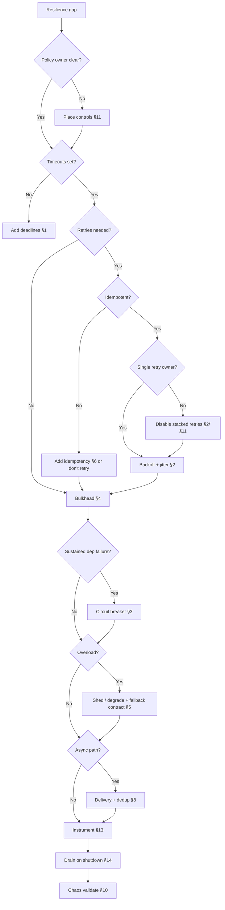

# Decision Guide — Resilience

When to apply which pattern — and common mistakes that cause cascades.

> **Related:** Overview stack → [00-overview.md](00-overview.md) · Policy placement → [§11](11-policy-placement.md) · Worked checkout → [§12](12-worked-example-checkout.md) · Architecture failure domains → [architecture §11](../../architecture-decisions/includes/11-failure-domains.md) · Overload → [HTS §9](../../high-throughput-systems/includes/09-backpressure-and-limits.md) · Rate limits → [api-rate-limiting §10](../../api-rate-limiting/includes/10-decision-guide.md)

---

## Master decision flow

---

## Scenario recommendations

| Scenario | Recommended approach |
|----------|----------------------|
| New outbound HTTP(Hypertext Transfer Protocol) client | Timeouts + bulkhead; retries only if idempotent; name the retry owner — [§11](11-policy-placement.md) |
| Mesh and app both retry | Keep timeouts in mesh; **one** retry owner — [§2](02-retries-backoff-jitter.md) |
| Payments dependency flaky | Tight timeout, breaker, **no** blind retry; idempotent keys |
| Browse page with recs + cart | Bulkhead recs; omit/stale contract; protect cart T0 — [§5](05-load-shedding-and-degradation.md), [§12](12-worked-example-checkout.md) |
| Tail latency on cheap reads | Consider **one** hedged request with cancel — [§2](02-retries-backoff-jitter.md) |
| Queue floods after outage | Jittered consumer backoff; DLQ(Dead Letter Queue); replay rate limit |
| Partner webhook duplicates | Dedup by event ID — [§6](06-idempotency-systemwide.md) |
| “Exactly once” stakeholder ask | At-least-once + idempotency; Kafka EOS(Exactly-Once Semantics) only in scope — [§8](08-delivery-semantics.md) |
| Singleton cron overlap | Lock/lease **or** `SKIP LOCKED` jobs — [§7](07-distributed-locks.md) |
| Site-wide brownout | Shed + breakers + reduce retries — [§9](09-cascading-failure.md) |
| Deploy kills in-flight checkouts | Graceful drain + idempotent T0 writes — [§14](14-graceful-shutdown-and-drain.md) |
| Unknown if patterns work | Game day — [§10](10-chaos-and-failure-injection.md); watch [§13](13-observability-for-resilience.md) signals |
| Edge abuse | Rate limit first — [api-rate-limiting](../../api-rate-limiting/README.md) |
| Need library names | Thin map only — [§15](15-implementation-map.md) |

---

## Priority checklist

- [ ] Every dependency has connect + request timeouts
- [ ] End-to-end deadline ≥ sum of child budgets
- [ ] Retry policy documented (including “none”) with a **single owner** layer
- [ ] Mesh/gateway retries not stacking with app retries
- [ ] Unsafe writes covered by idempotency
- [ ] Per-dependency concurrency caps
- [ ] Breakers on T0/T1 sync deps
- [ ] Fallback contract per T1/T2 (stale / omit / error) agreed with product
- [ ] Consumers: dedup + DLQ + alert
- [ ] Dashboards: pool wait, breaker state, retry ratio, degrade/shed rate — [§13](13-observability-for-resilience.md)
- [ ] Graceful shutdown: readiness fail → drain → exit — [§14](14-graceful-shutdown-and-drain.md)
- [ ] Liveness probes are not deep dependency checks — [cicd §7](../../cicd-and-environments/includes/07-containers-and-health.md)
- [ ] At least one chaos/game-day per critical journey
- [ ] Critical journey walkthrough (e.g. [§12 checkout](12-worked-example-checkout.md))

---

## Common mistakes

| Mistake | Why it hurts | Fix |
|---------|--------------|-----|
| Infinite client timeouts | Thread/pool meltdown | Explicit deadlines |
| Retry POST without keys | Double charges | Idempotency or no retry |
| Retries at every layer | Stampede | One owner — [§11](11-policy-placement.md) |
| No jitter | Thundering herd | Equal/full jitter |
| Shared executor | Cascade across features | Bulkheads |
| Breaker without timeout | Still hangs | Always both |
| Unbounded queues | Delayed meltdown | Cap + shed |
| Degrade without contract | UI/API(Application Programming Interface) surprise | Document fallback — [§5](05-load-shedding-and-degradation.md) |
| Distributed lock over HTTP call | Deadlocks / expiry hell | Redesign |
| Trusting broker EOS alone | Duplicate side effects | Dedup effects |
| Liveness = dep health | Restart storm | Shallow liveness |
| Instant kill on deploy | Partial writes | Drain — [§14](14-graceful-shutdown-and-drain.md) |
| Never injecting failure | False confidence | Chaos drills |
| Patterns without metrics | Cannot tune or trust | [§13](13-observability-for-resilience.md) |

---

## Quick decision summary

| Question | Default answer |
|----------|----------------|
| First control to add? | Timeouts |
| Where do retries live? | One owner — usually app outbound client |
| Retry writes? | Only if idempotent |
| Breaker when? | Sustained errors/latency with min volume |
| Overload tool? | Shed/degrade + rate limits + fallback contract |
| Async duplicates? | Expect them; dedup |
| Need a lock? | Prefer ownership/idempotency first |
| Hedge? | Rare; reads only; with cancel |
| How to verify? | Fault tests + game days + resilience metrics |

---

## See also

| Guide | Topics |
|-------|--------|
| [architecture-decisions](../../architecture-decisions/README.md) | Hop budget, failure domains |
| [high-throughput-systems](../../high-throughput-systems/README.md) | Saturation and backpressure |
| [api-design-and-protection](../../api-design-and-protection/README.md) | HTTP idempotency |
| [apache-kafka](../../apache-kafka/README.md) | Delivery guarantees |
| [sre-and-incidents](../../sre-and-incidents/README.md) | Incident response |
| [api-rate-limiting](../../api-rate-limiting/README.md) | Admission at the edge |
| [cicd-and-environments](../../cicd-and-environments/README.md) | Health probes, drain |
| [testing-strategy](../../testing-strategy/README.md) | Load/soak/resilience tests |