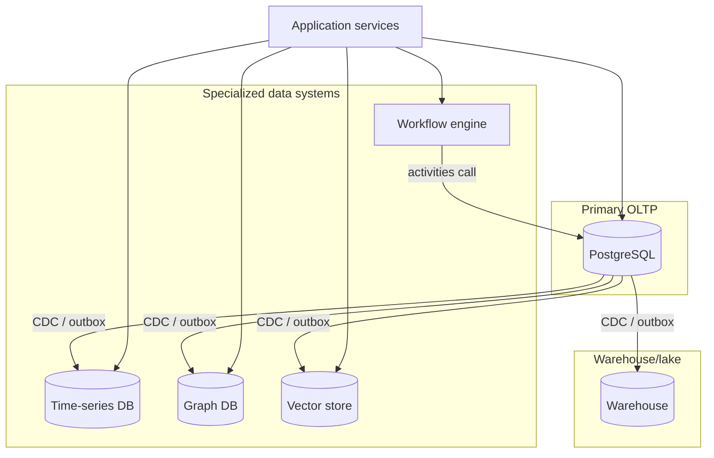

# Overview — Specialized Data Systems

Most products run on PostgreSQL plus a warehouse and never need anything else. This guide covers the four shapes of workload where a general-purpose relational store genuinely stops being the right tool: **time-ordered metrics at high cardinality, deeply connected graphs, similarity search over embeddings, and long-running multi-step workflows.**

**Rule of thumb:** Adopting a specialized store is an operational cost, not just a feature. Justify it with a workload property PostgreSQL (or your existing warehouse) structurally cannot serve — not with "this is what the tutorial used."

> **Related:**
> - OLTP vs OLAP baseline → [data-platforms §1](../../data-platforms/includes/01-oltp-vs-olap.md)
> - PostgreSQL's own limits → [postgresql-performance](../../postgresql-performance/README.md)
> - Event log as workflow baseline → [event-sourcing-and-cqrs §7](../../event-sourcing-and-cqrs/includes/07-sagas-and-distributed-workflows.md)
> - Capstone → [05-decision-guide.md](05-decision-guide.md)

---

## At a glance

| System | Workload shape | Section |
|--------|------------------|---------|
| **Time-series database** | Append-mostly, timestamp-ordered, high write cardinality, range/aggregate reads | [§1](01-time-series.md) |
| **Graph database** | Traversal-heavy queries over many-hop relationships | [§2](02-graph-databases.md) |
| **Vector store / RAG(Retrieval-Augmented Generation)** | Nearest-neighbor similarity search over high-dimensional embeddings | [§3](03-vector-and-rag.md) |
| **Workflow engine** | Long-running, multi-step processes needing durable state and retries | [§4](04-workflow-engines.md) |

---

## Where these sit relative to the rest of the data platform

Each specialized system is usually **fed from** the OLTP(Online Transaction Processing) system of record via CDC(Change Data Capture) or an outbox — see [data-platforms §1](../../data-platforms/includes/01-oltp-vs-olap.md) — rather than becoming a second source of truth. Workflow engines are the exception: they often *orchestrate* writes back into PostgreSQL rather than being fed by it.

---

## Document map

| # | Topic | File |
|---|-------|------|
| 1 | Time-series databases | [01-time-series.md](01-time-series.md) |
| 2 | Graph databases | [02-graph-databases.md](02-graph-databases.md) |
| 3 | Vector stores and RAG | [03-vector-and-rag.md](03-vector-and-rag.md) |
| 4 | Workflow engines | [04-workflow-engines.md](04-workflow-engines.md) |
| 5 | Decision guide | [05-decision-guide.md](05-decision-guide.md) |

---

## Adoption order

1. Confirm PostgreSQL genuinely can't serve the workload — see each section's "when PostgreSQL is enough" callout.
2. Prefer a **managed** offering for the first deployment of any of these — the operational learning curve is steep and the workload is, by definition, not your core competency.
3. Feed it asynchronously from the system of record; don't make it a second write path in the request — see [data-platforms §2](../../data-platforms/includes/02-search-systems.md) for the same pattern applied to search.
4. Instrument lag/freshness from day one — staleness is the recurring failure mode across all four systems here.

---

## Common mistakes

| Mistake | Fix |
|---------|-----|
| Reaching for a graph DB because the domain has foreign keys | Recursive CTE(Common Table Expression) handles most hierarchies — [§2](02-graph-databases.md) |
| Storing raw metrics in PostgreSQL rows indefinitely | Time-series DB with retention/downsampling — [§1](01-time-series.md) |
| Hand-rolling nearest-neighbor search with a full table scan | ANN(Approximate Nearest Neighbor) index — [§3](03-vector-and-rag.md) |
| Orchestrating a multi-day process with cron + status columns | Workflow engine or a well-tested saga — [§4](04-workflow-engines.md) |
| Adopting all four before any workload demands it | Each section's decision criteria; default to none |