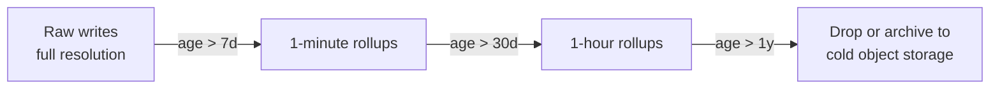

# Time-Series Databases

Time-series workloads are append-mostly, ordered by timestamp, queried by range and aggregate, and often written at far higher cardinality than a typical OLTP(Online Transaction Processing) table. A TSDB(Time-Series Database) is a storage engine specialized for exactly that shape.

> **Scope:** **Storage and query architecture** for time-series data — engine choice, retention, downsampling. Alerting on the metrics this stores, on-call practice, and dashboard design → [sre-and-incidents §4](../../sre-and-incidents/includes/04-observability-practice.md) and [high-throughput-systems §11](../../high-throughput-systems/includes/11-observability.md).
>
> **Related:** PostgreSQL partitioning baseline → [PG §10](../../postgresql-performance/includes/10-partitioning.md) · Retention cost → [finops-and-cost §4](../../finops-and-cost/includes/04-storage-and-retention-cost.md)

---

## At a glance

| Engine | Model | Best fit |
|--------|-------|----------|
| **TimescaleDB** | PostgreSQL extension; hypertables auto-partition by time | Teams already on PostgreSQL; SQL(Structured Query Language) joins against relational data alongside metrics |
| **InfluxDB** | Purpose-built TSDB, own storage engine and query language | Pure metrics/IoT workloads, high write throughput, no need for relational joins |
| **Prometheus** | Pull-based, in-memory + local TSDB, short local retention | Kubernetes/service metrics and alerting; pair with a remote-write long-term store |
| **Long-term Prometheus stores (Thanos, Cortex, Mimir)** | Object-storage-backed, horizontally scalable | Long retention and global query across many Prometheus instances |

**Rule of thumb:** If the query is "give me every row in this range with all its columns," a partitioned PostgreSQL table is fine. If the query is "give me the p99 of this metric, downsampled, across millions of unique label combinations," you need a TSDB.

---

## Why not just PostgreSQL

| Problem | Generic PostgreSQL table | TSDB approach |
|---------|---------------------------|----------------|
| **Storage** | Row storage; index bloat from constant inserts | Columnar/compressed chunks per time bucket; delta and dictionary encoding |
| **Cardinality** | One index per label combination gets expensive fast | Purpose-built label/tag indexing (inverted index over series) |
| **Retention** | Manual `DELETE`/partition drop | Native retention policies, automatic chunk expiry |
| **Downsampling** | Hand-written rollup jobs | Continuous aggregates / recording rules built in |

TimescaleDB narrows this gap by giving PostgreSQL native time-partitioning (hypertables), compression, and continuous aggregates — it is the right first stop for teams who want TSDB properties without leaving the PostgreSQL ecosystem. Reach for InfluxDB or Prometheus-family stores when write throughput or label cardinality outgrows what a PostgreSQL-based engine handles comfortably, or when the ecosystem (Grafana, alerting, existing Kubernetes tooling) already expects them.

---

## Retention and downsampling

| Pattern | TimescaleDB | InfluxDB | Prometheus family |
|---------|-------------|----------|---------------------|
| **Retention** | `drop_chunks` policy per hypertable | Retention policies per bucket | `--storage.tsdb.retention.time`; long-term via remote write |
| **Downsampling** | Continuous aggregates (materialized, incrementally refreshed) | Tasks/flux downsampling into a second bucket | Recording rules pre-compute aggregates; Thanos/Cortex/Mimir compact and downsample in object storage |
| **Compression** | Native columnar compression on older chunks | Built-in compression engine (TSM) | Local TSDB block compression; object storage for long-term |

**Rule of thumb for retention design:** decide the resolution/retention pairs *before* writing your first row (e.g. "full resolution 7 days, 1-minute rollups 90 days, 1-hour rollups 2 years") — retrofitting downsampling onto years of raw data is a slow, storage-heavy migration.

---

## Cardinality: the recurring failure mode

Nearly every time-series incident traces back to **label/tag cardinality explosion** — a label with unbounded values (user ID, request ID, raw URL path) multiplies the number of distinct series, and every engine here degrades under enough of them.

| Mitigation | How |
|------------|-----|
| **Bounded label values** | Enumerate allowed values; route free-form identifiers to logs/traces, not metric labels |
| **Cardinality budget** | Track total active series per team/service; alert before it becomes an incident |
| **Aggregate before ingest** | Pre-aggregate at the edge (e.g. per-route, not per-request) when raw granularity isn't needed |
| **Separate high-cardinality workloads** | If you truly need per-entity time series (e.g. per-device IoT telemetry), size for it explicitly rather than treating it like a metrics label |

This is the same discipline [sre-and-incidents §4](../../sre-and-incidents/includes/04-observability-practice.md) asks for at the practice level — this section is where the storage engine enforces (or fails to enforce) it.

---

## When PostgreSQL/TimescaleDB is enough

| Signal | Stay on PostgreSQL/TimescaleDB |
|--------|----------------------------------|
| Need to join time-series against relational domain data in the same query | Yes |
| Moderate write rate, bounded label cardinality | Yes |
| Team has no bandwidth to operate a new engine | Yes — start with the TimescaleDB extension |
| Millions of unique series, need purpose-built compression/query engine, or already Kubernetes/Prometheus-native | Move to InfluxDB or the Prometheus family |

---

## Common mistakes

| Mistake | Fix |
|---------|-----|
| Unbounded labels (user ID, raw path) on metrics | Bounded label values; push high-cardinality identifiers to logs/traces |
| No retention policy decided up front | Design resolution/retention tiers before first write |
| Treating Prometheus local storage as long-term | Remote write to Thanos/Cortex/Mimir for retention beyond weeks |
| Ad hoc rollup scripts instead of native continuous aggregates/recording rules | Use the engine's built-in downsampling |
| Running analytics-style ad hoc queries against the same TSDB serving alerting | Isolate or replicate — protect the alerting query path |