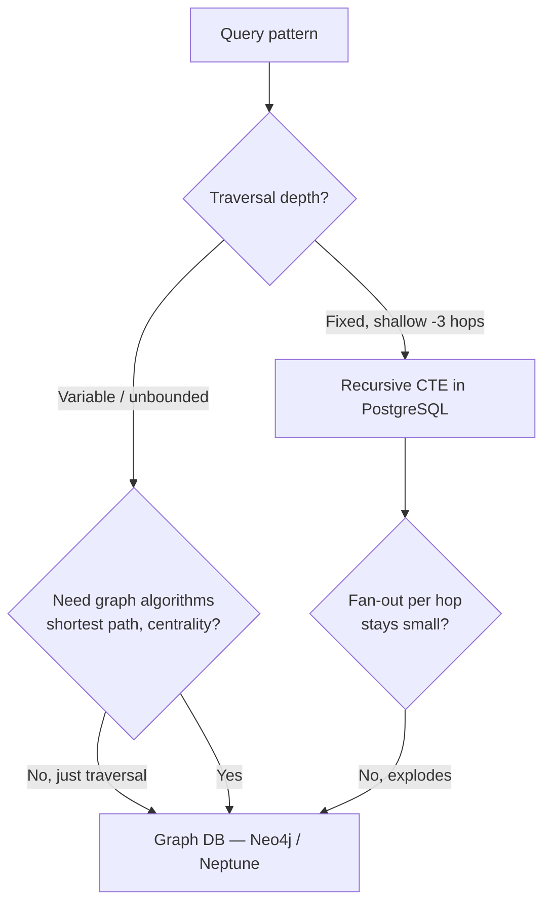

# Graph Databases

Graph databases earn their cost when the **query pattern is the traversal itself** — variable-depth "friends of friends of friends," shortest path, or community detection — not merely because the domain has foreign keys.

> **Related:** Recursive CTE(Common Table Expression) baseline → [PG §2](../../postgresql-performance/includes/02-indexing.md) · Time-series → [§1](01-time-series.md) · Decision guide → [05-decision-guide.md](05-decision-guide.md)

---

## At a glance

| Option | Model | Best fit |
|--------|-------|----------|
| **PostgreSQL recursive CTE** | Relational, `WITH RECURSIVE` traversal | Shallow-to-moderate depth (a handful of hops), predictable fan-out, already relational |
| **Neo4j** | Native property graph, Cypher query language | Deep/variable traversals, graph algorithms, self-hosted or Neo4j Aura |
| **Amazon Neptune** | Managed property graph (Gremlin/openCypher) or RDF(Resource Description Framework)/SPARQL(SPARQL Protocol and RDF Query Language) | Already on AWS(Amazon Web Services); want a managed graph engine without running Neo4j ops |

**Rule of thumb:** If you can bound the traversal depth and the query still reads naturally as SQL(Structured Query Language) joins, stay relational. Reach for a dedicated graph database when depth is **unbounded or highly variable**, or when you need graph algorithms (shortest path, PageRank, community detection) that relational engines don't provide natively.

---

## Why traversal depth is the deciding factor



A relational recursive CTE re-executes a join at every recursion level. That's fine when depth and fan-out are bounded (an org chart rarely exceeds a handful of levels; a category tree is shallow). It degrades badly when depth is unbounded and fan-out compounds — a social graph "friends of friends of friends" query can touch an exponentially growing row count per additional hop.

Graph databases store **index-free adjacency** — each node holds direct pointers to its relationships, so traversing one more hop is a pointer walk, not a re-executed join. That's what makes deep, variable-depth traversal fast regardless of overall graph size.

---

## Recursive CTE in PostgreSQL

```sql
WITH RECURSIVE org_chart AS (
    SELECT id, manager_id, name, 1 AS depth
    FROM employees
    WHERE id = :root_id
    UNION ALL
    SELECT e.id, e.manager_id, e.name, oc.depth + 1
    FROM employees e
    JOIN org_chart oc ON e.manager_id = oc.id
)
SELECT * FROM org_chart;
```

- Add a `depth` cap (`WHERE depth < N`) to avoid runaway recursion on unexpectedly cyclic or deep data.
- Index the join column (`manager_id` above) — recursive CTEs pay the same indexing rules as any other join.
- Works well for org charts, category/tag hierarchies, bill-of-materials trees, and permission inheritance chains that are shallow by design.

## Neo4j and Neptune

| | Neo4j | Amazon Neptune |
|--|-------|------------------|
| **Query language** | Cypher (declarative, pattern-matching) | openCypher or Gremlin (property graph); SPARQL for RDF workloads |
| **Operational model** | Self-hosted or Neo4j Aura (managed) | Fully managed AWS service |
| **Graph algorithms** | Graph Data Science library: PageRank, community detection, similarity, shortest path | Neptune Analytics for algorithmic workloads |
| **Best fit** | Teams wanting the richest tooling/algorithm library, or multi-cloud | AWS-native shops wanting managed ops with no cluster to run |

Cypher example for a variable-depth traversal that would be awkward as a recursive CTE:

```cypher
MATCH (a:Person {id: $rootId})-[:FRIEND*1..5]-(b:Person)
RETURN DISTINCT b.name
```

`*1..5` walks 1 to 5 hops in either direction natively — the graph engine handles the fan-out without you hand-writing recursion bounds or worrying about join explosion.

---

## Common graph use cases

| Use case | Why graph fits |
|----------|------------------|
| Social network (friends-of-friends, mutual connections) | Deep, variable traversal over a dense relationship graph |
| Fraud ring detection | Shortest-path / community-detection algorithms surface clusters relational joins can't cheaply reveal |
| Recommendation (collaborative filtering via shared connections) | Traversal + graph similarity algorithms |
| Knowledge graphs / entity relationships | Schema-flexible relationships between heterogeneous entity types |
| Permission/ACL(Access Control List) inheritance across deep, irregular hierarchies | Variable-depth traversal with cycle-safety built into the engine |

---

## When PostgreSQL is enough

| Signal | Stay relational |
|--------|-------------------|
| Traversal depth is fixed and shallow (org chart, category tree) | Yes |
| Fan-out per hop is small and bounded | Yes |
| No need for graph algorithms (shortest path, centrality, community detection) | Yes |
| Team has no bandwidth to run or pay for a second database | Yes — a recursive CTE with a depth cap covers most hierarchy needs |
| Deep/variable traversal, or graph algorithms are core to the feature | Move to Neo4j or Neptune |

---

## Common mistakes

| Mistake | Fix |
|---------|-----|
| Adopting a graph database because entities have relationships | Most relational domains don't need traversal-as-a-query-pattern; check depth/fan-out first |
| Unbounded recursive CTE with no depth cap | Add `WHERE depth < N`; guard against cycles |
| Running graph algorithms (PageRank, shortest path) as application code over relational joins | Use a graph engine's native algorithm library |
| Treating a graph database as the system of record for everything | Keep it scoped to the traversal-heavy subdomain; feed it via CDC(Change Data Capture) from the OLTP(Online Transaction Processing) system of record like other specialized stores — [overview](00-overview.md) |
| Choosing RDF/SPARQL by default | Property graph (Cypher/Gremlin) fits most application graphs better; reserve RDF/SPARQL for semantic-web/ontology-heavy interoperability needs |