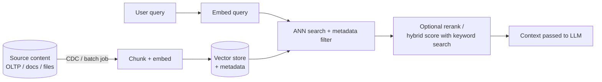
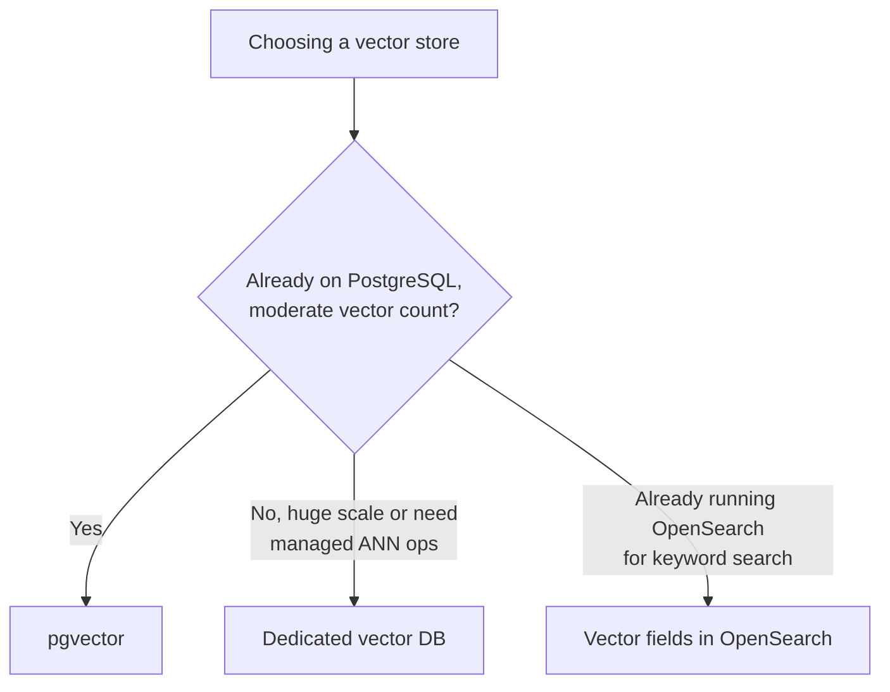

# Vector Stores and RAG

RAG(Retrieval-Augmented Generation) systems retrieve relevant context by similarity search over embeddings, then feed that context to a language model. This section covers the **retrieval architecture** — embedding stores, ANN(Approximate Nearest Neighbor) indexing, and hybrid search — not prompt engineering or model selection.

> **Scope:** **Architecture for storing and querying embeddings at scale** — index choice, freshness, hybrid ranking. This is not a product tutorial for any single vector database; evaluate specific products against the criteria here.
>
> **Related:** Feeding embeddings from the system of record → [overview](00-overview.md) · Search systems for keyword/faceted search → [data-platforms §2](../../data-platforms/includes/02-search-systems.md) · PII(Personally Identifiable Information) in embeddings → [enterprise-security-compliance §7](../../enterprise-security-compliance/includes/07-pii-and-data-classification.md)

---

## At a glance

| Component | Job |
|-----------|-----|
| **Embedding model** | Converts text/image/etc into a fixed-size dense vector |
| **Vector store** | Persists vectors + metadata; serves similarity queries |
| **ANN index** | Approximates nearest-neighbor search so it stays fast past millions of vectors |
| **Hybrid ranker** | Combines vector similarity with keyword/metadata filters for precision |

**Rule of thumb:** Exact nearest-neighbor search is `O(n)` per query — fine for a demo, unusable past a few hundred thousand vectors. Every production vector store trades a small amount of recall for an ANN index that makes queries sublinear.

---

## Retrieval architecture

- **Chunking** (splitting source content before embedding) is a retrieval-quality lever, not an infrastructure decision — pick chunk size/overlap per content type and evaluate empirically; this guide stops at "the architecture must support re-chunking and re-embedding without downtime," not "here is the right chunk size."
- **Freshness**: embeddings go stale the moment source content changes. Feed the pipeline via CDC(Change Data Capture) or an outbox from the system of record — the same pattern as [data-platforms §2](../../data-platforms/includes/02-search-systems.md) for search indexes — and track embedding lag as a first-class metric.

---

## Choosing a vector store

| Option | Model | Best fit |
|--------|-------|----------|
| **pgvector (PostgreSQL extension)** | Vectors as a column type; ANN via HNSW(Hierarchical Navigable Small World) or IVFFlat index | Already on PostgreSQL; moderate scale; want vectors joined against relational metadata in one query |
| **Dedicated vector database** (Pinecone, Weaviate, Milvus, Qdrant) | Purpose-built storage + ANN engine, often with built-in hybrid search and multi-tenant namespaces | Very large vector counts, need for managed scaling, or advanced filtering/hybrid features beyond what pgvector offers |
| **Search engine vector fields** (OpenSearch/Elasticsearch) | Vector similarity as one field type alongside existing full-text search | Already running OpenSearch for search; want one system for keyword + vector rather than two |

**Rule of thumb:** Start with **pgvector** unless you already know your vector count or query-per-second needs exceed what a PostgreSQL-hosted index comfortably serves — it avoids a second database and keeps vectors joinable against relational metadata (tenant, permissions, freshness timestamp) in one query.

---

## ANN indexing at the architecture level

| Index family | Idea | Tradeoff |
|---------------|------|----------|
| **HNSW** | Multi-layer navigable graph; walk from coarse to fine layers toward nearest neighbors | High recall, fast queries; more memory and slower build/insert than IVF-based indexes |
| **IVF (inverted file) / IVFFlat** | Cluster vectors into buckets (via k-means); search only the nearest buckets | Faster to build, lower memory; recall depends on bucket count tuning |
| **Product quantization** | Compress vectors into compact codes for approximate distance computation | Large memory savings at some recall cost; often layered on top of HNSW/IVF |

You do not need to implement any of these — every vector store above ships one or more. The architectural decision is **which tradeoff to accept**: HNSW when query latency and recall matter most and you can afford the memory/build cost; IVF-family when ingest volume or memory footprint dominates and a small recall hit is acceptable.

---

## Hybrid search

Pure vector similarity misses exact keyword matches (SKUs, names, error codes) that users expect to find verbatim; pure keyword search misses semantic similarity. Production RAG systems combine both.

| Approach | How |
|----------|-----|
| **Metadata pre-filter** | Filter by tenant/permission/date before ANN search — cheapest and most important filter to get right |
| **Parallel keyword + vector, merge scores** | Run BM25(-style) keyword search and ANN search separately; combine with a weighted or learned re-ranker |
| **Reciprocal rank fusion** | Merge two ranked lists by rank position rather than raw score, avoiding scale-mismatch between keyword and vector scores |
| **Cross-encoder rerank** | Re-score the top-K candidates from initial retrieval with a more expensive, more accurate model before final ranking |

Always apply **permission/tenant filtering as a hard pre-filter**, not a post-filter on top-K results — post-filtering can return fewer results than requested, or leak the existence of content a user shouldn't be able to see through similarity scores alone.

---

## When PostgreSQL/pgvector is enough

| Signal | Stay on pgvector |
|--------|---------------------|
| Vector count in the low millions or less | Yes |
| Need vectors joined against relational metadata (permissions, tenant, freshness) | Yes |
| Query volume fits comfortably on existing PostgreSQL capacity | Yes |
| Vector count in the tens of millions+, or need managed multi-region scaling | Move to a dedicated vector database |
| Need advanced built-in hybrid search/rerank features out of the box | Evaluate a dedicated vector database or your existing search engine's vector fields |

---

## Common mistakes

| Mistake | Fix |
|---------|-----|
| Exact (brute-force) nearest-neighbor search past a small dataset | ANN index (HNSW/IVF) |
| No freshness pipeline — embeddings never updated after source content changes | CDC/outbox-fed re-embedding pipeline; track embedding lag |
| Permission filtering applied after retrieving top-K results | Pre-filter by tenant/permission before or during the ANN search |
| Treating chunk size/overlap as a solved default | Evaluate empirically per content type; support re-chunking without downtime |
| Adopting a dedicated vector database before pgvector's limits are actually hit | Start with pgvector; migrate only when scale or feature needs demand it |
| No retrieval quality evaluation loop | Track recall/precision on a labeled query set before and after index or chunking changes |