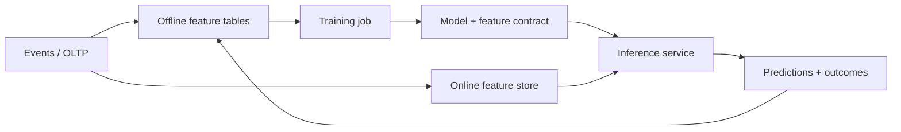
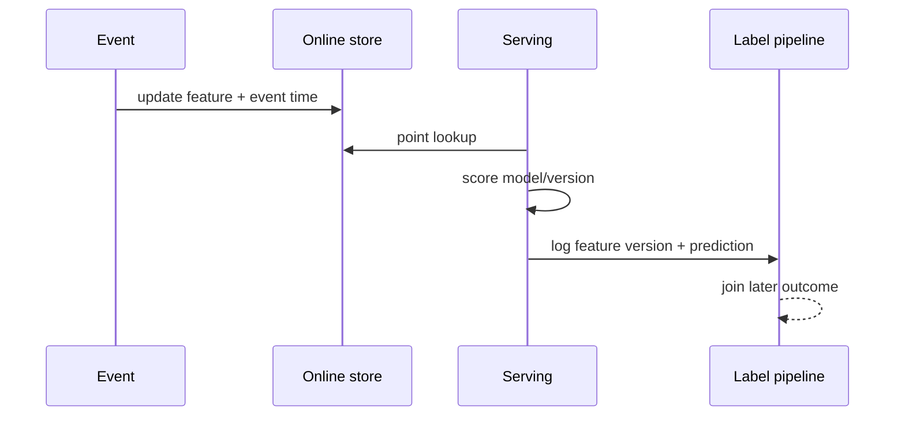

# Feature Stores and ML Serving

> **Scope:** This section owns online/offline feature consistency and low-latency ML(Machine Learning) serving. It does not cover vector retrieval or RAG(Retrieval-Augmented Generation) application design; see [§3](03-vector-and-rag.md).

> **Related:** [§3 Vector stores and RAG](03-vector-and-rag.md) · [data platforms](../../data-platforms/README.md) · [HTS caching](../../high-throughput-systems/includes/04-caching-layers.md)

---

## At a glance

| Concern | Production default |
|---------|--------------------|
| Feature definition | Versioned code/contract shared by training and serving |
| Offline store | Historical, point-in-time-correct training data |
| Online store | Low-latency latest feature values keyed by entity |
| Serving | Deadline, fallback, feature freshness metrics |
| Rollout | Shadow/canary model with prediction and business monitoring |
| Governance | Owner, lineage, access policy, retention per feature |

**Rule of thumb:** A feature store is valuable when the same governed features must be reproduced for training and low-latency inference; it is not a requirement for every model.

---

## Training and serving path

The offline store answers “what was known at the prediction time?” The online store answers “what is the current feature value within the serving latency budget?” Both derive from named feature definitions, not separately maintained SQL(Structured Query Language) and application logic.

| Component | Must guarantee |
|-----------|----------------|
| Feature definition | Entity key, type, owner, freshness, transformation version |
| Offline materialization | Point-in-time joins; no future data leakage |
| Online materialization | Idempotent updates, freshness timestamp, bounded lookup latency |
| Model registry | Model version linked to feature contract and training data |
| Inference service | Missing-value behavior, deadline, fallback, prediction log |

---

## Training-serving skew

Skew occurs when training features differ from inference features in definition, time, source, defaults, or join behavior. A model can pass offline evaluation while serving nonsense.

| Skew source | Prevention |
|-------------|------------|
| Future leakage | Point-in-time offline joins and event-time tests |
| Different transforms | Shared transformation artifact/version |
| Late events | Watermark, freshness policy, replay procedure |
| Missing online value | Explicit default plus missingness feature |
| Changed entity key | Contract test and dual-read migration |
| Stale materialization | Feature age metric and serving fallback |

Store feature timestamp, definition version, and source watermark with each prediction. Without them, a drift investigation cannot distinguish a changed model from stale or differently computed inputs.

---

## Serving latency and reliability

Budget inference as a request path: identity/authentication, feature lookups, model execution, optional rules, and response serialization all consume deadline. Keep online feature reads bounded and colocated where practical; do not make a real-time decision wait for warehouse queries.

| Situation | Safe behavior |
|-----------|---------------|
| Feature store timeout | Use documented fallback/default or return controlled degradation |
| Missing critical feature | Reject decision or route to manual/rules path |
| Model timeout | Use previous stable model only if semantics permit |
| Model registry unavailable | Serve already loaded approved version |
| Traffic spike | Concurrency limit, batching only within deadline, autoscale |

Use cache carefully. Cached features require a freshness budget and authorization scope; cached predictions require a deterministic input/version key and explicit invalidation when model or policy changes.

---

## Monitoring and rollout

Monitor system health and model quality separately. Low latency does not mean useful predictions; offline accuracy does not prove online inputs are correct.

| Signal | Detects |
|--------|---------|
| Feature freshness/missing rate | Pipeline lag or key mismatch |
| Feature distribution drift | Source/population change |
| Prediction distribution | Broken model load or input shift |
| p95 feature/model latency | Serving saturation |
| Outcome/label performance | Business quality after label delay |
| Fallback rate | Hidden dependency degradation |

Shadow new models without affecting decisions, then canary by bounded traffic/entity segment. Log old/new version, feature contract, decision, and outcome join key. Roll back on system SLO(Service Level Objective) or agreed quality guardrail, not an arbitrary accuracy number without label maturity.

---

## Governance and when not to adopt

Features often contain PII(Personally Identifiable Information) or encode policy. Maintain lineage, owners, access controls, retention, and deletion/recomputation behavior. Review features for prohibited proxies and explainability requirements before production use.

Use ordinary versioned tables plus a service when one team has few batch-scored models and no low-latency reuse. Adopt a feature store when many teams repeatedly rebuild the same entities, need consistent online/offline definitions, and can fund the operational ownership.

## Common mistakes

| Mistake | Fix |
|---------|-----|
| Train with current values for historical labels | Use point-in-time-correct joins |
| Reimplement transforms in serving code | Share versioned definitions/artifacts |
| Hide missing features behind zero | Model missingness explicitly and alert |
| Treat online store as source of truth | Rebuild it from durable source data |
| Release model without input observability | Log feature/model versions and freshness |
| Add a feature store for one simple batch model | Start with versioned tables and clear ownership |