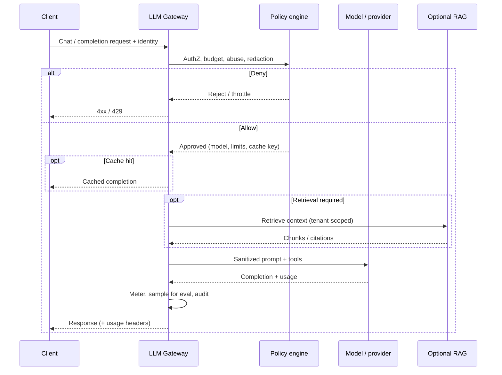
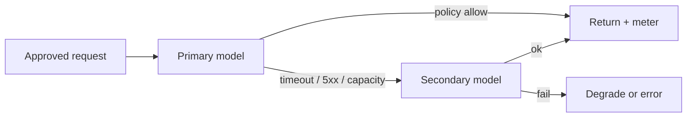

# LLM Gateway and Inference Edge

An LLM(Large Language Model) / AI gateway sits between product clients and model providers (or self-hosted inference). It owns admission control, budgets, caching, redaction, abuse defenses, failover, and hooks for evaluation — the same edge role an API(Application Programming Interface) gateway plays for HTTP(Hypertext Transfer Protocol) APIs, specialized for token-priced, high-variance inference.

> **Scope:** **Gateway and inference-edge operations** — auth, quotas, cache, PII(Personally Identifiable Information) redaction, abuse, model failover, eval hooks. This is **not** prompt engineering, chunking strategy, or RAG(Retrieval-Augmented Generation) retrieval design. Vector stores and retrieval → [§3](03-vector-and-rag.md). Online features / ML(Machine Learning) serving → [§3A](03A-feature-stores-and-ml-serving.md).
>
> **Related:** [§3 Vector stores and RAG](03-vector-and-rag.md) · [§3A Feature stores](03A-feature-stores-and-ml-serving.md) · API gateway request flows → [api-design §3A](../../api-design-and-protection/includes/03A-api-gateway-request-flows.md) · Rate tiers → [api-design §5](../../api-design-and-protection/includes/05-rate-limit-tiers.md) · PII classification → [ESC §7](../../enterprise-security-compliance/includes/07-pii-and-data-classification.md) · Resilience timeouts/breakers → [resilience §1–§3](../../resilience-patterns/includes/01-timeouts.md)

---

## At a glance

| Concern | Gateway default |
|---------|-----------------|
| **AuthN(Authentication) / AuthZ(Authorization)** | Service identity + tenant/user scope; never a shared org API key in every app |
| **Token budgets** | Per tenant / product / model; hard stop before soft warn |
| **Caching** | Semantic or exact-match only for safe, deterministic prompts; TTL(Time To Live) + tenant isolation |
| **PII redaction** | Strip or tokenize before provider egress; log redacted only |
| **Abuse** | Rate, cost, and content filters; quarantine noisy clients |
| **Failover** | Primary → secondary model/provider with explicit quality and cost policy |
| **Eval hooks** | Sampled shadow scoring and offline eval join keys — not blocking every request |

**Rule of thumb:** Treat every completion as a **metered, policy-gated remote call**. Product teams own prompts and retrieval; the gateway owns **who may spend tokens, on which models, with which data leaving the trust boundary**.

---

## Request path

| Hop | Owns |
|-----|------|
| **Client / BFF(Backend for Frontend)** | Product UX, conversation state, when to call retrieval |
| **Gateway** | Identity, budgets, cache, redaction, routing, metering |
| **Policy** | Allow/deny, model allow-list, data residency |
| **Optional RAG** | Retrieval only — [§3](03-vector-and-rag.md); gateway must pass tenant and auth context |
| **Model** | Inference; may be multi-provider behind the gateway |

Do not put retrieval *inside* the model provider account as an opaque black box if you need tenant isolation, citation audit, or independent scaling — keep RAG as an explicit hop under your control.

---

## Auth and tenancy

| Practice | Why |
|----------|-----|
| Per-service credentials into the gateway | Blast radius; rotate without rewriting every client |
| Map caller → tenant + product + environment | Budgets and audit are meaningless without scope |
| Propagate end-user subject when required | Abuse attribution and per-user caps |
| Separate staging vs prod keys and model allow-lists | Prevents accidental spend on expensive prod models |
| Deny by default unknown models / tools | Shadow IT and prompt-injection surface |

Gateway AuthZ is **admission**, not application AuthZ for domain resources. Downstream tools that read customer data still need their own checks — [api-design §12D](../../api-design-and-protection/includes/12D-fine-grained-authz.md).

---

## Token budgets and metering

| Control | Notes |
|---------|-------|
| **Hard budget** | Cut off at quota; return structured `budget_exhausted` |
| **Soft warn** | Metrics + optional client header before hard stop |
| **Per-model pricing** | Budget in **cost units**, not only tokens (models differ wildly) |
| **Concurrency + QPS** | Stop runaway loops even when budget remains |
| **Streaming** | Meter prompt tokens up front; completion tokens on finalize |

Expose usage on responses and in billing exports. Product and FinOps(Cloud Financial Operations) need the same numbers — [finops](../../finops-and-cost/README.md).

---

## Caching

| Mode | When safe |
|------|-----------|
| **Exact match** | Fully deterministic, non-personalized, no secrets in key |
| **Semantic / embedding cache** | Only for low-stakes, non-personalized answers; version the embed model |
| **Never cache** | User-private data, payments, health, live prices, tool results with side effects |

Cache keys must include tenant, model version, policy version, and prompt template version. A shared global cache across tenants is a confidentiality bug.

---

## PII redaction and egress

| Step | Practice |
|------|----------|
| Detect | Patterns + classifiers for high-risk fields before provider call |
| Redact / tokenize | Replace with stable tokens the product can reverse inside the trust boundary |
| Log | Store redacted prompt/response; retain raw only under explicit retention and access policy — [ESC §7](../../enterprise-security-compliance/includes/07-pii-and-data-classification.md) |
| Provider terms | Prefer providers with zero-retention / no-train options for customer data |
| Tools | Scrub tool arguments the same way as prompts |

Gateway redaction is defense-in-depth; product prompts should still minimize PII by design.

---

## Abuse and safety filters

| Layer | Example |
|-------|---------|
| **Volume** | Per-key and per-user rate / cost caps |
| **Content** | Block lists, prompt-injection heuristics, output filters where required |
| **Loop detection** | Agent/tool call depth and wall-clock budgets |
| **Quarantine** | Temporary deny for keys that burn budget or trigger safety alarms |

Pair with edge API rate limiting for public surfaces — [api-rate-limiting](../../api-rate-limiting/README.md).

---

## Model failover

| Rule | Why |
|------|-----|
| Failover policy is explicit (quality, cost, latency) | Silent downgrade can change product behavior |
| Do not failover into a model that violates residency or data policy | Compliance failure |
| Record which model served | Eval and incident forensics |
| Circuit-break unhealthy providers | [resilience §3](../../resilience-patterns/includes/03-circuit-breakers.md) |

---

## Eval hooks

| Hook | Use |
|------|-----|
| **Request id + prompt/template version** | Join offline labels and human review |
| **Shadow / sampled scoring** | Quality without blocking latency path |
| **Canary by model version** | Compare primary vs candidate under production traffic shape |
| **Guardrail metrics** | Refusal rate, toxicity, grounding fail (when retrieval used) |

Online eval is a **platform concern** adjacent to the gateway; feature-store / prediction logging patterns in [§3A](03A-feature-stores-and-ml-serving.md) apply when you score structured decisions, not free-form chat.

---

## Operational checklist

- [ ] Per-tenant budgets in cost units; hard stop enforced at gateway
- [ ] Model allow-list and residency policy as code
- [ ] PII redaction before egress; redacted audit trail
- [ ] Cache isolated by tenant; no cache for private or side-effecting calls
- [ ] Provider timeouts, breakers, and documented failover
- [ ] Usage and error dashboards; cost alerts before month-end surprise
- [ ] Eval sample pipeline keyed by request id and template/model version

---

## Common mistakes

| Mistake | Fix |
|---------|-----|
| Shipping product apps with the provider API key | Gateway + short-lived service credentials |
| Budgeting only in tokens | Cost units per model |
| Caching personalized completions globally | Tenant-scoped keys or no cache |
| Treating RAG as “inside the LLM vendor” | Explicit retrieval hop — [§3](03-vector-and-rag.md) |
| Failover without recording model id | Always meter and log serving model |
| Blocking every request on offline eval | Sampled / async hooks |
| Prompt engineering owned by the gateway team | Product owns prompts; gateway owns policy and spend |

---

## Pros and cons

### Central LLM gateway

**Pros:** One place for spend, PII egress, failover, and abuse; consistent metering for FinOps.

**Cons:** Another critical path; misconfig can deny all AI features; must stay thin (policy, not product logic).

### Direct provider SDK in every service

**Pros:** Fast to prototype.

**Cons:** Key sprawl, inconsistent budgets, no central redaction, impossible org-wide failover.