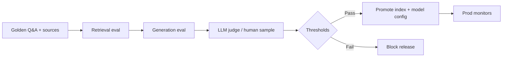

# RAG and LLM Evaluation

Shipping RAG(Retrieval-Augmented Generation) without an **eval harness** is shipping unmeasured quality. This article covers retrieval metrics, judge models, golden sets, and deploy gates — **not prompt craft or model pick**.

> **Scope:** Quality evaluation pipeline for RAG/LLM(Large Language Model) features — offline metrics, CI(Continuous Integration) gates, production monitors. Retrieval architecture → [§3](03-vector-and-rag.md). Gateway auth/budgets → [§3B](03B-llm-gateway-and-inference-edge.md). Search relevance tuning → [data-platforms §2B](../../data-platforms/includes/02B-search-relevance-and-ranking.md).
>
> **Related:** Feature store patterns → [§3A](03A-feature-stores-and-ml-serving.md) · PII(Personally Identifiable Information) in chunks → [ESC §7](../../enterprise-security-compliance/includes/07-pii-and-data-classification.md) · Contract testing culture → [testing §3](../../testing-strategy/includes/03-contract-testing-boundaries.md)

---

## At a glance

| Layer | Eval focus |
|-------|------------|
| **Retrieval** | Recall@K, MRR(Mean Reciprocal Rank) on golden chunks |
| **Generation** | Faithfulness, answer relevance (LLM judge or human) |
| **End-to-end** | Task success on labeled Q&A pairs |
| **Safety** | Refusal / leakage cases |
| **Ops** | Latency, cost, error rate via [§3B](03B-llm-gateway-and-inference-edge.md) |

**Rule of thumb:** **Gate deploy on retrieval first** — a bad index cannot be prompt-engineered away. Generation eval catches hallucination after retrieval is stable.

---

## Eval pipeline

| Artifact | Owner |
|----------|-------|
| **Golden set** | Product + domain experts; versioned in git |
| **Chunk manifest** | Expected doc ids per question |
| **Judge rubric** | Scoring criteria; temperature 0 |
| **Baseline** | Previous prod config for regression compare |

Architecture context → [§3](03-vector-and-rag.md).

---

## Retrieval metrics

| Metric | Catches |
|--------|---------|
| **Recall@K** | Missing relevant chunk in top K |
| **MRR** | Right chunk buried low |
| **nDCG(Normalized Discounted Cumulative Gain)** | Graded relevance |
| **Citation hit rate** | Returned chunk supports cited span |

Run against **frozen embeddings** when comparing ranker changes; re-embed only when embedding model changes. Hybrid keyword + vector cases mirror [data-platforms §2B](../../data-platforms/includes/02B-search-relevance-and-ranking.md).

---

## Generation and judge

| Method | Use |
|--------|-----|
| **LLM-as-judge** | Scale; rubric with reference answer |
| **Human spot-check** | 5–10% sample each release |
| **Exact match / BLEU** | Poor alone for open answers; OK for structured |
| **Faithfulness** | Answer entailed by retrieved context only |
| **Refusal tests** | Out-of-scope, PII requests |

Route judge calls through [§3B](03B-llm-gateway-and-inference-edge.md) with separate budget and model policy.

---

## Deploy gate

| Gate | Typical threshold |
|------|-------------------|
| **Retrieval Recall@5** | No regression > 2% vs baseline |
| **Faithfulness** | ≥ 95% on golden set |
| **Latency p99** | Within SLO(Service Level Objective) — [§3B](03B-llm-gateway-and-inference-edge.md) |
| **Cost per query** | Budget cap for canary |
| **Safety suite** | 100% pass on blocklist cases |

Canary in prod with shadow eval on sampled queries before full traffic.

---

## Common mistakes

| Mistake | Fix |
|---------|-----|
| Eval only final answer text | Split retrieval vs generation |
| Golden set from prod logs unchecked | Curated labels + negatives |
| Judge same model as prod | Independent judge model |
| No version pin on embeddings | Lock model + index build id |
| Prompt tweak bypasses CI | Config in git; gate on merge |
| PII in eval fixtures | Scrub — [ESC §7](../../enterprise-security-compliance/includes/07-pii-and-data-classification.md) |

---

## Pros and cons

| Approach | Pros | Cons |
|----------|------|------|
| **Full offline harness in CI** | Catches regressions pre-prod | Upfront golden investment |
| **Human-only QA** | High trust | Slow; not every deploy |
| **Prod-only thumbs feedback** | Real users | Late detection; biased |
