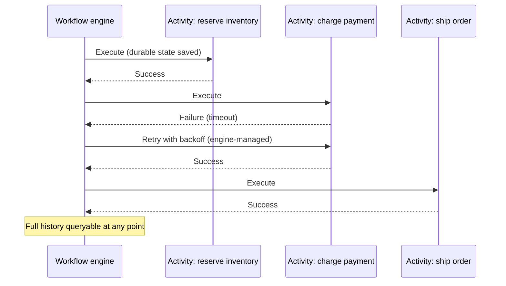
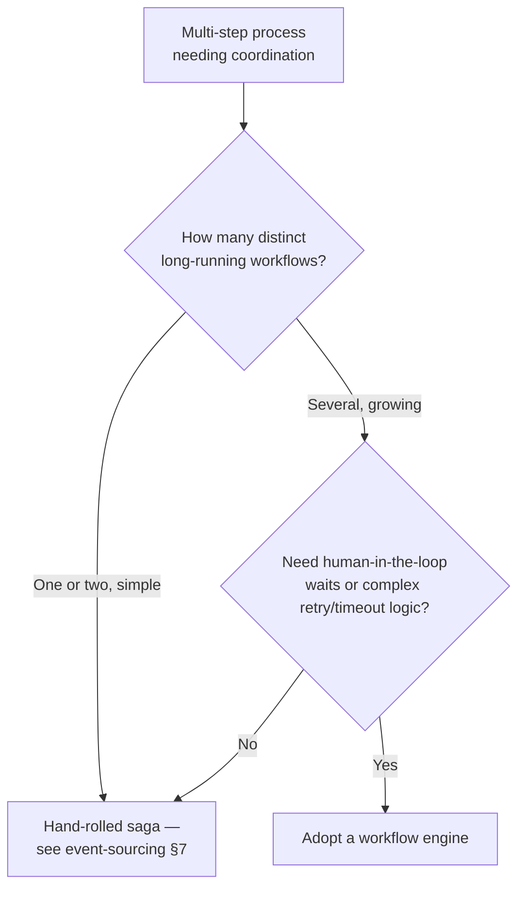

# Workflow Engines

Long-running, multi-step business processes — provisioning a resource across five services, a claims process that waits days for a human, a multi-stage batch pipeline — need durable state and reliable retries. A workflow engine (Temporal, AWS(Amazon Web Services) Step Functions, Camunda) gives you that as a platform instead of a bespoke saga you maintain forever.

> **Related:** Hand-rolled saga baseline → [event-sourcing-and-cqrs §7](../../event-sourcing-and-cqrs/includes/07-sagas-and-distributed-workflows.md), [§7A choreography vs orchestration](../../event-sourcing-and-cqrs/includes/07A-sagas-choreography-orchestration.md) · Idempotency for activities → [resilience-patterns §6](../../resilience-patterns/includes/06-idempotency-systemwide.md) · Decision guide → [05-decision-guide.md](05-decision-guide.md)

---

## At a glance

| Engine | Model | Best fit |
|--------|-------|----------|
| **Temporal** | Code-first: write workflows as regular code; the engine durably replays execution history | Teams wanting workflow logic in their own language with strong local testability |
| **AWS Step Functions** | Declarative state machine (JSON(JavaScript Object Notation)/ASL) orchestrating AWS services | Already AWS-native; want a managed, serverless orchestrator with no cluster to run |
| **Camunda** | BPMN(Business Process Model and Notation)-based process engine, strong human-task support | Processes with business-analyst-authored flowcharts and human approval steps |
| **Hand-rolled saga** | Application code + event log + compensation logic | Small number of steps, team already owns event sourcing, no appetite for a new platform |

**Rule of thumb:** A workflow engine earns its cost once you have **more than a couple of long-running, multi-step processes** that need durable retries, human-in-the-loop waits, or visibility into "which step is process #4821 stuck on right now." One or two simple sagas usually don't justify adopting a new platform.

---

## What a workflow engine gives you that cron + status columns don't

| Capability | Cron + status columns | Workflow engine |
|------------|-------------------------|-------------------|
| **Durable state across restarts** | Manual — reload state from DB, hope you covered every step | Built in — engine persists execution history |
| **Retry with backoff per step** | Hand-written, often inconsistent across jobs | Declarative per-activity retry policy |
| **Human-in-the-loop waits (hours/days)** | Polling loop or a second cron job | Native "wait for signal/timer" primitives |
| **Visibility ("what step is this stuck on")** | Ad hoc log grepping | Built-in execution history UI/query API(Application Programming Interface) |
| **Versioning running workflows during a deploy** | Extremely error-prone by hand | Engine-supported versioning (with care — see below) |

---

## Temporal vs Step Functions vs Camunda

| | Temporal | Step Functions | Camunda |
|--|----------|------------------|---------|
| **Authoring** | Code (Go, Java, TypeScript, Python, …) | Declarative state machine definition | BPMN diagram + code for task logic |
| **Hosting** | Self-hosted cluster or Temporal Cloud | Fully managed, serverless | Self-hosted or Camunda 8 SaaS(Software as a Service) |
| **Testing** | Strong — replay-based unit tests of workflow code | Limited to step-level testing; harder to unit test the whole flow | Process-level test tooling; less code-native than Temporal |
| **Human tasks** | Supported via signals, but not the primary design center | Supported via callback patterns | First-class — designed around human approval steps |
| **Vendor lock-in shape** | Open-source engine; portable if self-hosted | Deeply AWS-native | Open-source core; BPMN is a portable standard |

---

## Workflow engine vs hand-rolled saga

- A hand-rolled saga (event log + compensating actions, choreography or orchestration — see [event-sourcing-and-cqrs §7](../../event-sourcing-and-cqrs/includes/07-sagas-and-distributed-workflows.md)) is the right starting point for a small number of workflows your team already understands and can test.
- The tipping point toward a dedicated engine is usually **operational**, not architectural: you keep re-solving retry/backoff, human-wait, and observability primitives that a workflow engine gives you natively, and the cost of hand-maintaining them across a growing set of workflows exceeds the cost of adopting a platform.
- Workflow engines do not replace idempotency — every activity (the individual step a workflow invokes) must still be idempotent or side-effect-safe on retry, same as any other system in this corpus. See [resilience-patterns §6](../../resilience-patterns/includes/06-idempotency-systemwide.md).

---

## Operational considerations

| Concern | Practice |
|---------|----------|
| **Activity idempotency** | Every activity must tolerate at-least-once execution — the engine will retry on failure or worker crash |
| **Workflow versioning** | Changing workflow code while instances are mid-flight can break replay determinism — use the engine's versioning API (e.g. Temporal's `GetVersion`) rather than editing in place |
| **Timeouts per activity and per workflow** | Set explicit timeouts; an engine will happily wait forever on a hung activity without one |
| **Observability** | Alert on stuck workflows (no progress past an expected duration), not just failed ones |
| **Testing** | Prefer engines with strong local replay-based testing (Temporal) if workflow logic is complex and changes often |

---

## Common mistakes

| Mistake | Fix |
|---------|-----|
| Adopting a workflow engine for one simple two-step process | Hand-rolled saga is enough — [event-sourcing §7](../../event-sourcing-and-cqrs/includes/07-sagas-and-distributed-workflows.md) |
| Non-idempotent activities | Idempotency keys / natural dedup per activity — [resilience-patterns §6](../../resilience-patterns/includes/06-idempotency-systemwide.md) |
| Editing workflow code in place while instances are running | Use the engine's versioning primitive; keep old code path for in-flight instances |
| No timeout on a long-running activity | Explicit per-activity and per-workflow timeouts |
| Treating the engine's UI as the only observability | Export metrics (stuck workflows, activity failure rate) into your standard dashboards — [sre-and-incidents](../../sre-and-incidents/README.md) |
| Choosing Step Functions while multi-cloud is a hard requirement | Temporal or Camunda are more portable; Step Functions is deeply AWS-native |