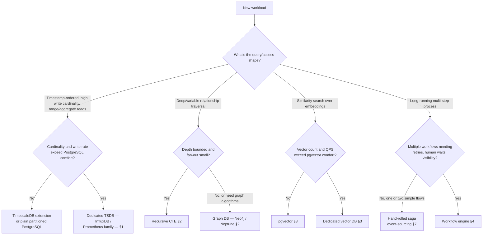

# Decision Guide — Specialized Data Systems

When each specialized store earns its cost over PostgreSQL, the warehouse, or a hand-rolled alternative.

> **Related:** Overview map → [00-overview.md](00-overview.md) · OLTP(Online Transaction Processing)/OLAP(Online Analytical Processing) baseline → [data-platforms §1](../../data-platforms/includes/01-oltp-vs-olap.md)

---

## Master decision flow

---

## Scenario recommendations

| Scenario | Recommended approach |
|----------|----------------------|
| Application metrics/dashboards, moderate scale | TimescaleDB extension on existing PostgreSQL |
| IoT telemetry, millions of devices reporting per second | InfluxDB or a Prometheus-family remote-write store |
| Kubernetes/service-level metrics and alerting | Prometheus + Thanos/Cortex/Mimir for retention |
| Org chart, category tree, shallow permission inheritance | Recursive CTE(Common Table Expression) in PostgreSQL |
| Social graph, fraud ring detection, recommendation via shared connections | Neo4j or Amazon Neptune |
| RAG(Retrieval-Augmented Generation) chatbot over internal docs, moderate corpus | pgvector alongside existing PostgreSQL |
| Multi-tenant SaaS(Software as a Service) product embedding search at large scale | Dedicated vector database (Pinecone, Weaviate, Milvus, Qdrant) |
| Provisioning workflow spanning five services with retries and approval steps | Temporal, Step Functions, or Camunda depending on cloud/authoring preference |
| Two-step saga (reserve inventory, charge payment) | Hand-rolled saga — see [event-sourcing-and-cqrs §7](../../event-sourcing-and-cqrs/includes/07-sagas-and-distributed-workflows.md) |
| Team with no bandwidth to operate any new database | Default to PostgreSQL extensions (TimescaleDB, pgvector) and recursive CTEs before any dedicated engine |

---

## Priority checklist

- [ ] Confirmed PostgreSQL (with extensions) genuinely can't serve the workload before adopting a new engine
- [ ] Retention/downsampling tiers decided before first write (time-series)
- [ ] Cardinality budget tracked and alerted on (time-series)
- [ ] Traversal depth/fan-out measured before choosing graph vs recursive CTE
- [ ] Embedding freshness pipeline (CDC(Change Data Capture)/outbox) in place, with lag tracked
- [ ] Permission/tenant filtering applied as a pre-filter on vector search, not a post-filter
- [ ] Workflow activities are idempotent; per-activity timeouts set
- [ ] Each specialized store fed asynchronously from the system of record, not a second write path in the request
- [ ] Managed offering evaluated first for any store the team hasn't operated before

---

## Common mistakes

| Mistake | Why it hurts | Fix |
|---------|---------------|-----|
| Adopting a specialized store before PostgreSQL's limits are actually hit | Extra operational surface with no workload benefit | Confirm the workload property first — [overview](00-overview.md) |
| Unbounded metric label cardinality | Time-series engine degrades, cost spikes | Bounded labels; cardinality budget — [§1](01-time-series.md) |
| Graph database adopted for shallow, bounded hierarchies | Unjustified operational cost | Recursive CTE — [§2](02-graph-databases.md) |
| Brute-force vector search past a small dataset | Query latency degrades linearly with data growth | ANN(Approximate Nearest Neighbor) index — [§3](03-vector-and-rag.md) |
| Hand-maintained retry/backoff/human-wait logic across many growing sagas | Duplicated, inconsistent reliability code | Workflow engine once the count justifies it — [§4](04-workflow-engines.md) |
| Any specialized store becoming a second source of truth | Split-brain, drift from the system of record | Feed via CDC(Change Data Capture)/outbox; system of record stays authoritative |

---

## Quick decision summary

| Question | Default answer |
|----------|-----------------|
| Time-series: PostgreSQL or dedicated TSDB(Time-Series Database)? | TimescaleDB extension first; dedicated TSDB once cardinality/throughput outgrow it |
| Graph: CTE or graph DB? | Recursive CTE unless traversal is deep/variable or needs graph algorithms |
| Vector: pgvector or dedicated? | pgvector first; dedicated vector DB once scale/feature needs demand it |
| Workflow: saga or engine? | Hand-rolled saga for one or two flows; engine once several need durable retries and visibility |
| Any of these fed synchronously in the request path? | No — always async via CDC/outbox |

---

## See also

| Guide | Topics |
|-------|--------|
| [data-platforms](../../data-platforms/README.md) | OLTP/OLAP split, search systems, migration coordination |
| [postgresql-performance](../../postgresql-performance/README.md) | Indexing, partitioning, recursive queries |
| [event-sourcing-and-cqrs](../../event-sourcing-and-cqrs/README.md) | Sagas, outbox, event log |
| [sre-and-incidents](../../sre-and-incidents/README.md) | Observability practice built on time-series metrics |
| [resilience-patterns](../../resilience-patterns/README.md) | Idempotency for workflow activities |
| [finops-and-cost](../../finops-and-cost/README.md) | Managed vs self-hosted TCO(Total Cost of Ownership) |