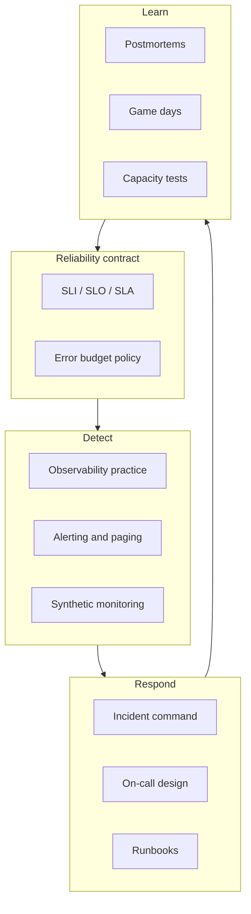

# SRE for Tech Leads

SRE(Site Reliability Engineering) is how you keep product velocity without burning reliability — or the on-call team. As a tech lead you own the **reliability contract** with product: what “good” means, how much risk to take, and how incidents are run.

> **Related:** Measurement lens → [high-throughput-systems §1](../../high-throughput-systems/includes/01-measurement-and-slo.md) · Deploy rollback → [deployment-strategies §13](../../deployment-strategies/includes/13-slo-rollback-triggers.md) · Runbooks → [RUNBOOK-TEMPLATE.md](../../RUNBOOK-TEMPLATE.md) · Decision guide → [§11](11-decision-guide.md)

---

## At a glance

| Responsibility | What “done” looks like |
|----------------|------------------------|
| **SLI(Service Level Indicator)/SLO(Service Level Objective)** | User-facing indicators with owners and dashboards |
| **Error budget** | Written policy: when to pause features vs reliability work |
| **Observability** | Metrics, logs, traces that answer “is the user hurt?” |
| **Alerting** | Pages only on symptoms that need humans now |
| **Incident command** | Roles, severity, comms template before the fire |
| **Postmortems** | Blameless write-ups with tracked follow-ups |
| **On-call** | Sustainable rotation, runbooks, escalation |

**Rule of thumb:** If product cannot name the SLO and the error-budget policy in one sentence each, you do not have SRE yet — you have monitoring.

---

## What this guide owns

| Section | Use when |
|---------|----------|
| [§1 SLI/SLO/SLA](01-sli-slo-sla.md) | Defining the contract |
| [§2 Error budgets](02-error-budgets.md) | Feature vs reliability trade-offs |
| [§3 Capacity](03-capacity-and-load-testing.md) | Before peak, launch, or major change |
| [§4 Observability](04-observability-practice.md) | Culture and signal design |
| [§5–§8](05-alerting-and-paging.md) | Pages, incidents, on-call |
| [§9–§10](09-game-days-and-drills.md) | Practice and proactive checks |
| [§11 Decision guide](11-decision-guide.md) | What to adopt first |

---

## Tech lead vs platform vs product

| Role | Owns | Does not own alone |
|------|------|--------------------|
| **Tech lead / service owner** | Service SLOs, runbooks, on-call health, incident follow-ups | Shared paging platform, org-wide SLO tooling |
| **Platform / SRE team** | Observability stack defaults, alert routing, golden dashboards | App-specific SLIs and business meaning |
| **Product** | Accepting budget burn / freeze decisions | Choosing which infra metrics to page on |

CI(Continuous Integration)/CD(Continuous Integration / Continuous Delivery) promotion and env ownership → [cicd-and-environments](../../cicd-and-environments/README.md). Deploy mechanics → [deployment-strategies](../../deployment-strategies/README.md).

---

## Minimum viable SRE (first 30 days)

1. Pick **one** user journey → one availability + one latency SLI → SLO with a window (30d).
2. Wire **error budget** burn alerts (fast + slow) and a one-page policy.
3. Write a runbook from [RUNBOOK-TEMPLATE.md](../../RUNBOOK-TEMPLATE.md); link it from the page.
4. Define SEV levels and who is IC(Incident Commander) after hours.
5. Schedule the first postmortem and one game-day within a quarter.

---

## Common mistakes

| Mistake | Fix |
|---------|-----|
| Equating uptime of VMs with user happiness | SLIs on request success and latency |
| Paging on every CPU spike | Symptom alerts + runbooks ([§5](05-alerting-and-paging.md)) |
| SLO without budget policy | [§2 Error budgets](02-error-budgets.md) |
| Incidents without roles | [§6 Incident command](06-incident-command.md) |
| Postmortems that blame people | [§7](07-postmortems.md) — systems and incentives |