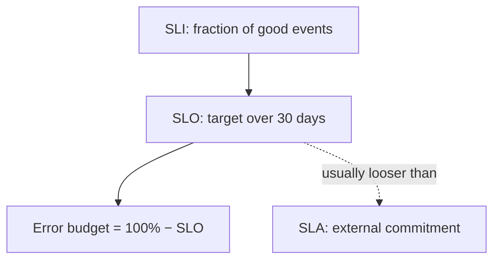

# SLI, SLO, and SLA

Reliability needs a shared vocabulary. Without it, “the API(Application Programming Interface) is down” and “we’re fine” can both be true depending on who you ask.

> **Scope:** **Reliability contract** — choosing indicators, objectives, and customer-facing agreements. Throughput measurement, load-test design, and layer profiling → [high-throughput-systems §1 Measurement and SLOs](../../high-throughput-systems/includes/01-measurement-and-slo.md).
>
> **Related:** Error budgets → [§2](02-error-budgets.md) · Observability practice → [§4](04-observability-practice.md) · Deploy rollback → [deployment-strategies §13](../../deployment-strategies/includes/13-slo-rollback-triggers.md)

---

## At a glance

| Term | Meaning | Audience |
|------|---------|----------|
| **SLI(Service Level Indicator)** | Measurable signal of user happiness | Engineering |
| **SLO(Service Level Objective)** | Target for an SLI over a window | Eng + product |
| **SLA(Service Level Agreement)** | Contractual promise (often with credits) | Legal / customers |

**Rule of thumb:** SLIs are facts. SLOs are goals. SLAs are lawsuits waiting to happen if you set them tighter than your SLO.

---

## How they nest

| Layer | Example |
|-------|---------|
| **SLI** | `successful_checkout_requests / total_checkout_requests` |
| **SLO** | 99.9% over 30 days → ~43 minutes of “bad” budget |
| **SLA** | 99.5% monthly with service credits below that |

Never sell an SLA stricter than the SLO you can actually defend with tooling and process.

---

## Good SLI shapes

Prefer **user-journey** indicators over raw host metrics.

| Pattern | Formula idea | Use when |
|---------|--------------|----------|
| **Availability** | Good / valid requests | Request/response APIs |
| **Latency** | Fraction under threshold (e.g. p99 < 300ms) | UX-sensitive paths |
| **Freshness** | Fraction of reads within staleness bound | Replicas, caches, projections |
| **Correctness** | Synthetic or shadow compare pass rate | Migrations, rewrites |
| **Throughput floor** | Sustained RPS capacity vs demand | Batch / pipeline SLOs |

| Avoid as primary SLI | Why |
|----------------------|-----|
| CPU / memory alone | Saturation ≠ user failure |
| “Pods Ready” | Can be Ready while returning 5xx |
| Ticket count | Lagging and political |

Throughput-oriented metric menus → [HTS §1](../../high-throughput-systems/includes/01-measurement-and-slo.md) and [HTS §11](../../high-throughput-systems/includes/11-observability.md).

---

## Worked examples

| Service | SLI | SLO (30d) | Notes |
|---------|-----|-----------|-------|
| **Checkout API** | HTTP(Hypertext Transfer Protocol) 2xx/3xx on `POST /checkout` excluding client 4xx | 99.9% | Exclude bad auth from denominator carefully |
| **Read API** | p99 latency < 200ms on `GET /items/{id}` | 99% of requests | Separate from availability SLO |
| **Worker** | Jobs completed within 5 min of enqueue | 99.5% | Use age-of-oldest + success rate |
| **Search index** | Documents searchable within 60s of write | 99% | CDC(Change Data Capture) lag as proxy |

Document **exclusions** (planned maintenance, client errors, third-party outages you do not control) in the same place as the SLO.

---

## Windows and burn

| Window | Strength | Weakness |
|--------|----------|----------|
| **Rolling 30 days** | Stable product conversation | Slow to react alone |
| **Multi-window burn** | Fast page + slow trend | Needs tooling |
| **Calendar month** | Matches some SLAs | Cliff at month boundary |

Pair a **long** SLO window with **short** burn-rate alerts ([§2](02-error-budgets.md), [§5](05-alerting-and-paging.md)).

---

## Publishing the contract

| Artifact | Contents |
|----------|----------|
| **SLO doc** | SLI formula, window, owners, exclusions, dashboard link |
| **Dashboard** | Current compliance + remaining budget |
| **Alert policy** | Fast/slow burn → [§5](05-alerting-and-paging.md) |
| **Customer SLA** | Only after internal SLO is green for a sustained period |

---

## Common mistakes

| Mistake | Fix |
|---------|-----|
| SLO = 100% | Leaves zero room for change; pick 99.9% or reality |
| One global SLO for all endpoints | Tier by criticality |
| SLA copied from marketing | Engineering sets SLO first |
| Measuring only infra | Measure user journeys |
| Changing SLI definition silently | Version the formula; note in postmortems |