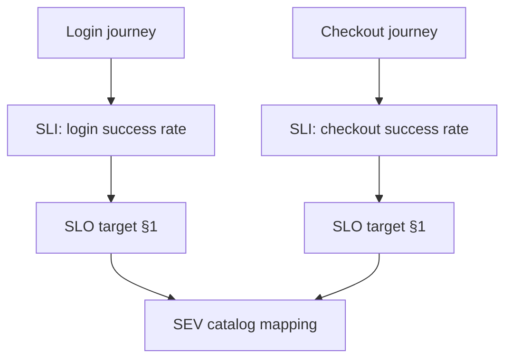
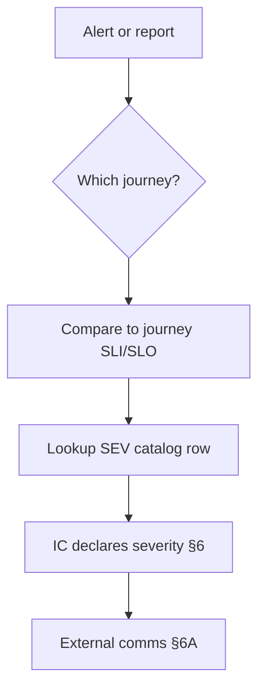

# Critical Journeys and SEV Catalog

Severity debates under stress waste minutes. Map **product-critical journeys** to **SEV(Severity) definitions** before the pager fires so on-call, IC(Incident Commander), and leadership share the same thresholds.

> **Scope:** Journey inventory, example SEV catalog, and how journeys tie to SLI(Service Level Indicator)/SLO(Service Level Objective) choices. Indicator math → [§1](01-sli-slo-sla.md). Roles and first 15 minutes → [§6](06-incident-command.md). Customer-facing updates → [§6A](06A-incident-communications.md).
>
> **Related:** Error budgets → [§2](02-error-budgets.md) · Alerting → [§5](05-alerting-and-paging.md) · Hypercare after fix → [§10A](10A-hypercare-checklist.md) · Checkout resilience example → [resilience §12](../../resilience-patterns/includes/12-worked-example-checkout.md)

---

## At a glance

| Artifact | Purpose |
|----------|---------|
| **Critical journey** | User-visible path whose failure is a business event |
| **Journey SLI** | Measurable good/bad for that path |
| **SEV mapping** | How much journey pain → which severity |
| **SEV catalog** | Named scenarios with default response |

**Rule of thumb:** If you cannot name the **primary journey SLI** for checkout/login/ingest, you will argue severity from gut feel at 3 a.m.

---

## Define critical journeys

| Journey | Example SLI | Notes |
|---------|---------------|-------|
| **Login / SSO(Single Sign-On)** | `successful_logins / attempts` | Include IdP(Identity Provider) dependency |
| **Checkout / pay** | `successful_checkouts / attempts` | Tie to money path — [payments](../../payments-and-fintech/README.md) |
| **Core API(Application Programming Interface) read/write** | Availability + latency on top routes | Split read vs write if needed |
| **Async ingest / webhook** | `processed_on_time / received` | Lag SLO, not just uptime |
| **Admin / support tools** | Separate lower tier unless revenue blocked |

Document **dependencies** (PSP(Payment Service Provider), search, identity) per journey — failure there inherits journey severity when it blocks the path.

Depth on SLI/SLO selection → [§1](01-sli-slo-sla.md). Do not duplicate error-budget math here — [§2](02-error-budgets.md).

---

## Example SEV catalog

Adjust names to your org; publish internally and link from runbooks — [RUNBOOK-TEMPLATE](../../RUNBOOK-TEMPLATE.md).

| ID | Scenario (journey) | User impact | Default SEV | Page? | Exec? |
|----|-------------------|-------------|-------------|-------|-------|
| **AUTH-TOTAL** | Login completely down | No one can authenticate | SEV1 | Yes | Yes |
| **AUTH-DEGRADED** | MFA(Multi-Factor Authentication) provider slow; password OK | Subset blocked or slow | SEV2 | Yes | Notify |
| **PAY-FAIL** | Checkout errors > SLO; charges may fail | Revenue path broken | SEV1 | Yes | Yes |
| **PAY-LATENCY** | Checkout p99 3× baseline; still succeeds | Conversion risk | SEV2 | Yes | Notify |
| **API-CORE** | Core API 5xx > 1% 10 min | Broad client failure | SEV1–2 | Yes | If sustained |
| **API-PARTNER** | One partner route down | Contractual subset | SEV2–3 | Partner SLA(Service Level Agreement) |
| **INGEST-LAG** | Pipeline lag > 2× SLO | Stale dashboards / ML(Machine Learning) | SEV2–3 | If customer-visible |
| **DATA-CORRECT** | Wrong rows / double charge suspected | Trust / money | SEV1 | Yes | Yes |
| **INTERNAL-ONLY** | CI(Continuous Integration) or staging | No prod user | SEV4 | No | No |

**SEV1:** majority of users or revenue path down/corrupt. **SEV2:** significant subset or major degradation. **SEV3:** minor / workaround. **SEV4:** internal/cosmetic — [§6](06-incident-command.md).

---

## Mapping journeys to response

| When impact is… | Action |
|-----------------|--------|
| **Unknown** | Assume higher SEV; downgrade explicitly in channel |
| **Single region / cell** | Map % users affected, not “one server” |
| **Degraded but usable** | SEV2 + comms; do not wait for total failure |
| **Data corruption** | SEV1; freeze writes; IC owns — [§6](06-incident-command.md) |

---

## Maintenance checklist

- [ ] Top 5 journeys named with owners and SLIs
- [ ] SEV catalog reviewed quarterly with product + support
- [ ] Each catalog row links to a runbook section
- [ ] Dashboards grouped by journey, not only service name
- [ ] Game day validates at least one SEV1 scenario — [§9](09-game-days-and-drills.md)

---

## Common mistakes

| Mistake | Fix |
|---------|-----|
| Severity by loudest customer | Journey % affected + catalog |
| One SLO for entire monolith | Journey-scoped SLIs |
| Login and checkout share one page policy | Split on-call routes |
| Catalog in wiki only | Link from alerts and §6 runbooks |
| No “data wrong” row | Add DATA-CORRECT SEV1 |

---

## Pros and cons

| Approach | Pros | Cons |
|----------|------|------|
| **Published SEV catalog** | Faster IC decisions; consistent exec updates | Must maintain as product changes |
| **Ad-hoc severity** | Flexible | Arguments during outages |
| **Journey-based SLIs** | Aligns eng and product | More dashboards to own |
