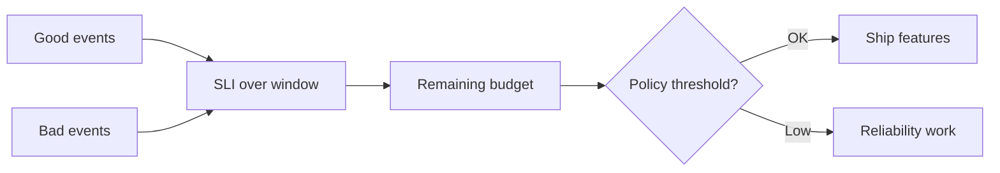

# Error Budgets

An error budget turns reliability from a slogan into a **spendable resource**. When the budget is healthy, ship features. When it is burned, prioritize reliability until it recovers.

> **Related:** SLI(Service Level Indicator)/SLO(Service Level Objective) definitions → [§1](01-sli-slo-sla.md) · Alerting on burn → [§5](05-alerting-and-paging.md) · Feature freeze vs flags → [cicd-and-environments §4](../../cicd-and-environments/includes/04-feature-flags-as-control.md) · Deploy gates → [deployment-strategies §13](../../deployment-strategies/includes/13-slo-rollback-triggers.md)

---

## At a glance

| Budget state | Engineering posture |
|--------------|---------------------|
| **Healthy (>50% remaining)** | Feature work default; normal canary |
| **Watch (25–50%)** | Tighten review; prefer flags; no risky migrations Friday |
| **Critical (<25% or fast burn)** | Reliability-first; freeze risky launches |
| **Exhausted** | Stop feature releases that can burn more; fix until recovery |

**Rule of thumb:** The budget policy must be **written and agreed with product before** the first bad week — not negotiated during an outage.

---

## Budget math

For a 30-day availability SLO(Service Level Objective) of 99.9%:

| Concept | Value |
|---------|-------|
| Allowed failure | 0.1% of valid requests |
| Wall-clock illusion | ≈ 43 minutes fully down — **misleading** for partial failure |
| Better view | Remaining bad-request allowance on the dashboard |

Always express burn in **user-impact units** (failed checkouts, slow searches), not only minutes of “downtime.”

---

## When to stop features

| Trigger | Action | Owner |
|---------|--------|-------|
| Fast burn (e.g. 2% budget in 1h) | Page; halt rollout; incident | On-call |
| Slow burn (budget on track to exhaust early) | Reliability sprint; defer launches | Tech lead + PM |
| Repeat SEV1/SEV2 in same area | Cap new scope in that area | Eng manager |
| Postmortem follow-ups overdue | Block related feature flags to 100% | Tech lead |

“Stop features” means **risk-increasing** change: new paths, schema rewrites, dependency upgrades without canary — not every commit. Use flags to keep merging while holding user exposure ([cicd §4](../../cicd-and-environments/includes/04-feature-flags-as-control.md), [deployment §7](../../deployment-strategies/includes/07-feature-flags.md)).

---

## Policy template (one page)

| Clause | Example wording |
|--------|-----------------|
| **Measurement** | Checkout availability SLI, 30-day rolling |
| **Healthy** | Remaining budget ≥ 50% — normal process |
| **Watch** | 25–50% — PM notified weekly; canary mandatory |
| **Freeze** | <25% or open SEV1 — no production feature exposure without TL + SRE(Site Reliability Engineering) sign-off |
| **Exceptions** | Security patches and budget-recovery fixes always allowed |
| **Exit** | Freeze lifts when remaining ≥ 40% for 7 consecutive days |

Socialize this in planning; put the link in the team README.

---

## Burn alerts vs feature process

| Alert | Human response |
|-------|----------------|
| **Fast burn** | Treat as incident ([§6](06-incident-command.md)) |
| **Slow burn** | Planning change, not necessarily a page |
| **Exhausted** | Explicit freeze ticket; review every release |

Wire deploy pipelines to respect burn where possible — pause progressive delivery when burn spikes ([deployment §10](../../deployment-strategies/includes/10-progressive-delivery.md), [§13](../../deployment-strategies/includes/13-slo-rollback-triggers.md)).

---

## Pros and cons

| Pros | Cons |
|------|------|
| Shared language with product | Needs trustworthy SLIs |
| Prevents endless “just one more feature” | Can be gamed with bad exclusions |
| Focuses reliability investment | Freeze without root-cause work wastes the pause |

---

## Common mistakes

| Mistake | Fix |
|---------|-----|
| Budget policy only in Slack lore | One-page doc + dashboard |
| Freeze all merges | Freeze **exposure**; keep CI(Continuous Integration) green |
| Ignoring slow burn | Weekly budget review in standup |
| Resetting the window after every incident | Keep the window; learn from burn rate |
| Punishing teams for spending budget on experiments | Budget is for **managed** risk — spend deliberately |