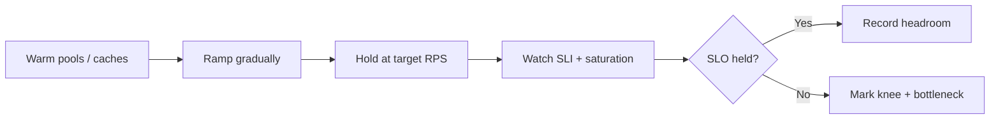

# Capacity and Load Testing

Capacity work answers: **how much load can we take while still meeting SLOs?** Load tests that ignore SLOs only produce vanity RPS numbers.

> **Related:** Throughput load-test recipes → [high-throughput-systems §1](../../high-throughput-systems/includes/01-measurement-and-slo.md) · Backpressure → [HTS §9](../../high-throughput-systems/includes/09-backpressure-and-limits.md) · Scale/deploy under load → [HTS §10](../../high-throughput-systems/includes/10-scale-and-deploy.md) · Synthetic probes → [§10](10-synthetic-monitoring.md)

---

## At a glance

| Question | Method |
|----------|--------|
| Where is the knee of the curve? | Gradual ramp to SLO(Service Level Objective) breach |
| Can we survive launch day? | Peak × headroom scenario |
| Will failover hold? | Fail a dependency mid-test |
| Did a change regress capacity? | Compare build_id baselines in CI(Continuous Integration) or pre-prod |

**Rule of thumb:** A load test without an SLO pass/fail gate is a demo, not a capacity decision.

---

## Test types

| Type | Goal | Cadence |
|------|------|---------|
| **Smoke load** | Pipeline sanity, no SLO claim | Every relevant PR/build |
| **Baseline** | Document sustained RPS at SLO | Per release train / monthly |
| **Stress** | Find breaking point past SLO | Quarterly or major launch |
| **Soak** | Leaks, saturation creep over hours | Before big events |
| **Spike** | Autoscale and queue behavior | When traffic is bursty |
| **Failover** | Behavior when primary DB/cache dies | Game day ([§9](09-game-days-and-drills.md)) |

---

## What to measure during the test

| Layer | Signals |
|-------|---------|
| **User SLI(Service Level Indicator)** | Success rate, latency percentiles |
| **App** | RPS, pool wait, GC, thread queue |
| **Data** | DB CPU, locks, connections, replication lag |
| **Async** | Queue depth, consumer lag, DLQ(Dead Letter Queue) |
| **Edge** | 429 rate, gateway latency |

Saturation-first menus → [HTS §11](../../high-throughput-systems/includes/11-observability.md).

---

## Designing realistic load

| Practice | Detail |
|----------|--------|
| **Traffic mix** | Match production read/write and endpoint weights |
| **Data shape** | Production-like cardinality and hot keys |
| **Auth** | Real token paths — do not skip gateway cost |
| **Think time** | Human vs machine clients differ |
| **Exclusions** | Do not DDoS shared staging DBs without isolation |

Prefer **pre-prod** or isolated stacks. If you must hit production-like data stores, get explicit approval and rate caps.

---

## Capacity planning loop

| Step | Output |
|------|--------|
| 1. Baseline at SLO | Max sustained good RPS |
| 2. Apply growth | `peak × 1.5` (or product forecast) |
| 3. Map bottlenecks | Scale vertically/horizontally or reduce work |
| 4. Cost check | Cost per 1M good requests |
| 5. Re-test after change | New baseline artifact in wiki/CI |

Pair with product rate tiers → [api-design §5](../../api-design-and-protection/includes/05-rate-limit-tiers.md).

---

## Gates in delivery

| Gate | Action |
|------|--------|
| PR smoke | Fail if p95 explodes on microbench / k6 smoke |
| Pre-prod baseline | Block promote if capacity regresses > agreed % |
| Canary | Live SLO burn → roll back ([deployment §13](../../deployment-strategies/includes/13-slo-rollback-triggers.md)) |

Promotion mechanics → [cicd-and-environments §2](../../cicd-and-environments/includes/02-cd-and-promotion.md).

---

## Common mistakes

| Mistake | Fix |
|---------|-----|
| Instant full load | Ramp; find the knee |
| Testing only happy GETs | Include writes and expensive searches |
| Ignoring dependency limits | Watch DB pool and downstream 429s |
| No build_id on results | Tag every run for comparison |
| Calling “passed” without SLO | Explicit pass criteria in the report |