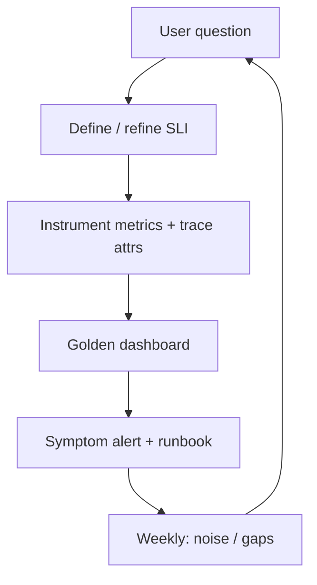

# Observability Practice

Observability is a **practice**, not a vendor checkbox. Metrics, logs, and traces only help when teams use them to ask product questions and to page on the right symptoms.

> **Scope:** **Culture and operating model** — what to measure, how to alert, how on-call uses signals. Layer-by-layer throughput metrics, RED(Rate, Errors, Duration)/USE(Utilization, Saturation, Errors) menus, and triage order → [high-throughput-systems §11 Observability](../../high-throughput-systems/includes/11-observability.md).
>
> **Related:** SLIs → [§1](01-sli-slo-sla.md) · Observability as platform product (retention, cardinality, collectors) → [§4A](04A-observability-platform.md) · Alerting → [§5](05-alerting-and-paging.md) · Synthetics → [§10](10-synthetic-monitoring.md) · Runbooks → [RUNBOOK-TEMPLATE.md](../../RUNBOOK-TEMPLATE.md)

---

## At a glance

| Pillar | Answers | Anti-pattern |
|--------|---------|--------------|
| **Metrics** | Is it broken *now*? Trends? | 10k charts, no SLI(Service Level Indicator) |
| **Logs** | What exactly failed for *this* request? | Unstructured spam |
| **Traces** | Where did time go across services? | 1% sample with no exemplars |
| **Continuous profiling** | Which code burns CPU/allocs? | Only after a war room |

**Rule of thumb:** Every high-severity dashboard panel should map to an SLI(Service Level Indicator), a saturation signal, or a runbook step — delete decorative graphs.

---

## Practice over tooling

| Cadence | Activity |
|---------|----------|
| **Per service launch** | Golden signals + SLI panels before GA |
| **Per incident** | Add the graph you wished you had |
| **Weekly** | Alert noise review ([§5](05-alerting-and-paging.md)) |
| **Quarterly** | Cardinality and cost cleanup |

---

## Metrics, logs, traces — division of labor

| Need | Prefer | Example |
|------|--------|---------|
| Page / SLO(Service Level Objective) burn | Metrics | Success rate, p99, queue depth |
| Debug one user | Logs + trace id | Error with `trace_id`, `user_id` hash |
| Cross-service latency | Traces | Gateway → app → DB spans |
| Deploy attribution | Metrics tagged `version`/`build_id` | Canary compare |

Detailed signal catalogs → [HTS §11](../../high-throughput-systems/includes/11-observability.md). Structured logging and cardinality warnings live there — do not duplicate full menus here.

---

## Alerting culture (preview)

| Principle | Practice |
|-----------|----------|
| **Symptoms over causes** | Page on user-facing burn; ticket on disk filling slowly |
| **Every page has a runbook** | Link from alert annotation |
| **Humans only when needed** | Autoscale and self-heal before paging |
| **Tune ruthlessly** | Recurring mute → fix or delete |

Full paging design → [§5](05-alerting-and-paging.md).

---

## Ownership model

| Artifact | Owner |
|----------|-------|
| Service golden dashboard | Service tech lead |
| Shared platform metrics | Platform / observability team |
| Alert routes and quiet hours | On-call lead + platform |
| Log retention / PII(Personally Identifiable Information) policy | Security + platform |

Tech lead vs platform boundaries for delivery → [cicd §8](../../cicd-and-environments/includes/08-platform-boundaries.md).

---

## Minimum golden dashboard

| Panel | Why |
|-------|-----|
| SLI compliance + budget remaining | Contract health |
| RPS + error rate by route class | Traffic shape |
| Latency p50/p99 | UX |
| Saturation (pool wait, lag, queue) | Early warning |
| Deploy / flag markers | Correlate change |

During incidents, start with this board, then drill into traces — same triage spirit as [HTS §11](../../high-throughput-systems/includes/11-observability.md).

---

## Common mistakes

| Mistake | Fix |
|---------|-----|
| Equating “we have Datadog” with observability | Practice loop above |
| Logging secrets / raw PII | Redact; hash identifiers |
| Infinite-label metrics | Bounded enums only |
| Tracing without exemplars to metrics | Link trace ↔ metric |
| Dashboards only experts can read | Golden board for on-call first |