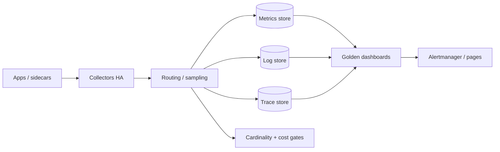

# Observability Platform

Observability practice ([§4](04-observability-practice.md)) tells teams *how to use* signals. An observability **platform** is the shared product that makes those signals affordable, reliable, and consistent: retention tiers, cardinality budgets, collector HA(High Availability), golden dashboard templates, and cost gates.

> **Scope:** **Platform product** for metrics, logs, traces, and profiles — ingest pipeline, storage tiers, budgets, and shared UX. Culture and SLI(Service Level Indicator) practice → [§4](04-observability-practice.md). Signal catalogs and triage → [HTS §11](../../high-throughput-systems/includes/11-observability.md). Cardinality / OTel(OpenTelemetry) pitfalls → [HTS §11A](../../high-throughput-systems/includes/11A-opentelemetry-and-cardinality.md). Paved-road modules → [cicd §8](../../cicd-and-environments/includes/08-platform-boundaries.md) · [§8A](../../cicd-and-environments/includes/08A-paved-road-catalog.md).
>
> **Related:** [§4 Observability practice](04-observability-practice.md) · Alerting → [§5](05-alerting-and-paging.md) · HTS observability → [§11](../../high-throughput-systems/includes/11-observability.md) · OTel / cardinality → [§11A](../../high-throughput-systems/includes/11A-opentelemetry-and-cardinality.md) · FinOps(Cloud Financial Operations) retention cost → [finops §4](../../finops-and-cost/includes/04-storage-and-retention-cost.md)

---

## At a glance

| Platform concern | Default |
|------------------|---------|
| **Retention tiers** | Hot / warm / cold with explicit product use cases |
| **Cardinality budgets** | Per-service and org quotas; reject or sample overflows |
| **Collector HA** | Redundant collectors; backpressure; no silent drop without metrics |
| **Golden dashboards** | Template per service type; SLI panels first |
| **Cost gates** | CI(Continuous Integration) / deploy checks on high-cardinality attributes |

**Rule of thumb:** Observability spend grows with **cardinality × retention × volume**. Cap the first; tier the second; sample the third — do not “buy a bigger cluster” as the only strategy.

---

## Platform architecture

| Layer | Platform owns | App owns |
|-------|---------------|----------|
| Instrumentation SDK defaults | Baseline attributes, redaction helpers | Business attributes, span names |
| Collectors / agents | Deploy, HA, upgrades, scrape config | Workload annotations / pod labels |
| Storage + retention | Tiers, compaction, access control | Which signals matter for their SLIs |
| Dashboards / alerts | Templates, shared datasources | Service panels, thresholds, runbook links |

Align with paved-road catalog modules — [cicd §8A](../../cicd-and-environments/includes/08A-paved-road-catalog.md).

---

## Retention tiers

| Tier | Typical use | Example retention |
|------|-------------|-------------------|
| **Hot** | Pages, canaries, live debug | Days (metrics) / hours–days (high-volume logs) |
| **Warm** | Weekly review, postmortems | Weeks–months |
| **Cold / archive** | Compliance, rare forensics | Months–years; restore latency OK |

| Signal | Guidance |
|--------|----------|
| **Metrics** | Keep SLI and saturation series hot; drop unused high-cardinality series aggressively |
| **Logs** | Short hot retention; structured fields; sample debug in prod |
| **Traces** | Head/tail sample; keep exemplars linked to metrics — [HTS §11A](../../high-throughput-systems/includes/11A-opentelemetry-and-cardinality.md) |
| **Profiles** | Continuous with aggressive aggregation; longer retention for incident windows only |

Cost of retention → [finops §4](../../finops-and-cost/includes/04-storage-and-retention-cost.md). PII(Personally Identifiable Information) in logs → [ESC §7](../../enterprise-security-compliance/includes/07-pii-and-data-classification.md).

---

## Cardinality budgets

| Control | Practice |
|---------|----------|
| **Allow-list labels** | Forbid `user_id`, raw URLs, unbounded `exception.message` as metric labels |
| **Per-service quota** | Soft warn → hard reject / drop with metric |
| **Org budget** | Monthly series / ingest caps visible to TLs |
| **CI gate** | Diff instrumentation PRs for new high-cardinality attributes |
| **Runtime gate** | Collector or pipeline drops offending series and pages platform |

Deep dive on OTel attribute explosions → [HTS §11A](../../high-throughput-systems/includes/11A-opentelemetry-and-cardinality.md).

---

## Collector HA and reliability

| Requirement | Why |
|-------------|-----|
| Multiple collectors / AZs | Agent or gateway failure must not black-hole telemetry |
| Backpressure metrics | Know when you are shedding |
| Durable buffer where needed | Short outages should not lose pages’ worth of SLI data |
| Separate critical vs best-effort paths | Never let debug logs starve SLI metrics |
| Platform SLO(Service Level Objective) on ingest | Treat pipeline like a product — [cicd §8A](../../cicd-and-environments/includes/08A-paved-road-catalog.md) |

During incidents, **do not** “fix” observability by restarting all collectors without a drain plan — you can erase the only evidence of the outage.

---

## Golden dashboards

| Panel class | Required |
|-------------|----------|
| User-facing SLI / error budget burn | Yes — [§1](01-sli-slo-sla.md) |
| RED(Rate, Errors, Duration) or USE(Utilization, Saturation, Errors) for critical deps | Yes — [HTS §11](../../high-throughput-systems/includes/11-observability.md) |
| Deploy / version markers | Yes |
| Saturation (CPU, pool, queue, RPS limits) | Yes |
| Decorative business vanity charts | No on the golden board |

Ship **templates** from platform; app teams clone and fill service-specific panels — practice in [§4](04-observability-practice.md).

---

## Cost gates

| Gate | When |
|------|------|
| PR checklist / linter | New metric labels, log fields, span attributes |
| Pre-prod soak | Cardinality and ingest volume vs budget |
| Prod alert | Series growth rate, ingest $/day, discarded samples |
| Quarterly review | Drop unused dashboards and series |

Make cost visible to service owners; invisible bills become platform resentment.

---

## Operational checklist

- [ ] Published retention tiers per signal type
- [ ] Cardinality allow-list + per-service quotas
- [ ] Collector HA with shed/drop metrics
- [ ] Golden dashboard template with SLI-first panels
- [ ] CI / review gates for high-cardinality instrumentation
- [ ] Platform ingest SLO and on-call ownership
- [ ] PII redaction defaults in SDK / collector

---

## Common mistakes

| Mistake | Fix |
|---------|-----|
| Unlimited labels “for debug” | Budgets + allow-lists — [HTS §11A](../../high-throughput-systems/includes/11A-opentelemetry-and-cardinality.md) |
| One retention for everything | Hot/warm/cold by use case |
| Single collector VM | HA + backpressure |
| 200-panel dashboards | Golden SLI set; deep links for niche charts |
| Platform pays all observability cost silently | Chargeback or visible budgets — FinOps |
| Practice guide without a platform product | Pair [§4](04-observability-practice.md) with this section |

---

## Pros and cons

### Observability as a platform product

**Pros:** Predictable cost, consistent golden signals, reliable ingest under load.

**Cons:** Requires real product ownership (SLOs, quotas, docs); app teams must accept guardrails.

### Every team picks a vendor sidecar

**Pros:** Fast local optimization.

**Cons:** Cardinality explosions, inconsistent SLIs, no org-wide incident UX.