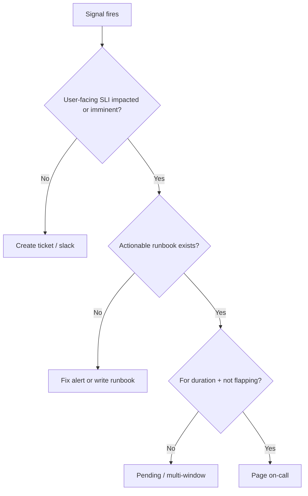

# Alerting and Paging

Pages are expensive — they interrupt sleep and train people to ignore noise. Good alerting pages **rarely**, with **clear next steps**.

> **Related:** Observability culture → [§4](04-observability-practice.md) · Error budget burn → [§2](02-error-budgets.md) · Incident command → [§6](06-incident-command.md) · On-call design → [§8](08-on-call-design.md) · Signal menus → [HTS §11](../../high-throughput-systems/includes/11-observability.md)

---

## At a glance

| Severity | Channel | Response |
|----------|---------|----------|
| **Page** | Phone / PagerDuty | Human now; start incident if user impact |
| **Ticket** | Issue tracker | Next business day |
| **Dashboard only** | None | Trend / capacity planning |

**Rule of thumb:** If the alert can wait until morning without user harm, it is not a page.

---

## Symptom vs cause

| Page on (symptoms) | Ticket on (causes) |
|--------------------|--------------------|
| SLO(Service Level Objective) burn / availability drop | Disk > 70% |
| Checkout success rate drop | Single pod restart |
| Synthetic journey failure ([§10](10-synthetic-monitoring.md)) | Certificate expires in 21 days |
| Queue oldest-age SLO breach | Elevated GC time without SLI(Service Level Indicator) impact |

---

## Multi-window burn alerts

Borrow Google’s multi-window idea for availability budgets:

| Alert | Rough intent |
|-------|--------------|
| **Fast burn** | “At this rate budget dies in hours” → page |
| **Slow burn** | “Budget dies before end of window” → ticket or daytime page |

Exact thresholds depend on SLO and tooling; document them next to the SLI ([§1](01-sli-slo-sla.md)).

---

## Alert quality checklist

| Check | Pass criteria |
|-------|---------------|
| **User impact** | Tied to SLI or agreed symptom |
| **Runbook link** | Annotation opens [RUNBOOK-TEMPLATE](../../RUNBOOK-TEMPLATE.md)-style doc |
| **Owner** | Team that can fix it |
| **Duration** | Not a single datapoint |
| **Inhibit / depend** | Downstream quiet when upstream pages |
| **Priority** | Page vs ticket explicit |

---

## Routing and escalation

| Concern | Practice |
|---------|----------|
| **Primary** | Service on-call |
| **Secondary** | Escalate after N minutes no ack |
| **Platform** | Only for shared infra symptoms |
| **Vendor** | Bridge after local mitigation started |
| **Quiet hours** | Match follow-the-sun; no silent drops of SEV1 |

On-call sustainability → [§8](08-on-call-design.md). During active incidents, IC(Incident Commander) owns comms ([§6](06-incident-command.md)) — alerts still fire but channel discipline matters.

---

## Deploy and flag correlation

Tag alerts and metrics with `version` / `build_id` / flag key so on-call can answer “did we just ship this?” — pairs with [deployment §13](../../deployment-strategies/includes/13-slo-rollback-triggers.md) and [cicd §6](../../cicd-and-environments/includes/06-rollback-vs-forward-fix.md).

---

## Noise reduction loop

| Weekly question | Action |
|-----------------|--------|
| Which pages had no action? | Raise threshold or demote |
| Which incidents had no page? | Add symptom coverage |
| Which pages lacked runbooks? | Write or link |
| Flapping? | Pending intervals, hysteresis |

---

## Common mistakes

| Mistake | Fix |
|---------|-----|
| Page on CPU | Page on SLI / saturation that predicts SLI |
| Alert without runbook | Block new pages lacking links |
| Same alert to five teams | One owner; escalate path |
| Eternal silences | Expire mutes; fix root |
| ChatOps as only notify | Keep durable ticket + postmortem trail |