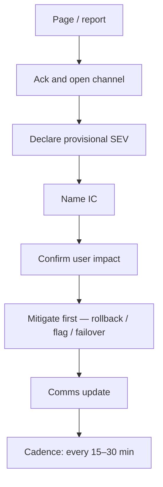

# Incident Command

Incidents need a temporary org chart. Without roles, everyone debugs, nobody communicates, and leadership gets conflicting updates.

> **Related:** Alerting → [§5](05-alerting-and-paging.md) · Postmortems → [§7](07-postmortems.md) · On-call → [§8](08-on-call-design.md) · Runbooks → [RUNBOOK-TEMPLATE.md](../../RUNBOOK-TEMPLATE.md) · Rollback → [deployment §13](../../deployment-strategies/includes/13-slo-rollback-triggers.md)

---

## At a glance

| Role | Job |
|------|-----|
| **IC(Incident Commander)** | Decide priority, assign work, drive cadence |
| **Ops / mitigations** | Execute rollbacks, failovers, config |
| **Communications** | Status page, exec, customer updates |
| **Scribe** | Timeline for the postmortem |
| **Subject experts** | Deep debug when called in |

**Rule of thumb:** If user impact is unclear, assume higher severity until proven otherwise — then downgrade explicitly.

---

## Severity model

| Severity | User impact | Response |
|----------|-------------|----------|
| **SEV1** | Majority of users / revenue path down or corrupt | Immediate all-hands; exec notified |
| **SEV2** | Significant subset or major degradation | Primary + secondary; daytime swell |
| **SEV3** | Minor or workaround exists | Business hours |
| **SEV4** | Cosmetic / internal | Ticket |

Map your product’s critical journeys (checkout, login, ingest) to SEV1 explicitly so on-call does not invent severity under stress.

---

## First 15 minutes

| Minute | Action |
|--------|--------|
| 0–2 | Ack page; join bridge/channel |
| 2–5 | Name IC; set severity; start scribe notes |
| 5–15 | Recent deploy/flag? SLO(Service Level Objective) burn? Runbook triage |
| 15+ | Mitigate; schedule next update |

Prefer **mitigation over root cause** early: roll back, disable flag, shed load, fail over. Decision aid → [cicd §6](../../cicd-and-environments/includes/06-rollback-vs-forward-fix.md).

---

## Communication norms

| Audience | Cadence | Content |
|----------|---------|---------|
| **War room** | Continuous | Facts, owners, next check-in time |
| **Status page** | Every 30–60 min while SEV1/2 | Impact, workaround, next update time |
| **Exec / AM** | On SEV change and resolution | Business impact, ETA if known |
| **Customers** | Per SLA(Service Level Agreement)/comms policy | Honest scope; no speculation |

Never speculate on root cause in external updates. Say what is broken, what you are doing, when you will update again.

---

## Channel hygiene

| Do | Do not |
|----|--------|
| One primary incident channel | Parallel private threads with decisions |
| Thread deep debug under IC direction | @channel every micro-hypothesis |
| Pin severity, IC, next update time | Debate blame mid-incident |
| Hand off IC explicitly on shift change | Ghost the bridge |

---

## Handoff and resolution

| Event | Action |
|-------|--------|
| **Mitigated** | Say so; keep watching for recurrence window |
| **Resolved** | Explicit resolve; leave monitoring note |
| **Handoff** | New IC restates severity, impact, open actions |
| **Follow-up** | Schedule postmortem ([§7](07-postmortems.md)) within policy (e.g. 5 business days for SEV1) |

---

## Common mistakes

| Mistake | Fix |
|---------|-----|
| No named IC | First ack becomes IC until handed off |
| Debugging before mitigation | Runbook rollback / flag off first |
| Severity inflation forever | Re-evaluate every update |
| External root-cause guesses | Stick to impact + actions |
| Lost timeline | Scribe from minute one |